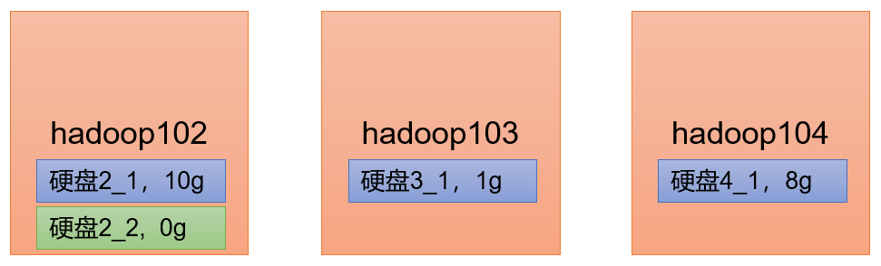
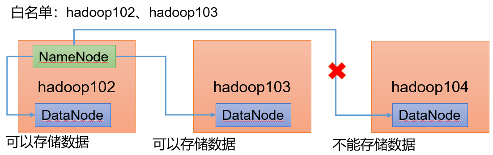
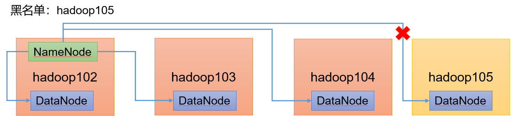

# 1. 大数据概论
## 1.1 大数据概念
1. 大数据（Big Data）：指无法在一定时间范围内用常规软件工具进行捕捉、管理和处理的数据集合，是需要新处理模式才能具有更强的决策力、洞察发现力和流程优化能力的海量、高增长率和多样化的信息资产
2. 大数据主要解决，海量数据的==采集、存储和分析计算==问题
3. 按顺序给出数据存储单位：bit、Byte、KB、MB、GB、TB、PB、EB、ZB、YB、BB、NB、DB。1Byte = 8bit 1K = 1024Byte 1MB = 1024K 1G = 1024M 1T = 1024G 1P = 1024T

## 1.2 大数据的特点
1. **Volume（大量）**

   截至目前，人类生产的所有印刷材料的数据量是200PB，而历史上全人类总共说过的话的数据量大约是5EB。当前，典型个人计算机硬盘的容量为TB量级，而一些大企业的数据量已经接近EB量级

2. **Velocity（高速）**

   这是大数据区分于传统数据挖掘的最显著特征。根据IDC的“数字宇宙”的报告，预计到2025年，全球数据使用量将达到163ZB。在如此海量的数据面前，处理数据的效率就是企业的生命。天猫双十一：2017年3分01秒，天猫交易额超过100亿；2020年96秒，天猫交易额超过100亿

3. **Variety（多样）**

   这种类型的多样性也让数据被分为结构化数据和非结构化数据。相对于以往便于存储的以数据库/文本为主的结构化数据，非结构化数据越来越多，包括网络日志、音频、视频、图片、地理位置信息等，这些多类型的数据对数据的处理能力提出了更高要求

4. **Value（低价值密度）**

   价值密度的高低与数据总量的大小成反比

## 1.3 大数据应用场景
1. 短视频平台
2. 电商站内广告推荐：给用户推荐可能喜欢的商品
3. 零售：分析用户消费习惯，为用户购买商品提供方便，从而提升商品销量。
   经典案例，纸尿布+啤酒
4. 物流仓储：京东物流，上午下单下午送达、下午下单次日上午送达
5. 保险：海量数据挖掘及风险预测，助力保险行业精准营销，提升精细化定价能力
6. 金融：多维度体现用户特征，帮助金融机构，推荐优质客户，防范欺诈风险
7. 房产：大数据全面助力房地产行业，打造精准投策与营销，选出更合适的地，建造更合适的楼，卖给更合适的人
8. 人工智能+ 5G + 物联网+ 虚拟与现实


# 2. Hadoop入门
## 2.1 Hadoop概念
1. Hadoop是什么
   2. Hadoop是一个由Apache基金会所开发的**分布式系统基础架构**
   3. 主要解决，海量数据的存储和海量数据的分析计算问题
   4. 广义上来说，Hadoop通常是指一个更广泛的概念——Hadoop生态圈

      
5. Hadoop发展历史
   6. Hadoop创始人Doug Cutting，为了实现与Google类似的全文搜索功能，他在Lucene框架基础上进行优化升级，查询引擎和索引引擎
   7. 2001年年底Lucene成为Apache基金会的一个子项目
   8. 对于海量数据的场景，Lucene框架面对与Google同样的困难，存储海量数据困难，检索海量速度慢
   9. 学习和模仿Google解决这些问题的办法：微型版Nutch
   10. **可以说Google是Hadoop的思想之源（Google在大数据方面的三篇论文）：GFS --->HDFS，Map-Reduce --->MR，BigTable --->HBase**
   11. 2003-2004年，Google公开了部分GFS和MapReduce思想的细节，以此为基础Doug Cutting等人用了2年业余时间实现了DFS和MapReduce机制，使Nutch性能飙升
   12. 2005 年Hadoop 作为Lucene的子项目Nutch的一部分正式引入Apache基金会
   13. 2006 年3 月份，Map-Reduce和Nutch Distributed File System （NDFS）分别被纳入到Hadoop 项目中，Hadoop就此正式诞生，标志着大数据时代来临
   14. 名字来源于Doug Cutting儿子的玩具大象
15. Hadoop 三大发行版本：Apache、Cloudera、Hortonworks。
   16. Apache 版本最原始（最基础）的版本，对于入门学习最好。2006

      官网地址：http://hadoop.apache.org
      下载地址：https://hadoop.apache.org/releases.html
   17. Cloudera 内部集成了很多大数据框架，对应产品CDH。2008

      官网地址：https://www.cloudera.com/downloads/cdh
      下载地址：https://docs.cloudera.com/documentation/enterprise/6/release-notes/topics/rg_cdh_6_download.html
   18. Hortonworks 文档较好，对应产品HDP。2011

      Hortonworks 现在已经被Cloudera 公司收购，推出新的品牌CDP
      官网地址：https://hortonworks.com/products/data-center/hdp/
      下载地址：https://hortonworks.com/downloads/#data-platform
19. **Hadoop 优势（4 高）**
   20. 高可靠性：Hadoop底层维护多个数据副本，所以即使Hadoop某个计算元素或存储出现故障，也不会导致数据的丢失

      
   21. 高扩展性：在集群间分配任务数据，可方便的扩展数以千计的节点

      
   22. 高效性：在MapReduce的思想下，Hadoop是并行工作的，以加快任务处理速度

      
   23. 高容错性：能够自动将失败的任务重新分配

      
24. ==**Hadoop 组成**（面试重点）==
   25. Hadoop1.x、2.x、3.x区别
      1. 在Hadoop1.x 时代，Hadoop中的MapReduce同时处理业务逻辑运算和资源的调度，耦合性较大
      2. 在Hadoop2.x时代，增加了Yarn。Yarn只负责资源的调度，MapReduce 只负责运算
      3. Hadoop3.x在组成上没有变化

         
   26. HDFS 架构概述
      1. Hadoop Distributed File System，简称HDFS，是一个分布式文件系统
      2. 架构组件：
         1. NameNode（nn）：存储文件的元数据，如文件名，文件目录结构，文件属性（生成时间、副本数、文件权限），以及每个文件的块列表和块所在的DataNode等
         2. DataNode(dn)：在本地文件系统存储文件块数据，以及块数据的校验和
         3. Secondary NameNode(2nn)：每隔一段时间对NameNode元数据备份

            
   27. YARN 架构概述
      1. Yet Another Resource Negotiator 简称YARN ，另一种资源协调者，是Hadoop 的资源管理器
      2. 架构组件：
         1. ResourceManager（RM）：整个集群资源（内存、CPU等）的老大
         2. ApplicationMaster（AM）：单个任务运行的老大
         3. NodeManager（NM）：单个节点服务器资源老大
         4. Container：容器，相当一台独立的服务器，里面封装了任务运行所需要的资源，如内存、CPU、磁盘、网络等

            
   28. MapReduce 架构概述

      MapReduce 将计算过程分为两个阶段：Map 和Reduce
      1. Map 阶段并行处理输入数据
      2. Reduce 阶段对Map 结果进行汇总

         
   29. HDFS、YARN、MapReduce 三者关系

      
   30. 大数据技术生态体系

      
      1. Sqoop：Sqoop 是一款开源的工具，主要用于在Hadoop、Hive 与传统的数据库（MySQL）间进行数据的传递，可以将一个关系型数据库（例如 ：MySQL，Oracle 等）中的数据导进到Hadoop 的HDFS中，也可以将HDFS 的数据导进到关系型数据库中
      2. Flume：Flume 是一个高可用的，高可靠的，分布式的海量日志采集、聚合和传输的系统，Flume 支持在日志系统中定制各类数据发送方，用于收集数据
      3. Kafka：Kafka 是一种高吞吐量的分布式发布订阅消息系统
      4. Spark：Spark 是当前最流行的开源大数据内存计算框架。可以基于Hadoop 上存储的大数据进行计算
      5. Flink：Flink 是当前最流行的开源大数据内存计算框架。用于实时计算的场景较多
      6. Oozie：Oozie 是一个管理Hadoop 作业（job）的工作流程调度管理系统
      7. Hbase：HBase 是一个分布式的、面向列的开源数据库。HBase 不同于一般的关系数据库，它是一个适合于非结构化数据存储的数据库
      8. Hive：Hive 是基于Hadoop 的一个数据仓库工具，可以将结构化的数据文件映射为一张数据库表，并提供简单的SQL 查询功能，可以将SQL 语句转换为MapReduce 任务进行运行。其优点是学习成本低，可以通过类SQL 语句快速实现简单的MapReduce 统计，不必开发专门的MapReduce 应用，十分适合数据仓库的统计分析
      9. ZooKeeper：它是一个针对大型分布式系统的可靠协调系统，提供的功能包括：配置维护、名字服务、分布式同步、组服务等

## 2.2 Hadoop运行环境搭建
1. 模板虚拟机环境准备
   2. 安装虚拟机
   3. 安装Linux
   4. 设置静态IP地址（见Linux实操命令那篇文章中的网络配置部分）
   5. 设置主机名（见Linux实操命令那篇文章中的设置主机名和Host映射部分）
   6. 配置Linux主机名映射

      ```java
      [root@hadoop100 ~]# vim /etc/hosts
      [root@hadoop100 ~]# cat /etc/hosts
      127.0.0.1   localhost localhost.localdomain localhost4 localhost4.localdomain4
      ::1         localhost localhost.localdomain localhost6 localhost6.localdomain6
      192.168.10.100 hadoop100
      192.168.10.101 hadoop101
      192.168.10.102 hadoop102
      192.168.10.103 hadoop103
      192.168.10.104 hadoop104
      192.168.10.105 hadoop105
      192.168.10.106 hadoop106
      192.168.10.107 hadoop107
      192.168.10.108 hadoop108
      [root@hadoop100 ~]# reboot
      ```
   7. 配置
8. hadoop100虚拟机配置要求如下：
   9. 使用yum安装`epel-release`

      注意：

      1. Extra Packages for Enterprise Linux 是为“红帽系”的操作系统提供额外的软件包，适用于RHEL、CentOS 和Scientific Linux
      2. 相当于是一个软件仓库，**大多数rpm 包在官方repository 中是找不到的**

      ```java
      [root@hadoop100 ~]# yum install -y epel-release
      ```
   10. 关闭防火墙，关闭防火墙开机自启

      ```java
      [root@hadoop100 ~]# systemctl stop firewalld
      [root@hadoop100 ~]# systemctl disable firewalld.service
      ```
   11. 创建cool用户

      ```java
      [root@hadoop100 ~]# useradd cool
      [root@hadoop100 ~]# passwd cool
      ```
   12. 配置cool用户具有root权限

      ```java
      [root@hadoop100 ~]# vim /etc/sudoers
      ```
      
   13. 在/opt目录下创建文件夹

      ```java
      [root@hadoop100 ~]# su cool
      [cool@hadoop100 root]$ cd /opt
      [cool@hadoop100 opt]$ mkdir module
      mkdir: 无法创建目录"module": 权限不够
      [cool@hadoop100 opt]$ sudo mkdir module
      [cool@hadoop100 opt]$ sudo mkdir software
      [cool@hadoop100 opt]$ ls
      module  rh  software  
      ```
   14. 修改两个文件夹的所有者

      ```java
      [cool@hadoop100 opt]$ sudo chown cool:cool module/ software/
      ```
   15. 卸载现有的JDK

      ```java
      rpm -qa | grep -i java | xargs -n1 sudo rpm -e --nodeps
      ```
      1. rpm -qa 查询所安装的所有rpm软件包
      2. grep -i：忽略大小写
      3. xargs -n1：表示每次只传递一个参数
      4. rpm -e –nodeps：强制卸载软件

## 2.3 克隆虚拟机
1. 利用模板机克隆三台虚拟机（先关闭模板机）

   右击$\to$管理$\to$克隆$\to$完整克隆

2. 修改克隆机的IP

   ```java
   [root@hadoop100 ~]# vim /etc/sysconfig/network-scripts/ifcfg-ens33 
   [root@hadoop100 ~]# vim /etc/hostname;
   [root@hadoop100 ~]# cat /etc/hostname
   hadoop102
    //修改主机名y方法：
   [root@hadoop100 ~]# hostnamectl set-hostname controller
   [root@hadoop100 ~]# cat /etc/hostname 
   controller
   ```

   

3. 重启生效
4. 检查三个克隆机之间互相可以ping通，且可以访问外网
5. 在Xshell上建立三个虚拟机的远程登录连接

## 2.4 安装JDK
1. 上传JDK文件到虚拟机Hadoop102，其他虚拟机上的复制102的即可
2. 解压JDK安装包

   ```java
   [root@hadoop102 software]# tar -zxvf jdk-8u212-linux-x64.tar.gz -C /opt/module/
   ```
3. 配置Java环境变量：进入/etc/profile.d

   ```java
   [root@hadoop102 ~]# cd /etc/profile.d
   [root@hadoop102 profile.d]# ll
   总用量 84
   -rw-r--r--. 1 root root  771 4月  11 2018 256term.csh
   -rw-r--r--. 1 root root  841 4月  11 2018 256term.sh
   -rw-r--r--. 1 root root 1348 4月  27 2018 abrt-console-notification.sh
   -rw-r--r--. 1 root root  660 6月  10 2014 bash_completion.sh
   -rw-r--r--. 1 root root  196 3月  25 2017 colorgrep.csh
   -rw-r--r--. 1 root root  201 3月  25 2017 colorgrep.sh
   -rw-r--r--. 1 root root 1741 4月  11 2018 colorls.csh
   -rw-r--r--. 1 root root 1606 4月  11 2018 colorls.sh
   -rw-r--r--. 1 root root   80 4月  11 2018 csh.local
   -rw-r--r--. 1 root root  373 4月  11 2018 flatpak.sh
   -rw-r--r--. 1 root root 1706 4月  11 2018 lang.csh
   -rw-r--r--. 1 root root 2703 4月  11 2018 lang.sh
   -rw-r--r--. 1 root root  123 7月  31 2015 less.csh
   -rw-r--r--. 1 root root  121 7月  31 2015 less.sh
   -rw-r--r--. 1 root root 1202 8月   6 2017 PackageKit.sh
   -rw-r--r--. 1 root root   81 4月  11 2018 sh.local
   -rw-r--r--. 1 root root  105 4月  11 2018 vim.csh
   -rw-r--r--. 1 root root  269 4月  11 2018 vim.sh
   -rw-r--r--. 1 root root 2092 9月   4 2017 vte.sh
   -rw-r--r--. 1 root root  164 1月  28 2014 which2.csh
   -rw-r--r--. 1 root root  169 1月  28 2014 which2.sh
   ```
4. 写一个自己的sh文件

   ```java
   [root@hadoop102 profile.d]# vim my_env.sh
   [root@hadoop102 profile.d]# cat my_env.sh
   #JAVA_HOME
   export JAVA_HOME=/opt/module/jdk1.8.0_212
   export PATH=$PATH:$JAVA_HOME/bin
   ```
5. source一下让变量生效

   ```java
   [root@hadoop102 profile.d]# source /etc/profile
   ```
6. 检查JDK是否安装好

   ```java
   [root@hadoop102 profile.d]# java -version
   java version "1.8.0_212"
   Java(TM) SE Runtime Environment (build 1.8.0_212-b10)
   Java HotSpot(TM) 64-Bit Server VM (build 25.212-b10, mixed mode)
   [root@hadoop102 profile.d]# echo $JAVA_HOME
   /opt/module/jdk1.8.0_212
   ```
## 2.5 安装Hadoop
1. 上传Hadoop安装包到虚拟机Hadoop102，其他虚拟机上的复制102的即可
2. 解压Hadoop安装包

   ```java
   [root@hadoop102 software]# tar -zxvf hadoop 3.1.3 .tar.gz -C /opt/module/
   ```
3. 配置Hadoop环境变量：

   ```java
   [root@hadoop102 module]# cd hadoop-3.1.3/
   [root@hadoop102 hadoop-3.1.3]# pwd
   /opt/module/hadoop-3.1.3
   [root@hadoop102 hadoop-3.1.3]# cd /etc/profile.d
   [root@hadoop102 profile.d]# vim my_env.sh 
   [root@hadoop102 profile.d]# cat my_env.sh 
   #JAVA_HOME
   export JAVA_HOME=/opt/module/jdk1.8.0_212
   export PATH=$PATH:$JAVA_HOME/bin
   export HADOOP_HOME=/opt/module/hadoop-3.1.3
   export PATH=$PATH:$HADOOP_HOME/bin
   export PATH=$PATH:$HADOOP_HOME/sbin
       //⭐Hadoop需要配置两个环境变量
   ```
4. source一下让变量生效

   ```java
   [cool@hadoop102 profile.d]$ source /etc/profile
   [cool@hadoop102 profile.d]$ hadoop
   ```
5. 检查Hadoop是否安装配置完成

   ```java
   [cool@hadoop102 profile.d]$ hadoop
   Usage: hadoop [OPTIONS] SUBCOMMAND [SUBCOMMAND OPTIONS]
    or    hadoop [OPTIONS] CLASSNAME [CLASSNAME OPTIONS]
     where CLASSNAME is a user-provided Java class
   ```
## 2.6 Hadoop的目录结构
1. 查看Hadoop目录内容

   ```java
   [cool@hadoop102 module]$ cd hadoop-3.1.3/
   [cool@hadoop102 hadoop-3.1.3]$ ll
   总用量 176
   drwxr-xr-x. 2 qhj qhj    183 9月  12 2019 bin
   drwxr-xr-x. 3 qhj qhj     20 9月  12 2019 etc
   drwxr-xr-x. 2 qhj qhj    106 9月  12 2019 include
   drwxr-xr-x. 3 qhj qhj     20 9月  12 2019 lib
   drwxr-xr-x. 4 qhj qhj    288 9月  12 2019 libexec
   -rw-rw-r--. 1 qhj qhj 147145 9月   4 2019 LICENSE.txt
   -rw-rw-r--. 1 qhj qhj  21867 9月   4 2019 NOTICE.txt
   -rw-rw-r--. 1 qhj qhj   1366 9月   4 2019 README.txt
   drwxr-xr-x. 3 qhj qhj   4096 9月  12 2019 sbin
   drwxr-xr-x. 4 qhj qhj     31 9月  12 2019 share
   ```
2. 重要目录：
   3. `bin`目录：存放对 Hadoop相关服务（ **hdfs yarn mapred**）进行**操作的脚本**
   4. `etc`目录：Hadoop的**配置文件**目录，存放 Hadoop的配置文件
   5. `lib`目录：存放 Hadoop的**本地库**（对数据进行压缩解压缩功能）
   6. `sbin`目录：存放**启动或停止** Hadoop相关服务的**脚本**
   7. `share`目录：存放 Hadoop的**依赖 jar包 、文档 、和官方案例**

# 3. Hadoop运行模式

Hadoop运行模式包括：

1. **本地模式：**

   单机运行，只是用来演示一下官方案例，生产环境不用

2. **伪分布式模式：**
   3. 也是单机运行，但是具备Hadoop集群的所有功能，一台服务器模拟一个分布式的环境
   4. 个别缺钱的公司用来测试，生产环境不用
5. **完全分布式模式：**

   多台服务器组成分布式环境，生产环境使用

   

## 3.1 本地运行模式
1. 创建在 hadoop-3.1.3文件下面创建一个 wcinput文件夹

   ```java
   [cool@hadoop102 hadoop-3.1.3]$ mkdir wcinput
   [cool@hadoop102 hadoop-3.1.3]$ cd wcinput/
   ```
2. 在 wcinput文件下创建一个 word.txt文件，编辑 word.txt文件

   ```java
   [cool@hadoop102 wcinput]$ vim word.txt
   [cool@hadoop102 wcinput]$ cat word.txt
   hadoop yarn
   hadoop mapreduce
   hadoop mapreduce
   hadoop mapreduce
   ```
3. 回到 Hadoop目录 /opt/module/hadoop-3.1.3 执行程序

   （**注意：**hadoop-3.1.3的所属组和所有者需要是当前操作的用户，不然会在创建wcoutput文件时，获取不到权限）

   ```java
   [cool@hadoop102 hadoop-3.1.3]$ hadoop  jar share/hadoop/mapreduce/hadoop-mapreduce-examples-3.1.3.jar wordcount wcinput wcoutput
   ```
4. 产看结果

   ```java
   [cool@hadoop102 hadoop-3.1.3]$ cd wcoutput/
   [cool@hadoop102 wcoutput]$ ls
   part-r-00000  _SUCCESS
   [cool@hadoop102 wcoutput]$ cat part-r-00000 
   hadoop	4
   mapreduce	3
   yarn	1
   ```
## 3.2 ⭐完全分布式运行模式
1. 准备 3台客户机（ 关闭防火墙、静态 IP、主机名称）
2. 安装 JDK
3. 配置环境变量
4. 安装 Hadoop
5. 配置环境变量
6. 配置集群
7. 单点启动
8. 配置ssh
9. 群起并测试集群

### 3.2.1 虚拟机准备
### 3.2.2 编写集群分发脚本 Xsync
1. **scp （secure copy）安全拷贝**
   2. scp定义：

      scp可以实现服务器与服务器之间的数据拷贝（from server1 to server2）

   3. 基本语法：

      `scp -r $pdir/$fname $user@$host:$pdir/$fname`

      `命令   递归   要拷贝的文件路径/名称   目的地用户@主机:目的地路径/名称`

   4. 案例实操：

      1. 将hadoop102上的JDK拷贝到hadoop103上

         ```java
         [cool@hadoop102 module]$ scp -r jdk1.8.0_212/ cool@hadoop103:/opt/module/
         ```
      2. 在hadoop103上拉取hadoop102上的Hadoop

         ```java
         [cool@hadoop103 module]$ scp -r cool@hadoop102:/opt/module/hadoop-3.1.3 ./
         ```
         > 结果：
         > 
         > ```java
         > [cool@hadoop103 module]$ ls
         > hadoop-3.1.3  jdk1.8.0_212
         > ```
      3. 在hadoop103上拉取hadoop102上的module下的所有文件，放到hadoop104上

         ```java
         [cool@hadoop103 module]$ scp -r cool@hadoop102:/opt/module/* cool@hadoop104:/opt/module/
         ```
         > 结果：
         > 
         > ```java
         > [cool@hadoop104 module]$ ll
         > 总用量 0
         > drwxr-xr-x. 11 cool cool 180 7月  16 19:22 hadoop-3.1.3
         > drwxr-xr-x.  7 cool cool 245 7月  16 19:22 jdk1.8.0_212
         > ```
5. **==rsync==远程==同步==工具**
   6. rsync主要用于备份和镜像。具有速度快、避免复制相同内容和支持符号链接的优点
   7. rsync和 scp区别： 用 rsync做文件的复制要比 scp的速度快，rsync**只对差异部分做更新**； scp是把所有文件都复制过去
   8. 基本语法：
      1. `rsync -av $pdir/$fname $user@$host:$pdir/$fname`
         `命令   选项参数   要拷贝的文件路径/名称   目的地用户@主机:目的地路径/名称`
      2. 参数选项：
         1. -a：归档拷贝
         2. -v：显示复制过程
   9. 案例实操：
      1. 删除hadoop103中 /opt/module/hadoop-3.1.3/wcoutput

         ```java
         [cool@hadoop103 hadoop-3.1.3]$ rm -rf wcoutput/
         ```
      2. 同步hadoop102中的 /opt/module/hadoop-3.1.3到 hadoop103

         ```java
         [cool@hadoop102 module]$ rsync -av hadoop-3.1.3/ cool@hadoop103:/opt/module/hadoop-3.1.3/
         ```
         > 结果：wcoutput又回来了，且同步的速度要比复制全部文件更快
         > 
         > ```java
         > [cool@hadoop103 hadoop-3.1.3]$ ls
         > bin  include  libexec      NOTICE.txt  sbin   wcoutput
         > etc  lib      LICENSE.txt  README.txt  share
         > ```
10. xsync集群分发脚本
   11. 需求 循环复制文件到所有节点的相同目录下
   12. 需求 分析：
      1. rsync命令原始拷贝：
         `rsync -av /opt/module atguigu @hadoop103:/opt/`
      2. 期望实现一个自定义脚本xsync
         `xsync 要同步的文件名称`
      3. 且期望脚本xsync，在任何路径都能使用 （需要将脚本放在声明全局环境变量的路径）
   13. 实现步骤：
      1. 查看当前的所有全局环境变量

         ```java
         [cool@hadoop102 ~]$ echo $PATH
         /usr/local/bin:/usr/bin:/usr/local/sbin:/usr/sbin:/opt/module/jdk1.8.0_212/bin:/opt/module/hadoop-3.1.3/bin:/opt/module/hadoop-3.1.3/sbin:/home/cool/.local/bin:/home/cool/bin
         ```
      2. 创建/home/cool/bin目录，并创建文件xsync

         ```java
         [cool@hadoop102 ~]$ mkdir /home/cool/bin/
         [cool@hadoop102 ~]$ cd /home/cool/bin/
         [cool@hadoop102 bin]$ vim xsync
         [root@hadoop102 bin]# cat xsync 
         #!/bin/bash
         #1. 判断参数个数
         if [ $# -lt 1 ]
         then
           echo Not Enough Arguement!
           exit;
         fi
         #2. 遍历集群所有机器
         for host in hadoop102 hadoop103 hadoop104
         do
           echo ====================  $host  ====================
           #3. 遍历所有目录，挨个发送
           for file in $@
           do
             #4 判断文件是否存在
             if [ -e $file ]
             then
               #5. 获取父目录
               pdir=$(cd -P $(dirname $file); pwd)
               #6. 获取当前文件的名称
               fname=$(basename $file)
               ssh $host "mkdir -p $pdir"
               rsync -av $pdir/$fname $host:$pdir
             else
               echo $file does not exists!
             fi
           done
         done
         ```
      3. 给xsync文件执行权限：

         ```java
         [cool@hadoop102 bin]$ chmod +x xsync
         [cool@hadoop102 bin]$ ls
         xsync
         ```
      4. 测试是否可以使用：
         1. 当前我们只在hadoop102上创建了/home/cool/bin目录，现在要使用刚刚写的脚本，将hadoop103和hadoop104上也同步拥有/home/cool/bin目录

            ```java
            [cool@hadoop102 bin]$ xsync /home/cool/bin
            ==================== hadoop102 ====================
            cool@hadoop102's password: 
            cool@hadoop102's password: 
            sending incremental file list
            sent 84 bytes  received 17 bytes  28.86 bytes/sec
            total size is 623  speedup is 6.17
            ==================== hadoop103 ====================
            cool@hadoop103's password: 
            cool@hadoop103's password: 
            sending incremental file list
            sent 84 bytes  received 17 bytes  28.86 bytes/sec
            total size is 623  speedup is 6.17
            ==================== hadoop104 ====================
            cool@hadoop104's password: 
            cool@hadoop104's password: 
            sending incremental file list
            sent 84 bytes  received 17 bytes  40.40 bytes/sec
            total size is 623  speedup is 6.17
            ```
         2. 执行后，另外两个虚拟机上也有了/home/cool/bin目录

            ```java
            [cool@hadoop103 /]$ cd /home/cool/bin
            [cool@hadoop103 bin]$ ls
            xsync
            ```
         3. 存在的问题：
            1. 当前我们定义的命令只存在/home/cool/bin目录下，故只有在当前目录下使用才有效
            2. 解决：需要将其放入/bin目录下，以便全局调用

               ```java
               [cool@hadoop102 bin]$ sudo cp xsync /bin/
               ```
      5. 此时只有在hadoop102上配置了JDK和Hadoop的环境变量，现在使用xsync命令将环境变量文件，分发同步给另外两台虚拟机

         ```java
         [cool@hadoop102 bin]$ sudo ./bin/xsync /etc/profile.d/my_env.sh
         ```
         1. Java和Hadoop的环境配置文件已经同步到其他两个主机

            ```java
            [cool@hadoop104 /]$ cd etc/profile.d/
            [cool@hadoop104 profile.d]$ cat my_env.sh 
            #JAVA_HOME
            export JAVA_HOME=/opt/module/jdk1.8.0_212
            export PATH=$PATH:$JAVA_HOME/bin
            export HADOOP_HOME=/opt/module/hadoop-3.1.3
            export PATH=$PATH:$HADOOP_HOME/bin
            export PATH=$PATH:$HADOOP_HOME/sbin
            ```
         2. 让环境变量生效

            ```java
            [cool@hadoop103 profile.d]$ source /etc/profile
            [cool@hadoop104 profile.d]$ source /etc/profile
            ```
         3. 此时在其他主机上也可以直接使用Java命令

            ```java
            [cool@hadoop103 ~]$ java -version
            java version "1.8.0_212"
            Java(TM) SE Runtime Environment (build 1.8.0_212-b10)
            Java HotSpot(TM) 64-Bit Server VM (build 25.212-b10, mixed mode)
            ```
### 3.2.3 SSH无密登录

1. 进入家目录下的用户目录

   ```java
   [cool@hadoop102 ~]$ cd /home/cool
   ```
2. 生成公钥和私钥

   ```java
   [cool@hadoop102 ~] ssh-keygen -t rsa
   ```
3. 此时在/home/cool/.ssh下生成了公钥和私钥两个文件

   ```java
   [cool@hadoop102 .ssh]$ ls
   id_rsa  id_rsa.pub  known_hosts
   ```
4. 将公钥拷贝到要免密登录的目标机器上

   ```java
   [cool@hadoop102 ~]$ ssh-copy-id hadoop102
   [cool@hadoop102 ~]$ ssh-copy-id hadoop103
   [cool@hadoop102 ~]$ ssh-copy-id hadoop104
   ```
5. 查看拷贝过来的公钥

   ```java
   [cool@hadoop103 .ssh]$ ls
   authorized_keys  known_hosts
   ```
6. 此时hadoop102可以免密登录到hadoop103、hadoop104上，以及自己

   ```java
   [cool@hadoop102 ~]$ ssh hadoop103
   Last login: Mon Jul 19 14:11:20 2021 from hadoop102
   [cool@hadoop103 ~]$ 
   ```
7. 重复上面的操作，将三台机器可以任意免密登录其他机器
8. /home/cool/.ssh目录下的文件功能解释
   9. `known_hosts`：记录ssh访问过计算机的公钥public key
   10. `id_rsa`：生成的私钥
   11. `id_rsa.pub`：生成的公钥
   12. `authorized_keys`：存放授权过的无密登录服务器公钥

### 3.2.4 集群配置
1. 集群部署规划：

   |          |       hadoop102        |            hadoop103            |           hadoop104            |
   | :------: | :--------------------: | :-----------------------------: | :----------------------------: |
   | **HDFS** | ==NameNode==  DataNode |            DataNode             | ==SecondaryNameNode== DataNode |
   | **YARN** |      NodeManager       | ==ResourceManager== NodeManager |          NodeManager           |

   注意：

   2. NameNode和 SecondaryNameNode不要安装在同一台服务器

   3. ResourceManager也很消耗内存，不要和 NameNode、SecondaryNameNode配置在同一台机器上

4. 配置文件说明：

   Hadoop配置文件分两类：默认配置文件和自定义配置文件，只有用户想修改某一默认配置值时，才需要修改自定义配置文件，更改相应属性值

   5. 默认配置文件：

      |       默认文件       |             文件存放在Hadoop的 jar包中的位置              |

      | :------------------: | :-------------------------------------------------------: |

      |  [core-default.xml]  |         hadoop-common-3.1.3.jar/core-default.xml          |

      |  [hdfs-default.xml]  |          hadoop-hdfs-3.1.3.jar/hdfs-default.xml           |

      |  [yarn-default.xml]  |       hadoop-yarn-common-3.1.3.jar/yarn-default.xml       |

      | [mapred-default.xml] | hadoop-mapreduce-client-core-3.1.3.jar/mapred-default.xml |

   6. 自定义配置文件：

      core-site.xml、 hdfs-site.xml、 yarn-site.xml、 mapred-site.xml四个配置 文件存放在$HADOOP_HOME/etc/hadoop这个 路径上 用户可以根据项目需求重新进行修改配置

7. 配置集群：

   ```java
   [cool@hadoop103 ~]$ cd /opt/module/hadoop-3.1.3/etc/hadoop/
   ```
   8. 核心配置文件

      ```java
      [cool@hadoop103 hadoop]$ vim core-site.xml 
      [cool@hadoop103 hadoop]$ cat core-site.xml 
      ```
      ```xml
      <?xml version="1.0" encoding="UTF-8"?>
      <?xml-stylesheet type="text/xsl" href="configuration.xsl"?>
      <configuration>
          <!--指定NameNode的地址-->
          <property>
              <name>fs.defaultFS</name>
              <value>hdfs://hadoop102:8020</value>
          </property>
          <!--指定Hadoop数据的存储目录-->
          <property>
              <name>hadoop.tmp.dir</name>
              <value>/opt/module/hadoop-3.1.3/data</value>
          </property>
          <!--配置 HDFS 网页登录使用的静态用户为 cool-->
          <property>
              <name>hadoop.http.staticuser.user</name>
              <value>cool</value>
          </property>
      </configuration>
      ```
   9. HDFS配置文件

      ```java
      [cool@hadoop103 hadoop]$ vim hdfs-site.xml 
      ```
      ```xml
      <?xml version="1.0" encoding="UTF-8"?>
      <?xml-stylesheet type="text/xsl" href="configuration.xsl"?>
      <configuration>
          <!-- nn web 端访问地址-->
          <property>
             <name>dfs.namenode.http-address</name>
             <value>hadoop102:9870</value>
          </property>
          <!-- 2nn web 端访问地址-->
          <property>
             <name>dfs.namenode.secondary.http-address</name>
             <value>hadoop104:9868</value>
          </property>
      </configuration>
      ```
   10. YARN配置文件

      ```java
      [cool@hadoop103 hadoop]$ vim yarn-site.xml 
      ```
      ```xml
      <?xml version="1.0"?>
      <configuration>
      <!-- Site specific YARN configuration properties -->
         <!-- 指定 MR 走 shuffle -->
         <property>
             <name>yarn.nodemanager.aux-services</name>
             <value>mapreduce_shuffle</value>
         </property>
         <!-- 指定 ResourceManager 的地址-->
         <property>
             <name>yarn.resourcemanager.hostname</name>
             <value>hadoop103</value>
         </property>
         <!-- 环境变量的继承 -->
         <property>
             <name>yarn.nodemanager.env-whitelist</name>
             <value>JAVA_HOME,HADOOP_COMMON_HOME,HADOOP_HDFS_HOME,HADOOP_CONF_DIR,CLASSPATH_PREPEND_DISTCACHE,HADOOP_YARN_HOME,HADOOP_MAPRED_HOME</value>
         </property>
      </configuration>
      ```
   11. MapReduce配置

      ```java
      [cool@hadoop103 hadoop]$ vim mapred-site.xml 
      ```
      ```xml
      <?xml version="1.0"?>
      <?xml-stylesheet type="text/xsl" href="configuration.xsl"?>
      <!-- Put site-specific property overrides in this file. -->
      <configuration>
         <!-- 指定 MapReduce 程序运行在 Yarn 上 -->
         <property>
            <name>mapreduce.framework.name</name>
            <value>yarn</value>
         </property>
      </configuration>
      ```
12. 在集群上分发配置好的Hadoop配置文件

   ```java
   [cool@hadoop103 hadoop]$ xsync /opt/module/hadoop-3.1.3/etc/hadoop/
   ```
13. 去 103和 104上 查看文件分发情况（可以看到配置文件全都同步完成）

### 3.2.5 群起集群
1. 配置workers：（Hadoop2.x叫做slaves）

   ```java
   [cool@hadoop103 hadoop]$ vim workers 
   [cool@hadoop103 hadoop]$ cat workers 
   hadoop102
   hadoop103
   hadoop104
   [cool@hadoop103 hadoop]$ xsync $HADOOP_HOME/etc 
   ```

   注意：该文件中添加的 内容结尾不允许有空格，文件中不允许有空行

2. 启动集群：**（不要在root用户下，启动集群）**
   3. 如果集群是第一次启动，需要在hadoop102节点格式化NameNode

      ```java
      [cool@hadoop103 hadoop]$ hdfs namenode -format
      ```
      1. ⭐如果集群在运行过程中报错，需要重新格式化 NameNode的话，一定要先停止namenode和 datanode进程， 并且要删除所有机器的 data和 logs目录，然后再进行格式
      2. 格式化 NameNode 会产生新的集群 id 导致 NameNode和原先的DataNode的集群 id不一致，集群找不到已往数据

         

      hadoop目录下会生成两个新文件夹data和logs

      ```java
      [cool@hadoop103 hadoop-3.1.3]$ ls
      bin   etc      lib      LICENSE.txt  NOTICE.txt  sbin   wcoutput
      data  include  libexec  logs         README.txt  share
      ```
   4. 启动HDFS

      ```java
      [cool@hadoop103 hadoop-3.1.3]$ sbin/start-dfs.sh
      ```
   5. 在配置了 ResourceManager的节点 hadoop103 启动 YARN

      ```java
      [cool@hadoop103 hadoop-3.1.3]$ sbin/start-yarn.sh
      ```
   6. 查看状态：

      ```java
      [cool@hadoop102 hadoop-3.1.3]$ jps
      5664 NodeManager
      5778 Jps
      5379 DataNode
      5212 NameNode
      ```
      ```java
      [cool@hadoop103 hadoop-3.1.3]$ jps
      3489 Jps
      2858 DataNode
      3035 ResourceManager
      3165 NodeManager
      ```
      ```java
      [cool@hadoop104 ~]$ jps
      4256 SecondaryNameNode
      4464 Jps
      4126 DataNode
      4350 NodeManager
      ```
   7. 在web端查看HDFS的 NameNode状态：
      1. hadoop102:9870
      2. 查看 HDFS上存储的数据信息
   8. Web端查看 YARN的 ResourceManager状态：
      1. hadoop103:8088
      2. 查看 YARN上运行的 Job信息
9. 集群基本测试：
   10. 上传文件到集群：

      ```java
      [cool@hadoop102 hadoop-3.1.3]$ hadoop fs -mkdir /input
      [cool@hadoop102 hadoop-3.1.3]$ hadoop fs -put wcinput/word.txt /input 
      ```
      
   11. 上传文件后查看文件存放在什么位置
      1. 查看 HDFS文件存储路径

         ```java
         [cool@hadoop102 hadoop-3.1.3]$ cd /opt/module/hadoop-3.1.3/data/dfs/data/current/BP-749848777-192.168.10.102-1626704546521/current/finalized/subdir0/subdir0/
         [cool@hadoop102 subdir0]$ ls
         blk_1073741825  blk_1073741825_1001.meta
         ```
      2. 查看 HDFS在磁盘存储文件内容

         ```java
         [cool@hadoop102 subdir0]$ ls
         blk_1073741825  blk_1073741825_1001.meta
         [cool@hadoop102 subdir0]$ cat blk_1073741825
         hadoop
         hadoop
         yarn
         yarn
         ```
         
         显示备份了3份：在三个主机上各存储一份
   12. 执行wordcount程序

      ```java
      [cool@hadoop102 hadoop-3.1.3]$ hadoop jar share/hadoop/mapreduce/hadoop-mapreduce-examples-3.1.3.jar wordcount /input /output
      ```

      注意：要在hadoop-3.1.3目录下，且输入文件的目录要存在（输出目标文件位置不能存在）

      

      

      

### 3.2.6 配置历史服务器
1. 配置mapred-site.xml（添加新配置）

   ```xml
   <?xml version="1.0"?>
   <?xml-stylesheet type="text/xsl" href="configuration.xsl"?>
   <configuration>
   <!-- 指定 MapReduce 程序运行在 Yarn 上 -->
      <property>
         <name>mapreduce.framework.name</name>
         <value>yarn</value>
      </property>
      <!-- 历史服务器端地址 -->
      <property>
         <name>mapreduce.jobhistory.address</name>
         <value>hadoop102:10020</value>
      </property>
      <!-- 历史服务器 web 端地址 -->
      <property>
         <name>mapreduce.jobhistory.webapp.address</name>
         <value>hadoop102:19888</value>
      </property>
   </configuration>
   ```
2. 分发配置：

   ```java
   [cool@hadoop102 hadoop-3.1.3]$ xsync etc/hadoop/mapred-site.xml
   ```
3. 在 hadoop102启动历史服务器

   ```java
   [cool@hadoop102 hadoop]$ mapred --daemon start historyserver
   [cool@hadoop102 hadoop]$ jps
   5664 NodeManager
   5379 DataNode
   7399 Jps
   5212 NameNode
   7340 JobHistoryServer
   ```
4. 运行完任务后便可点击history查看运行历史记录

   

   

### 3.2.7 配置日志聚集功能
1. 为什么要日志聚集？

   可以方便的查看到程序运行详情，方便开发调试

   

2. 开启日志聚集功能具体步骤：
   3. 配置 yarn-site.xml

      ```xml
      <?xml version="1.0"?>
      <configuration>
      <!-- Site specific YARN configuration properties -->
      <!-- 指定 MR 走 shuffle -->
         <property>
             <name>yarn.nodemanager.aux-services</name>
             <value>mapreduce_shuffle</value>
         </property>
         <!-- 指定 ResourceManager 的地址-->
         <property>
             <name>yarn.resourcemanager.hostname</name>
             <value>hadoop103</value>
         </property>
         <!-- 环境变量的继承 -->
         <property>
             <name>yarn.nodemanager.env-whitelist</name>
             <value>JAVA_HOME,HADOOP_COMMON_HOME,HADOOP_HDFS_HOME,HADOOP_CONF_DIR,CLASSPATH_PREPEND_DISTCACHE,HADOOP_YARN_HOME,HADOOP_MAPRED_HOME</value>
         </property>
          <!-- 开启日志聚集功能 -->
         <property>
            <name>yarn.log-aggregation-enable</name>
            <value>true</value>
         </property>
         <!-- 设置日志聚集服务器地址 -->
         <property>
            <name>yarn.log.server.url</name>
            <value>http://hadoop102:19888/jobhistory/logs</value>
         </property>
         <!-- 设置日志保留时间为 7 天 -->
         <property>
            <name>yarn.log-aggregation.retain-seconds</name>
            <value>604800</value>
         </property>
      </configuration>
      ```
   4. 分发配置：

      ```java
      [cool@hadoop102 hadoop]$ xsync yarn-site.xml 
      ```
   5. 重启NodeManager 、 ResourceManager和 HistoryServer
   6. 执行 WordCount程序

      ```java
      [cool@hadoop102 hadoop-3.1.3]$ hadoop jar share/hadoop/mapreduce/hadoop-mapreduce-examples-3.1.3.jar wordcount /input /logstestoutput
      ```
   7. 查看日志：

      
      
### 3.2.8 集群启动/停止方式总结
1. 各个模块分开启动 /停止
   2. 整体启动/停止HDFS

      `start dfs.sh/stop dfs.sh`

   3. 整体启动/停止YARN

      `start yarn.sh/stop yarn.sh`

4. 各个服务组件逐一启动 /停止
   5. 分别启动 /停止 HDFS组件

      `hdfs daemon start/stop namenode/datanode/secondarynamenode`

   6. 启动 /停止 YARN

      `yarn daemon start/stop resourcemanager/nodemanager`

### 3.2.9 编写Hadoop集群常用脚本
1. Hadoop集群启停脚本（包含 HDFS Yarn Historyserver）：`myhadoop.sh`
   2. 编写脚本：

      ```java
      [cool@hadoop102 hadoop]$ cd /home/cool/bin/
      [cool@hadoop102 bin]$ vim myhadoop.sh
      ```
      ```shell
      #!/bin/bash
      if [ $# -lt 1 ]
      then
      	echo "No Args Input..."
      	exit ;
      fi
      case $1 in
          "start")
              echo " =================== 启动 hadoop 集群 ==================="
              echo " --------------- 启动 hdfs ---------------"
              ssh hadoop102 "/opt/module/hadoop-3.1.3/sbin/start-dfs.sh"
              echo " --------------- 启动 yarn ---------------"
              ssh hadoop103 "/opt/module/hadoop-3.1.3/sbin/start-yarn.sh"
              echo " --------------- 启动 historyserver ---------------"
              ssh hadoop102 "/opt/module/hadoop-3.1.3/bin/mapred --daemon start historyserver"
          ;;
          "stop")
              echo " =================== 关闭 hadoop 集群 ==================="
              echo " --------------- 关闭 historyserver ---------------"
              ssh hadoop102 "/opt/module/hadoop-3.1.3/bin/mapred --daemon stop historyserver"
              echo " --------------- 关闭 yarn ---------------"
              ssh hadoop103 "/opt/module/hadoop-3.1.3/sbin/stop-yarn.sh"
              echo " --------------- 关闭 hdfs ---------------"
              ssh hadoop102 "/opt/module/hadoop-3.1.3/sbin/stop-dfs.sh"
          ;;
          *)
              echo "Input Args Error..."
          ;;
      esac
      ```
   3. 赋予脚本执行权限

      ```java
      [cool@hadoop102 bin]$ chmod +x myhadoop.sh 
      ```
   4. 测试脚本

      ```java
      [cool@hadoop102 bin]$ myhadoop.sh stop
       =================== 关闭 hadoop 集群 ===================
       --------------- 关闭 historyserver ---------------
       --------------- 关闭 yarn ---------------
      Stopping nodemanagers
      Stopping resourcemanager
       --------------- 关闭 hdfs ---------------
      Stopping namenodes on [hadoop102]
      Stopping datanodes
      Stopping secondary namenodes [hadoop104]
      [cool@hadoop102 bin]$ jps
      3925 Jps
      [cool@hadoop102 bin]$ myhadoop.sh start
       =================== 启动 hadoop 集群 ===================
       --------------- 启动 hdfs ---------------
      Starting namenodes on [hadoop102]
      Starting datanodes
      Starting secondary namenodes [hadoop104]
       --------------- 启动 yarn ---------------
      Starting resourcemanager
      Starting nodemanagers
       --------------- 启动 historyserver ---------------
      [cool@hadoop102 bin]$ jps
      4566 NodeManager
      4742 JobHistoryServer
      4806 Jps
      4109 NameNode
      4270 DataNode
      ```
5. 查看三台服务器 Java进程脚本：`jpsall`
   6. 编写脚本：

      ```java
      [cool@hadoop102 bin]$ vim jpsall.sh
      ```
      ```shell
      #!/bin/bash
      for host in hadoop102 hadoop103 hadoop104
      do
      	echo =============== $host ===============
      	ssh $host jps
      done
      ```
   7. 赋予执行权限

      ```java
      [cool@hadoop102 bin]$ chmod +x jpsall.sh 
      ```
   8. 测试脚本

      ```java
      [cool@hadoop102 bin]$ jpsall.sh
      =============== hadoop102 ===============
      4880 Jps
      4566 NodeManager
      4742 JobHistoryServer
      4109 NameNode
      4270 DataNode
      =============== hadoop103 ===============
      3794 ResourceManager
      3926 NodeManager
      3610 DataNode
      4332 Jps
      =============== hadoop104 ===============
      3328 SecondaryNameNode
      3601 Jps
      3212 DataNode
      3422 NodeManager
      ```
9. 分发 /home/atguigu/bin目录，保证自定义脚本在三台机器上都可以使用

   ```java
   [cool@hadoop102 bin]$ xsync /home/cool/bin/
   ```
### 3.2.10 常用端口号
1. Hadoop3.x
   2. HDFS NameNode 内部通常端口：`8020/9000/9820`
   3. HDFS NameNode 对用户的查询端口：`9870`
   4. Yarn查看任务运行情况：`8088`
   5. 历史服务器：`19888`
6. Hadoop2.x
   7. HDFS NameNode 内部通常端口：`8020/9000`
   8. HDFS NameNode 对用户的查询端口：`50070`
   9. Yarn查看任务运行情况：`8088`
   10. 历史服务器：`19888`

### 3.2.11 集群时间同步

**（开启会增加集群的开销，当前集群不需要开启）**

1. 找一个机器，作为时间服务器，所有的机器与这台集群时间进行定时的同步，生产环境根据任务对时间的准确程度要求周期 同步。 测试环境为了尽快看到效果采用 1分钟同步一次
2. 时间服务器配置（必须 root用户）
   3. 查看 所有节点 ntpd服务 状态 和 开 机 自启动 状态

      ```java
      [atguigu@hadoop102 ~]$ sudo systemctl st atus ntpd
      [atguigu@hadoop102 ~]$ sudo systemctl start ntpd
      [atguigu@hadoop102 ~]$ sudo systemctl is enabled ntpd
      ```
   4. 修改 hadoop102的 ntp.conf配置文件

      ```java
      [atguigu@hadoop102 ~]$ sudo vi m /etc/ntp.conf
      ```
      1. 授权 192.168.10.0-192.168.10.255网段上的所有机器可以从这台机器上查询和同步时间

         ```shell
         restrict 192.168.10 .0 mask 255.255.255.0 nomodify notrap
         ```
      2. 集群在局域网中，不使用其他互联网上的时间

         ```shell
         #对外网的时间服务全部注释
         #server 0.centos.pool.ntp.org iburst
         #server 1.centos.pool.ntp.org iburst
         #server 2.centos.pool.ntp.org iburst
         #server 3.centos.pool.ntp.org iburst
         ```
      3. 当该节点丢失网络连接，依然可以 采用 本地时间 作为时间服务器为集群中的其他节点提供时间同步

         ```java
         server 127.127.1.0
         fudge 127.127.1.0 stratum 10
         ```
   5. 修改 hadoop102的 /etc/sysconfig/ntpd 文件

      增加内容：让硬件时间与系统时间一起同步

      ```java
      SYNC_HWCLOCK=yes
      ```
   6. 重新启动 ntpd服务

      ```java
      [atguigu@hadoop102 ~]$ sudo systemctl start ntpd
      ```
   7. 设置 ntpd服务开机启动

      ```java
      [atguigu@hadoop102 ~]$ sudo systemctl enable ntpd
      ```
   8. 其他机器配置（必须 root用户）
      1. 关闭 所有节点 上 ntp服务和自启动

         ```java
         [atguigu@hadoop10 3 ~]$ sudo systemctl stop ntpd
         [atguigu@hadoop10 3 ~]$ sudo systemctl disable ntpd
         [atguigu@hadoop10 4 ~]$ sudo systemctl stop ntpd
         [atguigu@hadoop10 4 ~]$ sudo systemctl disable ntpd
         ```
      2. 在其他机器配置 1分钟与时间服务器同步一次

         ```java
         [atguigu@hadoop10 3 ~]$ sudo crontab e
         ```

         编写定时任务如下：

         ```java
         */1 * * * * / sbin/ntpdate hadoop102
         ```
### 3.2.12 ⭐常见问题
1. 问题：jps 不生效
   原因：全局变量hadoop java 没有生效。解决办法：需要source /etc/profile 文件
2. 问题：

   

   原因：登录使用的用户，要与配置文件中的一致

# 4. HDFS
## 4.1 HDFS概述
1. **HDFS背景**

   一个操作系统存不下所有的数据，那么就分配到更多的操作系统管理的磁盘中，但是不方便管理和维护，迫切需要一种系统来管理多台机器上的文件，这就是分布式文件管理系统。HDFS 只是分布式文件管理系统中的一种

2. **HDFS定义**
   3. HDFS（Hadoop Distributed File System），它是一个文件系统，用于存储文件，通过**目录树**来定位文件；其次，它是分布式的，由很多服务器联合起来实现其功能，集群中的服务器有各自的角色
   4. HDFS 的使用场景：适合**一次写入，多次读出**的场景。一个文件经过创建、写入和关闭之后就不需要改变
5. **HDFS优点**
   6. 高容错性
      1. 数据自动保存多个副本。它通过增加副本的形式，提高容错性
      2. 某一个副本丢失以后，它可以自动恢复
   7. 适合处理大数据
      1. 数据规模：能够处理数据规模达到GB、TB、甚至PB级别的数据
      2. 文件规模：能够处理百万规模以上的文件数量，数量相当之大
   8. 可构建在廉价机器上，通过多副本机制，提高可靠性。
9. **HDFS缺点**
   10. 不适合低延时数据访问，比如毫秒级的存储数据，是做不到的
   11. 无法高效的对大量小文件进行存储
      1. 存储大量小文件的话，它会占用NameNode大量的内存来存储文件目录和块信息。这样是不可取的，因为NameNode的内存总是有限的
      2. 小文件存储的寻址时间会超过读取时间，它违反了HDFS的设计目标
   12. 不支持并发写入、文件随机修改
      1. 一个文件只能有一个客户端对其进行写操作，不允许多个线程同时写

         
      2. 仅支持数据append（追加），不支持文件的随机修改

## 4.2 HDFS组成框架

1. **NameNode（nn）**：就是Master，它是一个主管、管理者
   2. 管理HDFS的名称空间
   3. 配置副本策略
   4. 管理数据块（Block）映射信息
   5. 处理客户端读写请求
6. **DataNode**：就是Slave。NameNode下达命令，DataNode执行实际的操作
   7. 存储实际的数据块
   8. 执行数据块的读/写操作
9. **Client**：就是客户端
   10. 文件切分。文件上传HDFS的时候，Client将文件切分成一个一个的Block，然后进行上传
   11. 与NameNode交互，获取文件的位置信息
   12. 与DataNode交互，读取或者写入数据
   13. Client提供一些命令来管理HDFS，比如NameNode格式化
   14. Client可以通过一些命令来访问HDFS，比如对HDFS增删查改操
15. **Secondary NameNode**：并非NameNode的热备。当NameNode挂掉的时候，它并不能马上替换NameNode并提供服务
   16. 辅助NameNode，分担其工作量，比如定期合并Fsimage和Edits，并推送给NameNode
   17. 在紧急情况下，可辅助恢复NameNode

## 4.3 HDFS 文件块大小
1. HDFS中的文件在物理上是分块存储（Block ）
2. 块的大小可以通过配置参数( dfs.blocksize）来规定
   3. 默认大小在Hadoop2.x/3.x版本中是128M
   4. Hadoop1.x版本中是64M
5. 如果一个块没有完全被使用，空闲部分也会被其他文件利用
6. 同一个文件被切分出的块，备份时存储的主机位置不一定一致
7. HDFS块大小的设置：

   
   8. 块设置太小：

      会增加寻址时间，程序一直在找块的开始位置

   9. 块设置太大：

      从磁盘传输数据的时间会明显大于定位这个块开始位置所需的时间。不利于并发计算：导致程序在处理这块数据时，会非常慢

   **总结：HDFS块的大小设置主要取决于磁盘传输速率**，（机械硬盘：128M；固态硬盘：256M）

## 4.4 HDFS的Shell操作
### 4.4.1 基本语法
1. `hadoop fs 具体命令` OR `hdfs dfs 具体命令`
2. 查看

   ```java
   [cool@hadoop102 bin]$ hadoop fs
   ```
### 4.4.2 常用命令
1. 准备工作：
   2. `-help`：输出这个命令的参数

      ```java
      [cool@hadoop102 bin]$ hadoop fs -help rm
      -rm [-f] [-r|-R] [-skipTrash] [-safely] <src> ... :
      ```
   3. `-mkdir`：创建文件夹

      ```java
      [cool@hadoop102 bin]$ hadoop fs -mkdir /sanguo
      ```
4. 上传：
   5. `-moveFromLocal`：从本地**剪切**粘贴到HDFS

      ```java
      [cool@hadoop102 hadoop-3.1.3]$ hadoop fs -moveFromLocal ./shuguo.txt /sanguo
      ```
   6. `-copyFromLocal`：从本地文件系统中**拷贝**文件到 HDFS路径去

      ```java
      [cool@hadoop102 hadoop-3.1.3]$ hadoop fs -copyFromLocal ./weiguo.txt /sanguo
      ```
   7. `-put`：等同于 copyFromLocal，生产环境更习惯用 put

      ```java
      [cool@hadoop102 hadoop-3.1.3]$ hadoop fs -put ./wuguo.txt /sanguo
      ```
   8. `-appendToFile`：追加一个文件到已经存在的文件末尾

      ```java
      [cool@hadoop102 hadoop-3.1.3]$ hadoop fs -appendToFile ./liubei.txt /sanguo/shuguo.txt
      ```
9. 下载：
   10. `-copyToLocal`：从 HDFS拷贝到本地

      ```java
      [cool@hadoop102 hadoop-3.1.3]$ hadoop fs -copyToLocal /sanguo/shuguo.txt ./
      ```
   11. `-get`：等同于 copyToLocal，生产环境更习惯用 get

      ```java
      [cool@hadoop102 hadoop-3.1.3]$ hadoop fs -get /sanguo/shuguo.txt ./shuguo2.txt
          //可以直接重命名
      ```
12. HDFS直接操作
   13. `-ls`: 显示目录信息
   14. `-cat`：显示文件内容
   15. `-chgrp`、 `-chmod`、 `-chown`：Linux文件系统中的用法一样，修改文件所属权限
   16. `-mkdir`：创建路径
   17. `-cp`：从 HDFS的一个路径拷贝到 HDFS的另一个路径
   18. `-mv`：在 HDFS目录中移动文件
   19. `-tail`：显示一个文件的末尾 1kb的数据（末尾往往是最新的）
   20. `-rm`：删除文件或文件夹
   21. `-rm -r` ：递归删除 目录 及目录里面内容
   22. `-du`：统计文件夹的大小信息
       1. 选项 [-s]：查看总大小

          ```java
          hadoop fs -du -s / jinguo
          ```
       2. 选项 [-h]：查看具体大小信息

          ```java
          hadoop fs -du -h / jinguo
          ```
   23. `-setrep`：设置 HDFS中文件的副本数量

       ```java
       hadoop fs setrep 10 / jinguo/shuguo.txt
       ```
       1. 这里设置的副本数只是记录在 NameNode的 元数据中，是否真的会有这么多副本
       2. 还得看 DataNode的数量：因为目前只有 3台设备，最多也就3个副本，只有节点数的增加到 10台时副本数才能达到10

## 4.4 HDFS的API操作
### 4.4.1 客户端环境准备
1. Windows依赖 文件夹拷贝hadoop-3.1.0到非中文路径
2. 配置 HADOOP_HOME环境变量`D:\hadoop-3.1.0"`
3. 配置 Path环境变量`%DADOOP_HOME%\bin`
4. 验证Hadoop环境变量是否正常：双击 winutils.exe
   > 如果报如下错误
   > 
   > 
   > 
   > 说明缺少微软运行库（正版系统往往有这个问题）。资料包里面有对应的微软运行库安装包双击安装即可
5. 在 IDEA中创建一个 Maven工程 HdfsClientDemo，并导入相应的依赖坐标+日志添加
   6. 添加pom.xml

      ```xml
      <dependencies>
              <dependency>
                  <groupId>org.apache.hadoop</groupId>
                  <artifactId>hadoop-client</artifactId>
                  <version>3.1.3</version>
              </dependency>
              <dependency>
                  <groupId>junit</groupId>
                  <artifactId>junit</artifactId>
                  <version>4.12</version>
              </dependency>
              <dependency>
                  <groupId>org.slf4j</groupId>
                  <artifactId>slf4j-log4j12</artifactId>
                  <version>1.7.30</version>
              </dependency>
      </dependencies>
      ```
   7. 若找不到包：

      
      刷新maven资源，重新下载
      
8. 在项目的src/main/resources目录下，新建一个文件，命名为“ log4j.properties”，在文件中填入

   ```properties
   log4j.rootLogger=INFO, stdout
   log4j.appender.stdout=org.apache.log4j.ConsoleAppender
   log4j.appender.stdout.layout=org.apache.log4j.PatternLayout
   log4j.appender.stdout.layout.ConversionPattern=%d %p [%c] - %m%n
   log4j.appender.logfile=org.apache.log4j.FileAppender
   log4j.appender.logfile.File=target/spring.log
   log4j.appender.logfile.layout=org.apache.log4j.PatternLayout
   log4j.appender.logfile.layout.ConversionPattern=%d %p [%c] - %m%n
   ```
9. 创建包名 com.atguigu.hdfs
10. 创建 HdfsClient类
11. 执行程序

   客户端去操作 HDFS时 ，是有一个用户身份的。默认 情况 下， HDFS客户端 API会从 采用 Windows默认用户访问 HDFS，会报权限异常错误。所以在访问 HDFS时，一定要配置用户

   ```java
   /*
   * 客户端代码常用套路 (HDFS,zookeeper)
   * 1. 获取一个客户端对象
   * 2. 执行相关操作命令
   * 3. 关闭资源
   * */
   public class HdfsClient {
       @Test
       public void testmkdir() throws URISyntaxException, IOException, InterruptedException {
           //连接集群的namenode地址
           URI uri = new URI("hdfs://hadoop102:8020");
           //创建一个配置文件
           Configuration configuration = new Configuration();
           //设置集群登录用户
           String user = "cool";
           //1. 获取客户端对象
           FileSystem fs = FileSystem.get(uri, configuration,user);
           //2. 创建一个文件夹
           fs.mkdirs(new Path("/xiyou/huaguoshan"));
           //3. 关闭资源
           fs.close();
       }
   }
   ```
10. 优化代码：将初始化操作和关闭操作封装

    ```java
    /*
    * 客户端代码常用套路 (HDFS,zookeeper)
    * 1. 获取一个客户端对象
    * 2. 执行相关操作命令
    * 3. 关闭资源
    * */
    public class HdfsClient {
        private FileSystem fs ;
        @Before
        public void init() throws URISyntaxException, IOException, InterruptedException {
            //连接集群的namenode地址
            URI uri = new URI("hdfs://hadoop102:8020");
            //创建一个配置文件
            Configuration configuration = new Configuration();
            //设置集群登录用户
            String user = "cool";
            //1. 获取客户端对象
            fs = FileSystem.get(uri, configuration,user);
        }
        @After
        public void close() throws IOException {
            fs.close();
        }
        @Test
        public void testmkdir() throws URISyntaxException, IOException, InterruptedException {
            //2. 创建一个文件夹
            fs.mkdirs(new Path("/xiyou/huaguoshan1"));
        }
    }
    ```
### 4.4.2 HDFS文件上传
1. 代码案例

   ```java
   @Test
   public void testput() throws URISyntaxException, IOException, InterruptedException {
       init();
       //参数列表：(是否删除原始数据,是否允许覆盖,原数据路径,目标路径)
       fs.copyFromLocalFile(false,false,new Path("D:/sunwukong.txt"),new Path("/xiyou/huaguoshan1"));
       close();
   }
   ```
2. 上传文件的备份数设置：（按优先级从高到低）
   3. 方式1：客户端代码中设置值

      ```java
      //创建一个配置文件
      Configuration configuration = new Configuration();
      configuration.set("dfs.replication","2");
      ```
   4. 方式2：ClassPath下的用户自定义配置文件

      

   5. 方式3：服务器的自定义配置 xxx-site.xml
   6. 方式4：服务器的默认配置 xxx-default.xml

### 4.4.3 HDFS文件下载
```java
//文件下载
@Test
public void testget() throws URISyntaxException, IOException, InterruptedException {
    init();
    //参数列表：(是否删除原始数据,原数据路径,目标路径)
    //目标路径不能存在
    fs.copyToLocalFile(false,new Path("/xiyou/huaguoshan1"),new Path("D:/"));
    close();
}
```
### 4.4.4 HDFS删除文件或目录
```java
//删除文件或目录
@Test
public void testrm() throws URISyntaxException, IOException, InterruptedException {
    init();
    //参数列表：(要删除的文件路径,是否递归删除)
    fs.delete(new Path("/xiyou/huaguoshan"),true);
    close();
}
```
### 4.4.5 HDFS文件更名移动
```java
//文件的更名和移动
@Test
public void testrename() throws URISyntaxException, IOException, InterruptedException {
    init();
    //参数列表：(原数据路径,目标路径)
    fs.rename(new Path("/xiyou/huaguoshan1/sunwukong.txt"),new Path("/xiyou/huaguoshan1/zhubajie.txt"));
    close();
}
```
### 4.4.6 HDFS获取文件信息
```java
//获取文件信息
@Test
public void showdetail() throws URISyntaxException, IOException, InterruptedException {
    init();
    RemoteIterator<LocatedFileStatus> listFiles = fs.listFiles(new Path("/"), true);
    while (listFiles.hasNext()){
        LocatedFileStatus next = listFiles.next();
        System.out.println("======"+next.getPath()+"======");
        System.out.println(next.getPermission());
        System.out.println(next.getOwner());
        System.out.println(next.getGroup());
        System.out.println(next.getLen());
        System.out.println(next.getModificationTime());
        System.out.println(next.getReplication());
        System.out.println(next.getBlockSize());
        System.out.println(next.getPath().getName());
        //获取块信息
        BlockLocation[] blockLocations = next.getBlockLocations();
        System.out.println(Arrays.toString(blockLocations));
        //[0,25,hadoop103,hadoop104,hadoop102]
        //表示从第0块读，到第25块结束
    }
    close();
}
```
### 4.4.7 HDFS类型判断
```java
//判断是文件夹还是文件
@Test
public void testisfile() throws IOException, URISyntaxException, InterruptedException {
    init();
    FileStatus[] status = fs.listStatus(new Path("/"));
    for (FileStatus fileStatus : status) {
        if(fileStatus.isFile()){
            System.out.println("文件:"+fileStatus.getPath().getName());
        }else {
            System.out.println("目录:"+fileStatus.getPath().getName());
        }
    }
    close();
}
```
## 4.5 HDFS的读写流程
### 4.5.1 HDFS 写数据流程


1. 客户端通过Distributed FileSystem 模块向NameNode 请求上传文件，NameNode检查目标文件是否已存在，父目录是否存在
2. NameNode 返回是否可以上传
3. for i in n
   4. 客户端请求第一个 Block 上传到哪几个DataNode 服务器上
   5. NameNode 返回3 个DataNode 节点，分别为dn1、dn2、dn3
   6. 客户端通过FSDataOutputStream 模块请求dn1 上传数据，dn1 收到请求会继续调用dn2，然后dn2 调用dn3，将这个通信管道建立完成
   7. dn1、dn2、dn3 逐级应答客户端
   8. 客户端开始往dn1 上传第一个Block
      1. 先从磁盘读取数据放到一个本地内存缓存，**同时**将数据传给下一个datanode
      2. 以Packet 为单位，dn1 收到一个Packet 就会传给dn2，dn2 传给dn3
      3. **dn1 每传一个packet会放入一个应答队列等待应答**
   9. 当一个Block 传输完成之后，客户端再次请求NameNode 上传第二个Block 的服务器
> 网络拓扑-节点距离计算
> 
> 1. 在HDFS 写数据的过程中，NameNode 会选择距离待上传数据最近距离的DataNode 接收数据
> 
> 2. 节点距离：两个节点到达最近的共同祖先的距离总和
> 
> 3. 图解：
> 
> 
> 
> 机架感知（副本存储节点选择）
> 
> 4. 第一个副本在Client所处的节点上。如果客户端在集群外，随机选一个
> 
> 5. 第二个副本在另一个机架的随机一个节点
> 
> 6. 第三个副本在第二个副本所在机架的随机节点
> 
> 

### 4.5.2 HDFS 读数据流程


1. 客户端通过DistributedFileSystem 向NameNode 请求下载文件，NameNode 通过查询元数据，找到文件块所在的DataNode 地址
2. 挑选一台DataNode（**就近原则**，然后随机）服务器，请求读取数据
3. DataNode 开始传输数据给客户端（注意是**串行读数据**，先dn1再dn2）
4. 从磁盘里面读取数据输入流，以Packet 为单位来做校验
5. 客户端以Packet 为单位接收，先在本地缓存，然后写入目标文件

## 4.6 NameNode 和 2NN
### 4.6.1 NN 和2NN 工作机制
> NameNode中的元数据是存储在哪里？
1. 存储在NameNode 节点的磁盘中
   2. 缺点：因为经常需要进行随机访问，还有响应客户请求，必然是效率过低
   3. 优点：可靠性比较高
4. 存储在NameNode 节点的内存中
   5. 优点：计算速度快
   6. 缺点：一旦断电，元数据丢失，整个集群就无法工作了
7. 取各自优点：在内存和磁盘都存一份：因此产生在磁盘中备份元数据的==FsImage==
   8. **问题一：**当NameNode **更新内存中的元数据时需要，同时更新FsImage**，会导致效率过低，但如果不更新，就会发生一致性问题，一旦NameNode断电，就会产生数据丢失

      解决办法：

      1. 引入==Edits== 文件（只进行追加操作，效率很高）
      2. 每当元数据有更新或者添加元数据时，修改内存中的元数据并追加到Edits 中
      3. 这样，一旦NameNode 节点断电，可以通过FsImage 和Edits 的合并，合成元数据
   9. **问题二：**如果长时间添加数据到Edits 中，会导致该文件数据过大，效率降低，而且一旦断电，恢复元数据需要的时间过长。因此，需要**定期进行FsImage 和Edits 的合并**，如果这个操作由NameNode 节点完成，又会效率过低

      解决办法：

      1. 引入一个新的节点==SecondaryNamenode==
      2. 专门用于FsImage 和Edits 的合并


### 4.6.2 Fsimage 和Edits 解析
1. NameNode工作处理过几次命令后，在 /opt/module/hadoop3.1.3/data/dfs/name/current/目录下产生如下文件：

   ```java
   [cool@hadoop102 ~]$ cd /opt/module/hadoop-3.1.3/data/dfs/name/current/
   [cool@hadoop102 current]$ ls
   edits_0000000000000000381-0000000000000000382
   edits_0000000000000000383-0000000000000000384
   edits_0000000000000000385-0000000000000000386
   edits_0000000000000000387-0000000000000000387
   edits_0000000000000000388-0000000000000000388
   edits_inprogress_0000000000000000389
   fsimage_0000000000000000386
   fsimage_0000000000000000386.md5
   fsimage_0000000000000000387
   fsimage_0000000000000000387.md5
   seen_txid
   VERSION
   ```
   2. **Fsimage文件：**HDFS文件系统元数据的一个永久性的检查点（全部元数据的一个镜像文件），其中包含HDFS文件系统的所有目录和文件inode的序列化信息

      ```java
      [cool@hadoop102 current]$ cat fsimage_000000000000000038
      cat: fsimage_000000000000000038: 没有那个文件或目录
      //直接查看不了
      ```
   3. **Edits文件：**存放HDFS文件系统的所有更新操作的路径，文件系统客户端执行的所有写操作首先会被记录到Edits文件中
   4. **seen_txid文件：**保存的是一个数字，就是最后一个edits_的数字

      ```java
      [cool@hadoop102 current]$ cat seen_txid 
      389
      ```
   5. **VERSION文件：**NameNode空间ID和集群ID

      ```java
      [cool@hadoop102 current]$ cat VERSION 
      #Wed Jul 21 14:52:42 CST 2021
      namespaceID=1683024876
      clusterID=CID-187fec41-04cf-440a-9be9-35d616114120
      cTime=1626704546521
      storageType=NAME_NODE
      blockpoolID=BP-749848777-192.168.10.102-1626704546521
      layoutVersion=-64
      ```
   6. **每次NameNode启动的时候**都会将Fsimage文件读入内存（此时的Fsimage文件），加载Edits里面的更新操作，保证内存中的元数据信息是最新的、同步的，可以看成NameNode启动的时候就将Fsimage和Edits文件进行了合并
7. oiv 查看Fsimage 文件
   8. 基本语法：`hdfs oiv -p 文件类型 -i 镜像文件 -o 转换后文件输出路径`
   9. 应用案例：

      ```java
      [cool@hadoop102 current]$ hdfs oiv -p xml -i fsimage_0000000000000000386 -o /opt/module/fsimage.xml
      2021-07-21 15:56:42,440 INFO offlineImageViewer.FSImageHandler: Loading 4 strings
      ```
      ```xml
      <inode>
          	<id>16469</id>
          	<type>FILE</type>
          	<name>shuguo.txt</name>
          	<replication>3</replication>		
          	<mtime>1626767129797</mtime>
          	<atime>1626766564334</atime>
          	<preferredBlockSize>134217728</preferredBlockSize>
          	<permission>cool:supergroup:0644</permission>
          	<blocks>
                  	<block>
                          	<id>1073741859</id
                              <genstamp>1038</genstamp
                              <numBytes>15</numBytes>
                  	</block>
          	</blocks>
          	<storagePolicyId>0</storagePolicyId>
      </inode>
      ```

      注意：Fsimage中没有记录块所对应 DataNode，为什么？

      在集群启动后，要求DataNode上报数据块信息，并间隔一段时间后再次上报

10. oev查看 Edits文件
   11. 基本语法：`hdfs oev -p 文件类型 -i 编辑日志 -o 转换后文件输出路径`
   12. 应用实例：

      ```java
      [cool@hadoop102 current]$ hdfs oev -p xml -i edits_0000000000000000388-0000000000000000388 -o /opt/module/edits.xml
      ```
      ```xml
      <?xml version="1.0" encoding="UTF-8" standalone="yes"?>
      <EDITS>
        <EDITS_VERSION>-64</EDITS_VERSION>
        <RECORD>
          <OPCODE>OP_START_LOG_SEGMENT</OPCODE>
          <DATA>
            <TXID>388</TXID>
          </DATA>
        </RECORD>
      </EDITS>
      ```
### 4.6.3 CheckPoint时间设置
1. 通常情况下，SecondaryNameNode每隔一小时执行一次

   ```xml
   <property>
   	<name>dfs.namenode.checkpoint.period</name>
   	<value>3600s</value>
   </property>
   ```
2. 一分钟检查一次操作次数，当操作次数达到 1百万时， SecondaryNameNode执行一次

   ```xml
   <property>
   	<name>dfs.namenode.checkpoint.txns</name>
   	<value>1000000</value>
   	<description>操作动作次数</description>
   </property>
   <property>
   	<name>dfs.namenode.checkpoint.check.period</name>
   	<value>60s</value>
   	<description> 1 分钟检查一次操作次数</description>
   </property>
   ```
## 4.7 DataNode
### 4.7.1 DataNode工作机制
1. 一个数据块在DataNode 上以文件形式存储在磁盘上，包括两个文件，一个是数据本身，一个是元数据包括数据块的长度，块数据的校验和，以及时间戳
2. DataNode 启动后向NameNode 注册，通过后，周期性（6 小时）的向NameNode 上报所有的块信息
   3. DN 向NN 汇报当前解读信息的时间间隔，默认6 小时

      ```xml
      <property>
      	<name>dfs.blockreport.intervalMsec</name>
      	<value>21600000</value>
      	<description>Determines block reporting interval in milliseconds </description>
      </property>
      ```
   4. DN 扫描自己节点块信息列表的时间，默认6小时

      ```xml
      <property>
      	<name>dfs.datanode.directoryscan.interval</name>
      	<value>21600s</value>
      	<description>Interval in seconds for Datanode to scan data
      directories and reconcile the difference between blocks in memory and on the disk. Support multiple time unit suffix(case insensitive), as described in dfs.heartbeat.interval.
      	</description>
      </property>
      ```
5. 心跳是每3 秒一次，心跳返回结果带有NameNode 给该DataNode 的命令如复制块数据到另一台机器，或删除某个数据块。如果超过10 分钟没有收到某个DataNode 的心跳，则认为该节点不可用
6. 集群运行中可以安全加入和退出一些机器

   
### 4.7.2 数据完整性

DataNode 节点上的数据损坏了，如何发现解决呢？

如下是DataNode 节点保证数据完整性的方法

1. 当DataNode 读取Block 的时候，它会计算CheckSum
2. 如果计算后的CheckSum，与Block 创建时值不一样，说明Block 已经损坏，故Client 读取其他DataNode 上的Block
3. 常见的校验算法crc（32），md5（128），sha1（160）
4. DataNode 在其文件创建后周期验证CheckSum

如果两个位置损坏，总的奇偶数不变，故奇偶校验不适合——采用循环冗余校验：


### 4.7.3 掉线时限参数设置
1. DataNode进程死亡或者网络故障造成DataNode无法与NameNode通信
2. NameNode不会立即把该节点判定为死亡，要经过一段时间，这段时间暂称作超时时长
3. HDFS默认的超时时长为10分钟+30秒（30秒：多给十次心跳机会）
4. 如果定义超时时间为TimeOut，则超时时长的计算公式为：

   `TimeOut = 2 * dfs.namenode.heartbeat.recheck-interval + 10 * dfs.heartbeat.interval`

   1. 默认的dfs.namenode.heartbeat.recheck-interval 大小为5分钟
   2. dfs.heartbeat.interval默认为3秒
3. 参数配置：

   hdfs-site.xml 配置文件中的heartbeat.recheck.interval 的单位为毫秒，dfs.heartbeat.interval 的单位为秒

   ```xml
   <property>
   		<name>dfs.namenode.heartbeat.recheck-interval</name>
   		<value>300000</value>
   </property>
   <property>
   <name>dfs.heartbeat.interval</name>
   <value>3</value>
   </property>
   ```
# 5. MapReduce
## 5.1 MapReduce概述
1. MapReduce定义
   2. MapReduce是一个 **分布式运算**程序的编程框架，是用户开发“基于 Hadoop的数据分析应用”的核心框架
   3. MapReduce核心功能是将 用户编写的业务逻辑代码 和 自带默认组件 整合成一个完整的分布式运算程序 ，并发运行在一个 Hadoop集群上
4. MapReduce优缺点
   5. **优点：**
      1. MapReduce易于编程：

         它简单的实现一些接口，就可以完成一个分布式程序，这个分布式程序可以分布到**大量廉价的 PC机**器上运行

      2. 良好的扩展性：

         当你的计算资源不能得到满足的时候，通过**动态增加服务器**来扩展它的计算能力

      3. 高容错性：

         比如其中一台机器挂了，它可以把上面的计算任务**转移**到另外一个节点上运行，不至于这个任务运行失败 ，而且这个过程不需要人工参与，而完全是由 Hadoop内部完成的

      4. 适合PB级以上海量数据的离线处理：

         可以实现上千台服务器集群并发工作，提供数据处理能力

   6. **缺点：**
      1. 不擅长实时计算：

         MapReduce 无法像MySQL 一样，在毫秒或者秒级内返回结果

      2. 不擅长流式计算：

         流式计算的输入数据是动态的，而MapReduce 的**输入数据集是静态的**，不能动态变化。MapReduce 自身的设计特点决定（sparkstreaming与 flink）

      3. 不擅长DAG（有向无环图）计算：
         1. 多个应用程序存在依赖关系，后一个应用程序的输入为前一个的输出
         2. MapReduce 虽然可以做，但是使用后，每个MapReduce 作业的输出结果都会写入到磁盘，会造成大量的磁盘IO，导致性能非常的低下

### 5.1.1 MapReduce 核心思想
1. MapReduce核心编程思想
   2. 分布式的运算程序往往需要分成至少2 个阶段
   3. **第一个阶段：**MapTask 并发实例，完全并行运行，互不相干
      1. 读数据，并按行处理
      2. 按空格切分行内单词
      3. KV键值对\<单词，1 >
      4. 将所有的KV键值对，按照单词的首字母，分成两个分区溢写到磁盘
   4. **第二个阶段：**ReduceTask 并发实例互不相干，但是他们的数据依赖于上一个阶段的所有MapTask 并发实例的输出
   5. MapReduce 编程模型只能包含一个Map 阶段和一个Reduce 阶段，**如果用户的业务逻辑非常复杂，那就只能多个MapReduce程序，串行运行**

      

6. MapReduce 进程

   一个完整的MapReduce 程序在分布式运行时有三类实例进程：

   7. MrAppMaster：负责整个程序的过程调度及状态协调

   8. MapTask：负责Map 阶段的整个数据处理流程

   9. ReduceTask：负责Reduce 阶段的整个数据处理流程

10. 常用数据序列化类型
   11. Java中的String在MapReduce 中为Text
   12. 其余的数据类型，都是直接在后面加Writable

### 5.1.2 MapReduce 编程规范
1. **Mapper阶段：**
   2. 用户自定义的Mapper要继承自己的父类
   3. Mapper的输入数据是KV对的形式（KV的类型可自定义）

      `<偏移量，一行的内容>`

   4. Mapper中的业务逻辑写在重写的map()方法中

   5. Mapper的输出数据是KV对的形式（KV的类型可自定义）

      `<hadoop，1>，<hadoop，1>，<c，1>`

   6. map()方法（MapTask进程）对每一个<K,V>调用一次

7. **Reducer阶段：**
   8. 用户自定义的Reducer要继承自己的父类
   9. Reducer的输入数据类型对应Mapper的输出数据类型，也是KV

      `<hadoop，(1,1)>，<c，(1)>`

   10. Reducer的业务逻辑写在重写的reduce()方法中

   11. Reducer的输出数据是KV对的形式

      `<hadoop，2>，<c，1>`

   12. ReduceTask进程对每一组相同k的<k,v>组调用一次reduce()方法

13. **Driver阶段：**

   相当于YARN集群的客户端，用于提交我们整个程序到YARN集群，提交的是

   封装了MapReduce程序相关运行参数的job对象

### 5.1.3 WordCount案例
1. **本地测试：**
   2. 环境准备：
      1. 创建maven 工程，MapReduceDemo
      2. 在pom.xml 文件中添加如下依赖

         ```xml
         <dependencies>
            <!--下载Hadoop依赖-->
         		<dependency>
         				<groupId>org.apache.hadoop</groupId>
         				<artifactId>hadoop-client</artifactId>
         				<version>3.1.3</version>
         		</dependency>
             <!--单元测试-->
         		<dependency>
         				<groupId>junit</groupId>
         				<artifactId>junit</artifactId>
         				<version>4.12</version>
         		</dependency>
             <!--打印日志-->
         		<dependency>
         				<groupId>org.slf4j</groupId>
         				<artifactId>slf4j-log4j12</artifactId>
         				<version>1.7.30</version>
         		</dependency>
         </dependencies>
         ```
      3. 在项目的src/main/resources 目录下，新建一个文件，命名为“log4j.properties”

         ```properties
         log4j.rootLogger=INFO, stdout
         log4j.appender.stdout=org.apache.log4j.ConsoleAppender
         log4j.appender.stdout.layout=org.apache.log4j.PatternLayout
         log4j.appender.stdout.layout.ConversionPattern=%d %p [%c] - %m%n
         log4j.appender.logfile=org.apache.log4j.FileAppender
         log4j.appender.logfile.File=target/spring.log
         log4j.appender.logfile.layout=org.apache.log4j.PatternLayout
         log4j.appender.logfile.layout.ConversionPattern=%d %p [%c] - %m%n
         ```
      4. 创建包名：wordcount
   3. 编写程序：
      1. Mapper类

         ```java
         /*
         * KEYIN：map阶段输入的key的类型——LongWritable（每行的偏移量）
         * VALUEIN：map阶段输入的value的类型——Text（每行的文本内容）
         * KEYOUT：map阶段输出的key的类型——Text（切分出来的每个单词）
         * VALUEOUT：map阶段输出的value的类型——IntWritable（1）
         * */
         public class WcMapper extends Mapper<LongWritable,Text,Text,IntWritable> {
             //map()每一行都会调用一次，避免每行都new对象，造成开销
             //将用于数据类型转化的实例化写到map()外边
             private Text outKey = new Text();
             private IntWritable outValue = new IntWritable();
             /**
              * @param key 每行的偏移量
              * @param value 每行的文本内容
              * @param context 上下文进行map和reduce之间的联络，及和系统之间的联络
              *
              * 写出的形式：< hadoop,1 > < hadoop,1 > < java,1 > < c++,1 >...
              */
             @Override
             protected void map(LongWritable key, Text value, Context context) throws IOException, InterruptedException {
                 //1. 获取一行
                 // 此时为Text类型，为了使用String丰富的API，对数据处理，需要先转化为String
                 String line = value.toString();
                 //2. 切分出每个单词
                 String[] words = line.split("\t");
                 //2. 循环写出
                 for (String word:words
                      ) {
                     //再将String和int类型，写回为Text和IntWritable
                     outKey.set(word);
                     outValue.set(1);
                     context.write(outKey,outValue);
                 }
             }
         }
         ```
      2. Reducer类

         ```java
         /*
          * KEYIN：reduce阶段输入的key的类型——Text
          * VALUEIN：reduce阶段输入的value的类型——IntWritable
          * KEYOUT：reduce阶段输出的key的类型——Text
          * VALUEOUT：reduce阶段输出的value的类型——IntWritable
          * */
         
         public class WcReducer extends Reducer<Text,IntWritable,Text,IntWritable> {
             private IntWritable outValue = new IntWritable();
             /**
              * @param key 且分出的单词
              * @param values 注意：并不是一个迭代器，集合的顶级父类，可以看作一个集合
              *               (1,1)  (1,1,1) ...
              * @param context 上下文进行map和reduce之间的联络，及和系统之间的联络
              *
              * 写出的形式：< hadoop,2 > < java,3 > < c++,1 >...
              */
             @Override
             protected void reduce(Text key, Iterable<IntWritable> values, Context context) throws IOException, InterruptedException {
                 int sum = 0;
                 //统计累加
                 for (IntWritable value : values) {
                     sum += value.get();
                 }
                 //数据类型转化
                 outValue.set(sum);
                 context.write(key,outValue);
             }
         }
         ```
      3. Driver驱动类

         ```java
         public class WcDriver {
             public static void main(String[] args) throws IOException, InterruptedException, ClassNotFoundException {
                 //1. 获取job
                 Configuration config = new Configuration();
                 Job job = Job.getInstance(config);
                 //2. 设置jar包路径
                 job.setJarByClass(WcDriver.class);
                 //3. 关联mapper和reducer
                 job.setMapperClass(WcMapper.class);
                 job.setReducerClass(WcReducer.class);
                 //4. 设置map输出的kv类型
                 job.setMapOutputKeyClass(Text.class);
                 job.setMapOutputValueClass(IntWritable.class);
                 //5. 设置最终输出的kv类型
                 job.setOutputKeyClass(Text.class);
                 job.setOutputValueClass(IntWritable.class);
                 //6. 设置输出路径和输出路径
                 //⭐注意：这里的FileInputFormat的包为org.apache.hadoop.mapreduce.lib.input.FileInputFormat中的
                 //FileOutputFormat同样
                 FileInputFormat.setInputPaths(job, new Path("D:/mapreduceTest/input"));
                 FileOutputFormat.setOutputPath(job,new Path("D:/mapreduceTest/output"));
                 //注：输出文件的路径不能存在
                 //7. 提交作业
                 boolean result = job.waitForCompletion(true);
                 System.exit(result ? 0 : 1);
             }
         }
         ```
   4. 输出结果：

      
      ```java
      c	1
      hadoop	1
      java	2
      javba	1
      ```
   5. 运行报错：
      > java.lang.UnsatisfiedLinkError: boolean org.apache.hadoop.io.nativeio.NativeIO$Windows.access0(java.lang.String, int)错误
      > 
      > **解决方法**：把Hadoop的bin目录下的文件复制到windows/system32下
   6. DeBug测试：
      1. map

         

         

      2. reduce

         

   7. mapper与reducer源码：

      ```java
      public class Mapper<KEYIN, VALUEIN, KEYOUT, VALUEOUT> {
          public Mapper() {
          }
          protected void setup(Mapper<KEYIN, VALUEIN, KEYOUT, VALUEOUT>.Context context) throws IOException, InterruptedException {
          }
          protected void map(KEYIN key, VALUEIN value, Mapper<KEYIN, VALUEIN, KEYOUT, VALUEOUT>.Context context) throws IOException, InterruptedException {
              context.write(key, value);
          }
          protected void cleanup(Mapper<KEYIN, VALUEIN, KEYOUT, VALUEOUT>.Context context) throws IOException, InterruptedException {
          }
          public void run(Mapper<KEYIN, VALUEIN, KEYOUT, VALUEOUT>.Context context) throws IOException, InterruptedException {
              this.setup(context);	//初始化环境
              try {
                  while(context.nextKeyValue()) {
                      //执行map方法（需要重写）
                      this.map(context.getCurrentKey(), context.getCurrentValue(), context);
                  }
              } finally {
                  this.cleanup(context);	//清空运行环境
              }
          }
          public abstract class Context implements MapContext<KEYIN, VALUEIN, KEYOUT, VALUEOUT> {
              public Context() {
              }
          }
      }
      ```
8. **集群测试：**
   9. Driver驱动类中的输入输出路径是windows本地的，不是集群上的文件目录；同时在集群上执行程序时想要动态地使用输入和输出路径，故需修改代码：

      ```java
      FileInputFormat.setInputPaths(job, new Path(args[0]));
      FileOutputFormat.setOutputPath(job,new Path(args[1]));
      ```
   10. 添加maven打包需要的插件

      ```xml
      <plugins>
              <!--maven项目打包插件-->
              <plugin>
                  <artifactId>maven-compiler-plugin</artifactId>
                  <version>3.6.1</version>
                  <configuration>
                      <source>1.8</source>
                      <target>1.8</target>
                  </configuration>
              </plugin>
              <!--将所有依赖的jar包也一起打包的插件-->
              <plugin>
                  <artifactId>maven-assembly-plugin</artifactId>
                  <configuration>
                      <descriptorRefs>
                          <descriptorRef>jar-with-dependencies</descriptorRef>
                      </descriptorRefs>
                  </configuration>
                  <executions>
                      <execution>
                          <id>make-assembly</id>
                          <phase>package</phase>
                          <goals>
                              <goal>single</goal>
                          </goals>
                      </execution>
                  </executions>
              </plugin>
       </plugins>
      ```
   11. 使用maven将程序打包：（集群上有程序所依赖的hadoop.jar包，故直接使用不带依赖的jar包即可）

      

      

   12. 将jar包拷贝到Hadoop集群的/opt/module/hadoop-3.1.3

   13. 启动集群

   14. 执行程序

      ```java
      [cool@hadoop102 hadoop-3.1.3]$ hadoop jar wc.jar WordCountTest1.WcDriver /input /output
          //使用driver类的全类名
      ```
## 5.2 Hadoop 序列化
### 5.2.1 序列化概述
1. 什么是序列化

   **序列化**就是 把内存中的对象，转换成字节序列 （或其他数据传输协议）以便于存储到磁盘（持久化）和网络传输

   **反序列化**就是将收到字节序列（或其他数据传输协议）或者是 磁盘的持久化数据，转换成内存中的对象

2. 为什么要序列化
   3. 一般来说，“活的”对象只生存在内存里，关机断电就没有了
   4. “活的”对象**只能由本地的进程使用**，不能被发送到网络上的另外一台计算机，mapTask和reduceTask有可能放在不同的主机上运行，将对象序列化存储，可以保证数据从mapTask到不同主机的reduceTask
5. 为什么不用 Java的序列化
   6. Java的序列化是一个重量级序列化框架（ Serializable），一个对象被序列化后，会附带很多额外的信息（各种校验信息， Header，继承体系等），不便于在网络中高效传输
   7. 所以Hadoop自己开发了一套序列化机制（ Writable）

      
8. Hadoop序列化特点：
   9. 紧凑 高效使用存储空间
   10. 快速 读写数据的额外开销小
   11. 互操作 支持多语言的交互

### 5.2.2 Bean对象实现序列化
1. 企业开发中往往常用的基本序列化类型不能满足所有需求 如想**在 Hadoop框架内部传递一个 bean对象**， 那么 该对象就需要实现序列化接口
2. ==实现bean对象序列化步骤：==
   3. 必须 实现 Writable接口
   4. 反序列化时，需要反射调用空参构造函数，所以必须有空参构造
   5. 重写序列化方法
   6. 重写反序列化方法
   7. **反序列化的顺序和序列化的顺序完全一致**
   8. 要想把结果显示在文件中，需要重写toString()，可用"\t"分开，方便后续用
   9. 如果需要将自定义的bean 放在key 中传输，则还需要实现Comparable 接口，因为MapReduce 框中的Shuffle 过程要求对key 必须能排序（详见后面排序案例）

### 5.2.3 序列化案例
1. 需求
   2. 输入数据格式

      ```java
      Id 	手机号码	网络ip 	上行流量	下行流量	网络状态码
      1	13736230513	192.196.100.1	www.atguigu.com	2481	24681	200
      2	13846544121	192.196.100.2			264	0	200
      3 	13956435636	192.196.100.3			132	1512	200
      4 	13966251146	192.168.100.1			240	0	404
      ```
   3. 期望输出数据格式

      **（将上行流量、下行流量、总流量封装在bean中，bean对象如果想要传输，就必须实现序列化接口）**

      ```java
      电话号		上行流量 	下行流量	总流量
      13470253144	180	180	360
      13509468723	7335	110349	117684
      13560439638	918	4938	5856
      ```
4. 分析：
   5. map阶段
      1. 读取一行数据，切分字段
      2. 抽取电话号、上行流量、下行流量
      3. 以手机号为key，bean作为value进行map的输出
   6. reduce阶段

      累加上行流量、下行流量

7. 代码：
   8. FlowBean

      ```java
      /*
      * 1. 定义类实现writable接口
      * 2. 重写序列化和反序列化方法
      * 3. 重写空参构造
      * 4. toString方法用于打印输出
      * */
      public class FlowBean implements Writable {
          private long upFlow;    //上行流量
          private long downFlow;  //下行流量
          private long sumFlow;   //总流量
          //空参构造
          public FlowBean() {
          }
          //序列化方法
          @Override
          public void write(DataOutput dataOutput) throws IOException {
              dataOutput.writeLong(upFlow);
              dataOutput.writeLong(downFlow);
              dataOutput.writeLong(sumFlow);
          }
          //反序列化方法
          @Override
          public void readFields(DataInput dataInput) throws IOException {
              this.upFlow = dataInput.readLong();
              this.downFlow = dataInput.readLong();
              this.sumFlow = dataInput.readLong();
          }
          //重写toString方法
          @Override
          public String toString() {
              return upFlow +"\t"+ downFlow +"\t"+ sumFlow;
          }
          public long getUpFlow() {
              return upFlow;
          }
          public long getDownFlow() {
              return downFlow;
          }
          public long getSumFlow() {
              return sumFlow;
          }
          public void setUpFlow(long upFlow) {
              this.upFlow = upFlow;
          }
          public void setDownFlow(long downFlow) {
              this.downFlow = downFlow;
          }
          public void setSumFlow(long sumFlow) {
              this.sumFlow = sumFlow;
          }
          public void setSumFlow() {
              this.sumFlow = this.upFlow + this.downFlow;
          }
      }
      ```
   9. mapper类

      ```java
      public class FlowMapper extends Mapper<LongWritable,Text,Text,FlowBean> {
          private Text outKey = new Text();
          private FlowBean outValue = new FlowBean();
          @Override
          protected void map(LongWritable key, Text value, Context context) throws IOException, InterruptedException {
              //1. 获取一行信息
              String line = value.toString();
              //2. 切割一行
              String[] split = line.split("\t");
              //3. 抓取想要的数据
              //数据每行构造有残缺，但从后取角标一致
              String phone = split[1];
              String upflow = split[split.length - 3];
              String downflow = split[split.length - 2];
              //4. 封装，以便mapper输出
              outKey.set(phone);
              outValue.setUpFlow(Long.parseLong(upflow));
              outValue.setDownFlow(Long.parseLong(downflow));
              outValue.setSumFlow();
              //5. 写出
              context.write(outKey,outValue);
          }
      }
      ```
   10. reducer类

      ```java
      public class FlowReducer extends Reducer<Text,FlowBean,Text,FlowBean> {
          private FlowBean outValue = new FlowBean();
          @Override
          protected void reduce(Text key, Iterable<FlowBean> values, Context context) throws IOException, InterruptedException {
              //1. 遍历集合累加值
              long totalUp = 0;
              long totalDown = 0;
              //相同key的输入，会进入循环
              for (FlowBean value : values) {
                  totalUp += value.getUpFlow();
                  totalDown += value.getDownFlow();
              }
              //2. 封装outKey，outValue
              outValue.setUpFlow(totalUp);
              outValue.setDownFlow(totalDown);
              outValue.setSumFlow();
              context.write(key,outValue);
          }
      }
      ```
   11. driver类

      ```java
      public class FlowDriver {
          public static void main(String[] args) throws IOException, InterruptedException, ClassNotFoundException {
              Configuration config = new Configuration();
              Job job = Job.getInstance(config);
              job.setJarByClass(FlowDriver.class);
              job.setMapperClass(FlowMapper.class);
              job.setReducerClass(FlowReducer.class);
              job.setMapOutputKeyClass(Text.class);
              job.setMapOutputValueClass(FlowBean.class);
              job.setOutputKeyClass(Text.class);
              job.setOutputValueClass(FlowBean.class);
              FileInputFormat.setInputPaths(job, new Path("D:/FlowTest/input"));
              FileOutputFormat.setOutputPath(job,new Path("D:/FlowTest/output"));
              boolean result = job.waitForCompletion(true);
              System.exit(result ? 0 : 1);
          }
      }
      ```
## 5.3 ⭐MapReduce框架原理
### 5.3.1 MapReduce工作流程


1. ==输入数据接口： InputFormat==
   2. 默认使用的实现类是： TextInputFormat
   3. TextInputFormat的功能逻辑是：一次读一行文本，然后将该行的起始偏移量作为key，行内容作为 value返回
   4. CombineTextInputFormat可以把多个小文件合并成一个切片处理，提高处理效率
5. ==逻辑处理接口： Mapper==
   用户根据业务需求实现其中三个方法：map() setup() cleanup ()
6. ==Partitioner 分区==
   7. 有默认实现 HashPartitioner，逻辑是根据 key的哈希值和 numReduces来返回一个分区号； key.hashCode()&Integer.MAXVALUE % numReduces
   8. 如果业务上有特别的需求，可以自定义分区
9. ==Comparable 排序==
   10. 当我们用自定义的对象作为 key来输出时，就必须要实现WritableComparable接口，重写其中的 compareTo()方法
   11. 部分排序：对最终输出的每一个文件进行内部排序
   12. 全排序：对所有数据进行排序，通常只有一个 Reduce
   13. 二次排序：排序的条件有两个
14. ==Combiner 合并==
   Combiner合并可以提高程序执行效率，减少 IO传输。但是使用时必须不能影响原有的业务处理结果
15. ==逻辑处理接口： Reducer==

   用户根据业务需求实现其中三个方法：reduce() setup() cleanup ()

16. ==输出数据接口： OutputFormat==

   17. 默认实现类是 TextOutputFormat，功能逻辑是：将每一个 KV对，向目标文本文件输出一行

   18. 用户还可以自定义 OutputFormat

### 5.3.2 InputFormat 数据输入
1. 切片与MapTask并行度决定机制
   2. MapTask的并行度决定 Map阶段的任务处理并发度，进而影响到整个 Job的处理速度
   3. 但是，1G的数据启动 8个 MapTask 可以提高集群的并发处理能力。那么 1K的数据，也启动 8个 MapTask，并不会提高计算能力，集群机器启动的时间远远大于任务计算实际使用的时间，得不偿失
   4. **数据块**与**数据切片**大小：
      1. 数据块：Block是HDFS物理上把数据分成一块一块。 数据块是 HDFS存储数据单位
      2. 数据切片：
         1. 数据切片只是在逻辑上对输入进行 分片，并不会在磁盘上将其切分成片进行存储，只是一个逻辑上的分配
         2. 数据切片是 MapReduce程序计算输入数据的单位 ，**一个切片会对应启动一个 MapTask**
      3. 数据切片大小的设置：
         1. 自定义100M：

            

         2. 按物理块大小128M切分：

            

   5. 总结：
      1. 一个Job的Map阶段**并行度由**客户端在提交Job时的**切片数决定**
      2. 每一个Split切片分配一个MapTask并行实例处理
      3. 默认情况下，**切片大小=BlockSize**
      4. 切片时不考虑数据集整体，而是逐个针对**每一个文件单独切片**

         

6. **Job提交流程源码和切片源码详解**
   7. **==Job提交流程源码详解==**

      

      1. driver程序中提交的位置：

         ```java
         boolean result = job.waitForCompletion(true);   //在此处打断点，DeBugy
         ```
      2. `waitForCompletion( )`

         ```java
         public boolean waitForCompletion(boolean verbose) throws IOException, InterruptedException, ClassNotFoundException {
                 if (this.state == Job.JobState.DEFINE) {
                     this.submit();		//⭐
                 }
             if (verbose) {		//submit( ) 执行完后
                     this.monitorAndPrintJob();		//打开监控程序，打印任务日志
                 } else {
                     int completionPollIntervalMillis = getCompletionPollInterval(this.cluster.getConf());
                     while(!this.isComplete()) {
                         try {
                             Thread.sleep((long)completionPollIntervalMillis);
                         } catch (InterruptedException var4) {
                         }
                     }
                 }
                 return this.isSuccessful(); 	//提交完成，并将Stag路径下的所有文件都删除
             }
         }
         ```
      3. `submit( )`

         ```java
         public void submit() throws IOException, InterruptedException, ClassNotFoundException {
                 this.ensureState(Job.JobState.DEFINE);
                 this.setUseNewAPI();	//看新旧API的兼容问题
                 this.connect();		//有两个客户端：本地客户端-yarn客户端（连接相应客户端）
                 final JobSubmitter submitter = this.getJobSubmitter(this.cluster.getFileSystem(), this.cluster.getClient());
                 this.status = (JobStatus)this.ugi.doAs(new PrivilegedExceptionAction<JobStatus>() {
                     public JobStatus run() throws IOException, InterruptedException, ClassNotFoundException {
                         return submitter.submitJobInternal(Job.this, Job.this.cluster); //⭐提交相关Job信息
                     }
                 });
             	//提交完成后，job的状态由DEFINE变为RUNNING
                 this.state = Job.JobState.RUNNING;		
                 LOG.info("The url to track the job: " + this.getTrackingURL());
         }
         ```
      4. `submitJobInternal( )`

         ```java
         JobStatus submitJobInternal(Job job, Cluster cluster) throws ClassNotFoundException, InterruptedException, IOException {
                 this.checkSpecs(job);	//输出路径校验
                 Configuration conf = job.getConfiguration();
                 addMRFrameworkToDistributedCache(conf);
             	//创建给集群提交数据的Stag 路径（临时路径）
                 Path jobStagingArea = JobSubmissionFiles.getStagingDir(cluster, conf);
                 ...
                  //获取jobid ，并创建Job路径（Stag路径与Job ID的拼接）
                 JobID jobId = this.submitClient.getNewJobID();
                 ...  
                 //🟢如果是集群模式，会将程序jar包也提交（放在Job路径）；本地模式则不提交
                 this.copyAndConfigureFiles(job, submitJobDir);
                 ...
                 //🟢切片：执行后会在Job路径中生成切片的配置信息
                 int maps = this.writeSplits(job, submitJobDir); 	//设置切片个数
                 conf.setInt("mapreduce.job.maps", maps);	//配置切片个数对于的MapTask个数
                 ...
                 //🟢提交配置参数：执行后会在Job路径中生成任务提交的配置信息
                 this.writeConf(conf, submitJobFile);
             	//提交信息
             	status = this.submitClient.submitJob(jobId, submitJobDir.toString(), job.getCredentials());
         ```
         1. `checkSpecs(job)`

            ```java
            private void checkSpecs(Job job) throws ClassNotFoundException, InterruptedException, IOException {
                    OutputFormat<?, ?> output = (OutputFormat)ReflectionUtils.newInstance(job.getOutputFormatClass(), job.getConfiguration());
                    output.checkOutputSpecs(job);
            }
            ```
         2. 检查输出路径`checkOutputSpecs(job)`

            ```java
            public void checkOutputSpecs(JobContext job) throws FileAlreadyExistsException, IOException {
                    Path outDir = getOutputPath(job);
                //输入若为空：抛出输出路径未设置的异常
                    if (outDir == null) { 
                        throw new InvalidJobConfException("Output directory not set."); 
                    } else {
                        TokenCache.obtainTokensForNamenodes(job.getCredentials(), new Path[]{outDir}, job.getConfiguration());
                        //输入若已存在：抛出输出路径已存在的异常
                        if (outDir.getFileSystem(job.getConfiguration()).exists(outDir)) {
                            throw new FileAlreadyExistsException("Output directory " + outDir + " already exists");
                        }
                    }
            }
            ```
         3. 最终**Job临时路径**中存放的需要提交的内容有：

            

   8. **==切片源码解析==**
      1. `writeSplits( )`（在submitJobInternal( )中）

         ```java
         private int writeSplits(JobContext job, Path jobSubmitDir) throws IOException, InterruptedException, ClassNotFoundException {
                 JobConf jConf = (JobConf)job.getConfiguration();
                 int maps;
                 if (jConf.getUseNewMapper()) {
                     //切片
                     maps = this.writeNewSplits(job, jobSubmitDir);	
                 } else {
                     maps = this.writeOldSplits(jConf, jobSubmitDir);
                 }
                 return maps;
         }
         ```
      2. `writeNewSplits( job, jobSubmitDir )`

         ```java
         private <T extends InputSplit> int writeNewSplits(JobContext job, Path jobSubmitDir) throws IOException, InterruptedException, ClassNotFoundException {
                 Configuration conf = job.getConfiguration();
                 InputFormat<?, ?> input = (InputFormat)ReflectionUtils.newInstance(job.getInputFormatClass(), conf);
                 List<InputSplit> splits = input.getSplits(job);		//getSplits(job)
                 T[] array = (InputSplit[])((InputSplit[])splits.toArray(new InputSplit[splits.size()]));
                 Arrays.sort(array, new JobSubmitter.SplitComparator());
                 //在Job路径中产生切片文件
                 JobSplitWriter.createSplitFiles(jobSubmitDir, conf, jobSubmitDir.getFileSystem(conf), array);
                 return array.length;
         }
         ```
      3. `getSplits( job )`

         ```java
         public List<InputSplit> getSplits(JobContext job) throws IOException {
                 StopWatch sw = (new StopWatch()).start();
             	//⭐获取最小切分值：在job设置的值 和 mapreduce-default.xml文件中配置的 值中取最大值
             		//默认为 minSize = 1
                 long minSize = Math.max(this.getFormatMinSplitSize(), getMinSplitSize(job));
             	//⭐获取最大切分值：如果没有设置，则返回long取值范围的最大值
             		//默认为Long.MAXValue
                 long maxSize = getMaxSplitSize(job);
                 List<InputSplit> splits = new ArrayList();
                 List<FileStatus> files = this.listStatus(job);
                 boolean ignoreDirs = !getInputDirRecursive(job) && job.getConfiguration().getBoolean("mapreduce.input.fileinputformat.input.dir.nonrecursive.ignore.subdirs", false);
             	//遍历输入文件夹中的所有文件
                 Iterator var10 = files.iterator();
                 while(true) {
                     while(true) {
                         while(true) {
                             FileStatus file;
                             do {
                                 //⭐迭代器遍历每个文件：每个文件都是单独进行切片
                                 if (!var10.hasNext()) {
                                     job.getConfiguration().setLong("mapreduce.input.fileinputformat.numinputfiles", (long)files.size());
                                     sw.stop();
                                     if (LOG.isDebugEnabled()) {
                                         LOG.debug("Total # of splits generated by getSplits: " + splits.size() + ", TimeTaken: " + sw.now(TimeUnit.MILLISECONDS));
                                     }
                                     return splits;
                                 }
                                 file = (FileStatus)var10.next();
                             } while(ignoreDirs && file.isDirectory());
                             //获取当前文件的存储位置：path = file:/D:/mapreduceTest/input/sunwukong.txt
                             Path path = file.getPath();
                             //获取当前文件的长度：length = 28
                             long length = file.getLen();
                             if (length != 0L) {
                                 BlockLocation[] blkLocations;
                                 if (file instanceof LocatedFileStatus) {
                                     blkLocations = ((LocatedFileStatus)file).getBlockLocations();
                                 } else {
                                     FileSystem fs = path.getFileSystem(job.getConfiguration());
                                     blkLocations = fs.getFileBlockLocations(file, 0L, length);
                                 }
                                 //检查当前文件是否支持切片
                                 //有的文件并不支持切片，如经过特定压缩算法处理过后的文件
                                 if (this.isSplitable(job, path)) {
                                     //⭐（固定）获取块的大小：由于是在本地执行，block = 33554432（32M）
                                     long blockSize = file.getBlockSize();
                                     //⭐（可自定义）切片大小：也是splitSize = 33554432（32M）
                                     		/*computeSplitSize计算公式：
                                     		     🟡return Math.max(minSize, Math.min(maxSize, blockSize));
                                     		     🔴故这里通过设置minSize和maxSize的大小可以自定义blockSize的值
                                     		*/
                                     long splitSize = this.computeSplitSize(blockSize, minSize, maxSize);
                                     long bytesRemaining;
                                     int blkIndex;
                                     //⭐⭐切片规则：
                                     //如果 bytesRemaining(文件每切片一次剩余部分的大小) 比 splitSize(切片大小) 1.1倍大，则切分成两片
                                     //如果 比 splitSize(切片大小) 1.1倍小，则不会将其切分成两片，按一片处理
                                     //如若文件大小为：32.1M，正常切会切除0.1M的小片，负载不均衡
                                     for(bytesRemaining = length; (double)bytesRemaining / (double)splitSize > 1.1D; bytesRemaining -= splitSize) {
                                         blkIndex = this.getBlockIndex(blkLocations, length - bytesRemaining);
                                         splits.add(this.makeSplit(path, length - bytesRemaining, splitSize, blkLocations[blkIndex].getHosts(), blkLocations[blkIndex].getCachedHosts()));
                                     }
         							//反复取模splitSize进行切割
                                     if (bytesRemaining != 0L) {
                                         blkIndex = this.getBlockIndex(blkLocations, length - bytesRemaining);
                                         splits.add(this.makeSplit(path, length - bytesRemaining, bytesRemaining, blkLocations[blkIndex].getHosts(), blkLocations[blkIndex].getCachedHosts()));
                                     }
                                 } else {
                                     if (LOG.isDebugEnabled() && length > Math.min(file.getBlockSize(), minSize)) {
                                         LOG.debug("File is not splittable so no parallelization is possible: " + file.getPath());
                                     }
                                     splits.add(this.makeSplit(path, 0L, length, blkLocations[0].getHosts(), blkLocations[0].getCachedHosts()));
                                 }
                             } else {
                                 splits.add(this.makeSplit(path, 0L, length, new String[0]));
                             }
                         }
                     }
                 }
         }
         ```
      4. 总结：
         1. 程序先找到你数据存储的目录
         2. 开始遍历处理（规划切片）目录下的每一个文件
         3. 遍历第一个文件
            1. 获取文件大小 fs.sizeOf( )
            2. 计算切片大小
               ==blocksize计算公式：== `computeSplitSize(Math.max(minSize,Math.min(maxSize,blocksize)))`
            3. 默认情况下，切片大小 = blocksize = 32M
            4. 开始切，形成第1个切片：ss.txt—0:128M；第2个切片ss.txt—128:256M；第3个切片ss.txt—256M:300M
               注意：（每次切片时，都要==判断切完剩下的部分是否大于块的1.1倍==，不大于1.1倍就划分一块切片）
            5. 将切片信息写到一个切片规划文件中（切片规划文件放在Job提交路径中）
            6. 整个切片的核心过程在`getSplit( )`方法中完成
            7. InputSplit只记录了切片的元数据信息，比如起始位置、长度以及所在的节点列表等
            8. 提交切片规划文件到YARN上，YARN上的MrAppMaster就可以**根据切片规划文件计算开启MapTask个数**
9. ==**InputFormat数据输入：FileInputFormat**==
   10. FileInputFormat 实现类：
      > 在运行MapReduce 程序时，输入的文件格式包括：基于行的日志文件、二进制格式文件、数据库表等。那么，针对不同的数据类型，MapReduce 是如何读取这些数据的呢？

      FileInputFormat 常见的接口实现类包括：

      1. **TextInputFormat**（使用较多）：一次读取一行（偏移量：内容）
      2. KeyValueTextInputFormat：以键值对读入（key-开头：value-内容）
      3. NLineInputFormat：一次读入多行
      4. **CombineTextInputFormat**（使用较多）：一次读取多个文件（小文件场景）
      5. 自定义InputFormat
   11. **==TextInputFormat==**
      1. TextInputFormat 是默认的FileInputFormat 实现类
      2. **按行读取每条记录**
         1. 键是存储该行在整个文件中的起始字节偏移量，整个文件中的起始字节偏移量， LongWritable类型
         2. 值是这行的内容，不包括任何行终止类型。值是这行的内容，不包括任何行终止符（符（换行符和回车符），换行符和回车符），Text类型
      3. 示例：

         ```xml
         <-! 文本记录->
         Rich learning form
         Intelligent learning engine
         Learning more convenient
         From the real demand for more close to the enterprise
         <-! 输入形式->
         ( 0 , Rich learning)
         ( 20 , Intelligent learning engine)
         ( 49 , Learning more convenient)
         ( 74 , From the real demand for more close to the enterprise)
         ```
   12. **==CombineTextInputFormat==**
      > TextInputFormat切片机制不管文件多小 都会是一个单独的切片都会交给一个 MapTask 这样如果有大量小文件就会产生大量的MapTask 处理效率极其低下
      1. 应用场景：

         用于小文件过多的场景， 它可以**将多个小文件从逻辑上规划到一个切片中**这样多个小文件就可以交给一个 MapTask处理

      2. 虚拟存储切片最大值设置

         `CombineTextInputFormat.setMaxInputSplitSize(job, 4194304);`(4M)

      3. 切片机制**（虚拟存储过程+切片过程）**

         
         1. 虚拟存储过程：将小文件进行虚拟存储一次（逻辑上）
         2. 切片过程：逻辑上将虚拟存储的小文件进行切片
            1. 判断虚拟存储的文件大小是否大于setMaxInputSplitSize值，大于等于则单独形成一个切片
            2. 如果不大于则跟下一个虚拟存储文件进行合并，共同形成一个切片
   13. FileInputFormat应用实例：
      1. **TextInputFormat切片实例：**
         1. 输入文件：

            

         2. 不对切片进行设置，默认为TextInputFormat
         3. 切片情况：

            ```java
            查看控制台日志输出信息：number of splits:4
            //4个切片对应的4个maptask
            2021-07-29 09:47:42,143 INFO [org.apache.hadoop.mapred.Task] - Task 'attempt_local398906906_0001_m_000000_0' done.
            2021-07-29 09:47:42,710 INFO [org.apache.hadoop.mapred.Task] - Task 'attempt_local398906906_0001_m_000001_0' done.
            2021-07-29 09:47:42,143 INFO [org.apache.hadoop.mapred.Task] - Task 'attempt_local398906906_0001_m_000002_0' done.
            2021-07-29 09:47:43,367 INFO [org.apache.hadoop.mapred.Task] - Task 'attempt_local398906906_0001_m_000003_0' done.
            //默认情况下只有一个reducetask
            2021-07-29 09:47:44,761 INFO [org.apache.hadoop.mapred.Task] - Task 'attempt_local398906906_0001_r_000000_0' done.
            ```
      2. **CombineTextInputFormat切片实例：**
         1. 输入文件：

            

         2. 对切片进行设置：在Driver中设置

            ```java
            //设置切片方式：
            //如果不设置InputFormat，它默认用的是TextInputFormat.class
            job.setInputFormatClass(CombineTextInputFormat.class);
            //虚拟存储切片最大值设置4m
            CombineTextInputFormat.setMaxInputSplitSize(job,4194304);
            ```
         3. 切片情况：

            ```java
            查看控制台日志输出信息：number of splits:3
            //3个切片对应的3个maptask
            2021-07-29 09:58:34,079 INFO [org.apache.hadoop.mapred.Task] - Task 'attempt_local398906906_0001_m_000000_0' done.
            2021-07-29 09:58:34,079 INFO [org.apache.hadoop.mapred.Task] - Task 'attempt_local398906906_0001_m_000001_0' done.
            2021-07-29 09:58:34,079 INFO [org.apache.hadoop.mapred.Task] - Task 'attempt_local398906906_0001_m_000002_0' done.
            //默认情况下只有一个reducetask
            2021-07-29 09:58:34,079 INFO [org.apache.hadoop.mapred.Task] - Task 'attempt_local398906906_0001_r_000000_0' done.
            ```
### 5.3.3 Shuffle 机制（分区、排序）
1. Shuffle 机制

   Map 方法之后，Reduce 方法之前的数据处理过程称之为Shuffle

2. **==Partition 分区==**
   3. 问题引出

      要求将==统计结果按照条件输出到不同文件中（分区）==，比如：将统计结果按照手机归属地不同省份输出到不同文件中（分区）

   4. **默认Partitioner分区**

      ```java
      public class HashPartitioner<K, V> extends Partitioner<K, V> {
          public HashPartitioner() {
          }
          public int getPartition(K key, V value, int numReduceTasks) {
              return (key.hashCode() & 2147483647) % numReduceTasks;
              //默认分区是根据key的hashCode对ReduceTasks个数取模得到的
          }
      }
      ```
      1. 默认分区是根据key的hashCode对ReduceTasks个数取模得到的，当前设置：

         ```java
         job.setNumReduceTasks(2);
         ```

         故 `key.hashCode( )  %  numReduceTasks` 取模的结果只有`0，1`两种，故会分成两个分区

      2. 注意：用户没法控制哪个key存储到哪个分区，只能由取模结果决定
   5. **自定义Partitioner分区**
      1. 自定义类继承Partitioner，重写getPartition()方法
      2. 在Job驱动中，指定自定义的Partitioner类，以及设置**相应数量**的ReduceTask
   6. 自定义Partition分区案例实操
      1. 需求：

         将统计结果按照手机归属地不同省份输出到不同文件中（分区）

         ```java
         136  →  分区0  →  地区1
         137  →  分区1  →  地区2
         138  →  分区2  →  地区3
         139  →  分区3  →  地区4
         其他  →  分区4  →  地区5
         ```
      2. 代码：
         1. 自定义类ProvincePartitioner，继承Partitioner

            ```java
            public class ProvincePartitioner extends Partitioner <Text,FlowBean> {
                //重写getPartition方法
                @Override
                public int getPartition(Text text, FlowBean flowBean, int i) {
                    //分区数
                    int partition = 0;
                    String phone = text.toString();
                    String prephone = phone.substring(0,3);
                    if("136".equals(prephone)){
                        partition = 0;
                    }else if ("137".equals(prephone)){
                        partition = 1;
                    }else if ("138".equals(prephone)){
                        partition = 2;
                    }else if ("139".equals(prephone)){
                        partition = 3;
                    }else {
                        partition = 4;
                    }
                    return partition;
                }
            }
            ```
         2. 在Job驱动中，指定自定义的Partitioner类，以及设置**相应数量**的ReduceTask

            ```java
            //指定自定义分区器
            job.setPartitionerClass(ProvincePartitioner.class);
            //同时指定相应数量的 ReduceTask
            job.setNumReduceTasks(5);
            ```
      3. 输出结果：5个分区文件

         

   7. 分区数与设置的ReduceTask数的关系：
      1. 如果`ReduceTask的数量 > getPartition的结果数`，则会多产生几个空的输出文件part-r-000xx
      2. 如果`1 < ReduceTask的数量 < getPartition的结果数`，则有一部分分区数据无处安放，会报IO异常
      3. 如果`ReduceTask的数量 = 1` ，则不管MapTask端输出多少个分区文件，最终结果都交给这一个ReduceTask，最终也就只会产生一个结果文件part-r-00000
      4. 分区号必须从零开始，逐一累加
8. **ReduceTask 并行度决定机制**
   9. 设置ReduceTask 并行度（个数）

      ReduceTask 的并行度同样影响整个Job 的执行并发度和执行效率，但与MapTask 的并发数由切片数决定不同，ReduceTask 数量的决定是可以直接手动设置：默认值是1，手动设置为4

      ```java
      job.setNumReduceTasks(4);
      ```
   10. 实验：测试ReduceTask 多少合适
      1. 实验环境：1 个Master 节点，16 个Slave 节点：CPU:8GHZ，内存: 2G
      2. 实验结论：（需要实际测试）

         MapTask =16

         ReduceTask 1 5 10 15 **16** 20 25 30 45 60

         总时间 892 146 110 92 **88** 100 128 101 145 104

   11. 注意：
      1. ReduceTask=0，表示没有Reduce阶段，输出文件个数和Map个数一致
      2. ReduceTask默认值就是1，所以输出文件个数为一个
      3. 如果数据分布不均匀，就有可能在Reduce阶段产生数据倾斜（136开头1个，137开头1000个：负载不均衡）
      4. **ReduceTask数量并不是任意设置，还要考虑业务逻辑需求**，有些情况下，需要计算全局汇总结果，就只能有1个ReduceTask
      5. **具体多少个ReduceTask，需要根据集群性能而定**
      6. **如果分区数不是1，但是ReduceTask为1，是否执行分区过程？**

         答案是：不执行分区过程。因为在MapTask的源码中，执行分区的前提是先判断ReduceNum个数是否大于1。不大于1肯定不执行（回忆源码中：如果是1，会减一进行判断，不会执行gePartition方法，最后只有一个0号分区）

12. **==WritableComparable 排序==**
   13. 概述：
      1. 排序是MapReduce框架中最重要的操作之一
      2. **MapTask 和ReduceTask 均会对数据按照key进行排序**
      3. 该操作属于Hadoop的默认行为，任何应用程序中的数据均会被排序
      4. ==主要目的==：是为了在传入reduce( )时，方便将同一个key的数据传入同一个reduce( )，排序后相同key的数据都会排在一起，只需要和下一个比较是否相同即可找出所有相同key的数据
      5. 默认排序是按照字典顺序排序，且实现该排序的方法是快速排序
   14. 在哪里排序？
      1. 在MapTask阶段：
         1. MapTask会将处理的结果暂时放到环形缓冲区中，当环形缓冲区使用率达到一定阈值后，再**对缓冲区中的数据进行一次快速排序**，并将这些有序数据溢写到磁盘上
         2. 而当数据处理完毕后，会产生大量溢写文件，会**对这些磁盘文件进行归并排序**
      2. 在ReduceTask阶段：
         1. ReduceTask从每个MapTask上远程拷贝（主动拉取）相应的数据文件，如果文件大小超过一定阈值，则溢写磁盘上，否则存储在内存中，如果内存中文件大小或者数目超过一定阈值，则进行一次合并后将数据溢写到磁盘上；如果磁盘上文件数目达到一定阈值，则**进行一次归并排序以生成一个更大文件**
         2. 当所有数据拷贝完毕后，ReduceTask**统一对内存和磁盘上的所有数据进行一次归并排序**
   15. 排序分类：
      1. **部分排序**

         MapReduce根据输入记录的键对数据集排序。保证输出的每个文件内部有序

      2. 全排序（使用很少）

         最终输出结果只有一个文件，且文件内部有序。实现方式是只设置一个ReduceTask。但该方法在

         处理大型文件时效率极低，因为一台机器处理所有文件，完全丧失了MapReduce所提供的并行架构

      3. 辅助排序：（GroupingComparator分组）

         在Reduce端对key进行分组。应用于：在接收的key为bean对象时，想让一个或几个字段相同（全部

         字段比较不相同）的key进入到同一个reduce方法时，可以采用分组排序

      4. **二次排序**

         在自定义排序过程中，如果compareTo中的判断条件为两个即为二次排序

   16. **WritableComparable 排序案例实操（全排序）**
      1. 需求

         根据案例2.3序列化案例产生的结果再次对总流量进行倒序排序

      2. 期望输出：

         ```java
         13509468723 7335 110349 117684
         13736230513 2481 24681 27162
         13956435636 132 1512 1644
         13846544121 264 0 264
         ```
      3. 需求分析
         1. 需要两次MapReduce
         2. 第一次MapReduce：之前序列化案例
         3. 第二次MapReduce：将序列化案列中的输出中的flowbean看作，第二次第一次MapReduce的key，手机号作为value，进行排序
         4. FlowBean实现WritableComparable接口重写compareTo方法
      4. 代码：
         1. FlowBean中重写compareTo( )

            ```java
            //实现WritableComparable接口
            public class FlowBean implements WritableComparable<FlowBean> {
                private long upFlow;    //上行流量
                private long downFlow;  //下行流量
                private long sumFlow;   //总流量
                ......
                @Override
                public int compareTo(FlowBean o) {
                    if(this.sumFlow > o.sumFlow){
                        //所有return取负：实现递减排序
                        return -1;
                    }else if(this.sumFlow < o.sumFlow){
                        return 1;
                    }else {
                        //当sumflow相同时，按照upflow排序（此处为递增）
                        //使用两个参数做判断，即为二次排序
                        if(this.upFlow > o.upFlow){
                            return 1;
                        }else if(this.upFlow < o.upFlow){
                            return -1;
                        }else {
                            return 0;
                        }
                    }
                }
            }
            ```
         2. 第二次的Mapper类：

            ```java
            public class FlowMapper extends Mapper<LongWritable,Text,FlowBean,Text> {
                private  FlowBean outK = new FlowBean();
                private Text outV = new Text();
                @Override
                protected void map(LongWritable key, Text value, Context context) throws IOException, InterruptedException {
                    String line = value.toString();
                    String[] words = line.split("\t");
                    outV.set(words[0]);
                    outK.setUpFlow(Long.parseLong(words[1]));
                    outK.setDownFlow(Long.parseLong(words[2]));
                    outK.setSumFlow();
                    context.write(outK,outV);
                }
            }
            ```
         3. 第二次的Reduce类：

            ```java
            public class FlowReducer extends Reducer<FlowBean,Text,Text, FlowBean> {
                private FlowBean outValue = new FlowBean();
                @Override
                protected void reduce(FlowBean key, Iterable<Text> values, Context context) throws IOException, InterruptedException {
                    //有可能的情况：
                    //两个不同用户它们的手机号不同，但FlowBean的数据会完全相同
                    //导致相同FlowBean作为key，会进入同一个reduce
                    //进入同一个reduce的数据的value(手机号)需要遍历输出
                    for (Text value : values) {
                        context.write(value,key);
                    }
                }
            }
            ```
         4. 第二次的Driver类：

            ```java
            public class FlowDriver {
                public static void main(String[] args) throws IOException, InterruptedException, ClassNotFoundException {
                    Configuration config = new Configuration();
                    Job job = Job.getInstance(config);
                    job.setJarByClass(FlowDriver.class);
                    job.setMapperClass(FlowMapper.class);
                    job.setReducerClass(FlowReducer.class);
                    //Map的输出为<FlowBean,Text>
                    job.setMapOutputKeyClass(FlowBean.class);
                    job.setMapOutputValueClass(Text.class);
                    job.setOutputKeyClass(Text.class);
                    job.setOutputValueClass(FlowBean.class);
                    //FlowBean案例的输出结果，作为输入
                    //需要把crc文件删掉
                    FileInputFormat.setInputPaths(job, new Path("D:/FlowTest/output"));
                    FileOutputFormat.setOutputPath(job,new Path("D:/FlowTest/compa_output"));
                    boolean result = job.waitForCompletion(true);
                    System.exit(result ? 0 : 1);
                }
            }
            ```
      5. 结果：

         ```java
         13509468723	7335	110349	117684
         13975057813	11058	48243	59301
         13568436656	3597	25635	29232
         13736230513	2481	24681	27162
         18390173782	9531	2412	11943
         13630577991	6960	690	7650
         ```
17. **==分区 + 排序应用案例：==**
   18. 在排序案例的基础上加一个分区器：

      ```java
      //注意输入数序为：<FlowBean,Text>
      public class ProvincePartitioner extends Partitioner <FlowBean,Text> {
          @Override
          public int getPartition(FlowBean flowBean, Text text, int i) {
              int partition = 0;
              String phone = text.toString();
              String prephone = phone.substring(0,3);
              if("136".equals(prephone)){
                  partition = 0;
              }else if ("137".equals(prephone)){
                  partition = 1;
              }else if ("138".equals(prephone)){
                  partition = 2;
              }else if ("139".equals(prephone)){
                  partition = 3;
              }else {
                  partition = 4;
              }
              return partition;
          }
      }
      ```
   19. 配置分区类与NumReduceTasks：

      ```java
      job.setPartitionerClass(ProvincePartitioner.class);
      job.setNumReduceTasks(5);
      ```
20. **==Combiner 合并==**
   21. 概念：
      1. Combiner是MR程序中Mapper和Reducer之外的一种组件
      2. Combiner组件的父类就是Reducer（**在map阶段提前执行的小reduce**）
      3. Combiner和Reducer的区别在于**运行的位置**
      4. Combiner是在每一个MapTask所在的节点运行
      5. Combiner的意义就是对每一个MapTask的输出进行局部汇总（**Combiner只合并当前MapTask上的数据，而ReduceTask是需要合并所有数据**），以减小网络传输量
      6. Combiner能够应用的前提是不能影响最终的业务逻辑，而且，Combiner的输出kv应该跟Reducer的输入kv类型要对应起来

         ```java
         //求平均值的逻辑，并不适合使用combiner
         //Mapper
         3 5 7 ->(3+5+7)/3=5
         2 6 ->(2+6)/2=4 
         //Reducer
         (3+5+7+2+6)/5=23/5 不等于(5+4)/2=9/2
         ```
   22. Combiner 合并应用案例：
      1. 实现继承Reducer的Combiner类：

         ```java
         public class WcCombiner extends Reducer<Text, IntWritable,Text,IntWritable> {
             private IntWritable OutV = new IntWritable();
             @Override
             protected void reduce(Text key, Iterable<IntWritable> values, Context context) throws IOException, InterruptedException {
                 //逻辑和reduce一样，也是合并
                 int sum = 0;
                 for (IntWritable value : values) {
                     sum = sum + value.get();
                 }
                 OutV.set(sum);
                 context.write(key,OutV);
             }
         }
         ```
      2. Driver中配置Combiner类：

         ```java
         job.setCombinerClass(WcCombiner.class);
         ```
      3. 运行结果：

         ```java
         //日志文件：
         Map-Reduce Framework
         		Map input records=8
         		Map output records=8
         		Map output bytes=68
         		Map output materialized bytes=56
         		Input split bytes=107
         		Combine input records=8		
         		Combine output records=4	//Combiner在MapTask中提前合并了部分数据
         ```
      4. **注意：**
         1. 如果设置ReduceTask数 = 0，则程序不会有reduce阶段，也就不会有shuffle阶段：combiner即使写了，也不会生效
         2. ⭐由于combiner与reduce的代码逻辑相同，可以==直接指定reduce类为combiner==

            ```java
            job.setCombinerClass(WcReducer.class);
            ```
### 5.3.4 OutputFormat 数据输出
1. OutputFormat是MapReduce输出的基类，所有实现MapReduce输出都实现了OutputFormat接口
2. OutputFormat实现类：

   
   默认输出格式TextOutputFormat
3. 自定义OutputFormat
   4. 应用场景：
      例如：输出数据到MySQL/HBase/Elasticsearch等存储框架中
   5. **自定义OutputFormat步骤**：
      1. 自定义一个类继承FileOutputFormat
      2. 改写RecordWriter，具体改写输出数据的方法write()
6. 自定义OutputFormat案例
   7. 需求：
      1. 过滤输入的log日志，包含atguigu的网站输出到  e:/atguigu.log
      2. 不包含atguigu的网站输出到  e:/other.log

         ```java
         www.baidu.com
         www.google.com
         www.atguigu.com
         www.sohu.com
         →
         //e:/atguigu.log：
         www.atguigu.com
         //e:/other.log：
         www.baidu.com
         www.google.com
         www.sohu.com
         ```
   8. 需求分析：
      1. map阶段：网址作为key传入，value值为空，使用nullwritable占位
      2. reduce阶段：不做任何操作，传入什么就传出什么
      3. 自定义一个OutputFormat类
      4. 创建一个类LogRecordWriter继承RecordWriter
         1. 创建两个文件的输出流：atguiguOut、otherOut
         2. 编写逻辑：如果输入数据包含atguigu，输出到atguiguOut流；如果不包含atguigu，输出到otherOut流
      5. 将自定义的输出格式组件设置到 job
   9. 代码：
      1. mapper类：

         ```java
         public class Omapper extends Mapper<LongWritable, Text,Text, NullWritable> {
             @Override
             protected void map(LongWritable key, Text value, Context context) throws IOException, InterruptedException {
                 context.write(value,NullWritable.get());
             }
         }
         ```
      2. reducer类：

         ```java
         public class Oreducer extends Reducer<Text, NullWritable,Text,NullWritable> {
             @Override
             protected void reduce(Text key, Iterable<NullWritable> values, Context context) throws IOException, InterruptedException {
                 //防止相同网址，reduce只输出一个，而丢数据
                 for (NullWritable value : values) {
                     context.write(key,NullWritable.get());
                 }
             }
         }
         ```
      3. 自定义一个OutputFormat类：

         ```java
         public class LogOutputFormat extends FileOutputFormat<Text, NullWritable> {
             @Override
             public RecordWriter<Text, NullWritable> getRecordWriter(TaskAttemptContext job) throws IOException, InterruptedException {
                 //要重写的方法返回值为RecordWriter<Text, NullWritable>
                 //故还需要自定义写一个继承自RecordWriter的类LogRecordWriter
                 //返回一个LogRecordWriter类的对象
                 LogRecordWriter lrw = new LogRecordWriter(job);
                 return lrw;
             }
         }
         ```
      4. 创建一个类LogRecordWriter继承RecordWriter：

         ```java
         public class LogRecordWriter extends RecordWriter<Text, NullWritable> {
             private FSDataOutputStream outputStream1;
             private FSDataOutputStream outputStream2;
             public LogRecordWriter(TaskAttemptContext job) {
                 //创建两条流
                 try {
                     FileSystem fs = FileSystem.get(job.getConfiguration());
                     outputStream1 = fs.create(new Path("D:\\MapReduceData\\outputformat\\file1.log"));
                     outputStream2 = fs.create(new Path("D:\\MapReduceData\\outputformat\\file2.log"));
                 } catch (IOException e) {
                     e.printStackTrace();
                 }
             }
             @Override
             public void write(Text text, NullWritable nullWritable) throws IOException, InterruptedException {
                 String line = text.toString();
                 if(line.contains("atguigu")){
                     outputStream1.writeBytes(line+"\n");
                 }else{
                     outputStream2.writeBytes(line+"\n");
                 }
             }
             @Override
             public void close(TaskAttemptContext taskAttemptContext) throws IOException, InterruptedException {
                 //关闭流
                 IOUtils.closeStream(outputStream1);
                 IOUtils.closeStream(outputStream2);
             }
         }
         ```
      5. Driver类：

         ```java
         public class Odriver {
             public static void main(String[] args) throws IOException, InterruptedException, ClassNotFoundException {
                 Configuration config = new Configuration();
                 Job job = Job.getInstance(config);
                 job.setJarByClass(WcDriver.class);
                 job.setMapperClass(Omapper.class);
                 job.setReducerClass(Oreducer.class);
                 job.setMapOutputKeyClass(Text.class);
                 job.setMapOutputValueClass(NullWritable.class);
                 job.setOutputKeyClass(Text.class);
                 job.setOutputValueClass(NullWritable.class);
                 //设置自定义的outpuformat
                 job.setOutputFormatClass(LogOutputFormat.class);
                 FileInputFormat.setInputPaths(job, new Path("D:\\MapReduceData\\inputoutputformat\\input"));
                 // 虽然我们自定义了outputformat ， 但是因为我们的outputformat 继承自fileoutputformat
                 // 而fileoutputformat 要输出一个_SUCCESS 文件，所以在这还得指定一个输出目录
                 FileOutputFormat.setOutputPath(job,new Path("D:\\MapReduceData\\inputoutputformat\\output"));
                 boolean result = job.waitForCompletion(true);
                 System.exit(result ? 0 : 1);
             }
         }
         ```
### 5.3.5 MapReduce 内核源码解析
1. **MapTask源码解析流程**
   2. mapper中的write(outKey,outValue)

      ```java
      context.write(outKey,outValue);		//打断点
      ```
   3. write( )方法

      ```java
      //传入的参数：key：13956435636，value：132\t1512\t1644
      public void write(K key, V value) throws IOException, InterruptedException {
          		//collector即为环形缓冲区
          		//在进入环形缓存区之前，就会先根据分区器partitioner.getPartition将分区定好
                  this.collector.collect(key, value, this.partitioner.getPartition(key, value, this.partitions));
      }
      ```
   4. 进入分区器（指定的自定义分区器）

      ```java
      public class ProvincePartitioner extends Partitioner <Text,FlowBean> {
          @Override
          public int getPartition(Text text, FlowBean flowBean, int i) {
              int partition = 0;
              String phone = text.toString();
              String prephone = phone.substring(0,3);
              if("136".equals(prephone)){
                  partition = 0;
              }else if ("137".equals(prephone)){
                  partition = 1;
              }else if ("138".equals(prephone)){
                  partition = 2;
              }else if ("139".equals(prephone)){
                  partition = 3;
              }else {
                  partition = 4;
              }
              return partition;
          }
      }
      ```
   5. 环形缓冲区：collect( )

      ```java
      public synchronized void collect(K key, V value, int partition) throws IOException {
          this.reporter.progress();
          if (key.getClass() != this.keyClass) {
              throw new IOException("Type mismatch in key from map: expected " + this.keyClass.getName() + ", received " + key.getClass().getName());
          } else if (value.getClass() != this.valClass) {
              throw new IOException("Type mismatch in value from map: expected " + this.valClass.getName() + ", received " + value.getClass().getName());
          } else if (partition >= 0 && partition < this.partitions) {
              this.checkSpillException();
              this.bufferRemaining -= 16;
              int kvbidx;
              int kvbend;
              int bUsed;
              ...
              try {
                   //计算keystart
                  kvbidx = this.bufindex;				   
                  //keystart需要能够序列化，因为maptask和reducetask可能不在同一个节点上，故需要跨界点通讯
                  this.keySerializer.serialize(key); 
                  if (this.bufindex < kvbidx) {
                      this.bb.shiftBufferedKey();
                      kvbidx = 0;
                  }
                  //计算valuestart
                  kvbend = this.bufindex;
                  //同样需要支持序列化
                  this.valSerializer.serialize(value);
                  this.bb.write(this.b0, 0, 0);
                  bUsed = this.bb.markRecord();
                  this.mapOutputRecordCounter.increment(1L);
                  this.mapOutputByteCounter.increment((long)this.distanceTo(kvbidx, bUsed, this.bufvoid));
                  //环形缓冲区中的数据分为元数据和实际数据
                 	//元数据：index，partition，keystart，valuestart
                  //实际数据：key，value，unsued
                  //元数据赋值
                  this.kvmeta.put(this.kvindex + 2, partition);    //partition
                  this.kvmeta.put(this.kvindex + 1, kvbidx);		 //keystart
                  this.kvmeta.put(this.kvindex + 0, kvbend);		//valuestart
                  this.kvmeta.put(this.kvindex + 3, this.distanceTo(kvbend, bUsed));
                  //index
                  this.kvindex = (this.kvindex - 4 + this.kvmeta.capacity()) % this.kvmeta.capacity();
              } catch (MapTask.MapBufferTooSmallException var15) {
                  MapTask.LOG.info("Record too large for in-memory buffer: " + var15.getMessage());
                  this.spillSingleRecord(key, value, partition);
                  this.mapOutputRecordCounter.increment(1L);
              }
          } else {
              throw new IOException("Illegal partition for " + key + " (" + partition + ")");
          }
      }
      ```
   6. 接着读入下一行，直到读取完最后一行数据，将最后一行数据也读入环形缓存区
   7. 之后，再次进入mapper时：不会再执行map( )，而是执行clearup( )

      ```java
      public void run(Mapper<KEYIN, VALUEIN, KEYOUT, VALUEOUT>.Context context) throws IOException, InterruptedException {
              this.setup(context);
              try {
                  while(context.nextKeyValue()) {
                      this.map(context.getCurrentKey(), context.getCurrentValue(), context);
                  }
              } finally {
                  //执行clearup( )
                  this.cleanup(context);
              }
      }
      ```
   8. 执行maptask中的output.close( )

      ```java
      private <INKEY, INVALUE, OUTKEY, OUTVALUE> void runNewMapper(JobConf job, TaskSplitIndex splitIndex, TaskUmbilicalProtocol umbilical, TaskReporter reporter) throws IOException, ClassNotFoundException, InterruptedException {
         	 ...
                  ((RecordWriter)output).close(mapperContext);
           ...
      }
      ```
   9. 调用NewOutputCollector的close( )

      ```java
      private class NewOutputCollector<K, V> extends RecordWriter<K, V> {
              ...
              public void close(TaskAttemptContext context) throws IOException, InterruptedException {
                     //将环形缓冲区中的内容溢写出来
                      this.collector.flush();
              }
      }
      ```
   10. **==collector.flush( )==**

      ```java
      public void flush() throws IOException, ClassNotFoundException, InterruptedException {
                  MapTask.LOG.info("Starting flush of map output");
                  if (this.kvbuffer == null) {
                      MapTask.LOG.info("kvbuffer is null. Skipping flush.");
                  } else {
                              ...
                              //⭐sortAndSpill( )：在此处进行快排（针对索引数据），并溢写到文件
                              this.sortAndSpill();
                               ... 
                  }
                    ...     
                   //⭐对所有一些文件进行归并，归并为一个溢写文件
                   this.mergeParts();
      }
      ```
      1. **sortAndSpill( )**

         ```java
         private void sortAndSpill() throws IOException, ClassNotFoundException, InterruptedException {            try {                                
             //创建一个文件：之后缓冲区溢写出的内容都会放在这个文件当中                
             //注意：并不是一个分区对于一个溢写文件，分区只是逻辑上的一个划分                
             Path filename = this.mapOutputFile.getSpillFileForWrite(this.numSpills, size);                
             ...                
                 //快速排序（针对索引数据）                
                 this.sorter.sort(this, mstart, mend, this.reporter);                                
                 ...                
                 //遍历所有分区，把所有分区内容都溢写出去                
                     for(int i = 0; i < this.partitions; ++i) {                    
                         ...                
                     }            
         }
         ```
      2. **mergeParts( )**

         ```java
         private void mergeParts() throws IOException, InterruptedException, ClassNotFoundException {          
             ...            
                 //对所有溢写文件进行归并排序            
                 for(i = 0; i < this.numSpills; ++i) {                
                     filename[i] = this.mapOutputFile.getSpillFile(i);                
                     finalOutFileSize += this.rfs.getFileStatus(filename[i]).getLen();            
                 }    		
             //当所有溢写文件归并为一个时，进行输出            
             if (this.numSpills == 1) {               
                 ...           
             } else {               
                 ...                
             }            
         }
         ```
11. **MapTask源码解析流程**

   ```java
   // =================== 1. 初始化阶段===================
   if (isMapOrReduce()) 
       //reduceTask324行，提前打断点initialize()
       //初始化 reduceTask333行
       init(shuffleContext); 
   // reduceTask375行     	
   totalMaps = job.getNumMapTasks(); 
   //reduceTask拉取数据需要知道要拉几份    
   merger = createMergeManager(context); 
   //合并方法，Shuffle 第80 行         
   // MergeManagerImpl 第232 235 行	
   //拉取到的内容一部分放在内存中，一部分放在磁盘中    
   this.inMemoryMerger = createInMemoryMerger(); 		
   //准备内存    
   this.onDiskMerger = new OnDiskMerger(this); 			 
   //准备磁盘
   // ===================  2. 抓取阶段===================
   //初始化完成，开始抓取
   rIter = shuffleConsumerPlugin.run();      	
   eventFetcher.start(); 
   //开始主动抓取数据，Shuffle 第107 行	
   eventFetcher.shutDown(); 
   //抓取结束，Shuffle 第141 行        
   copyPhase.complete(); 
   //copy 阶段完成，Shuffle 第151 行      	
   taskStatus.setPhase(TaskStatus.Phase.SORT); 
   //开始排序阶段，Shuffle 第152 行    
   //开始归并排序  	
   sortPhase.complete(); 
   //排序阶段完成，即将进入reduce 阶段 reduceTask382 行
    // =================== 3. reducer执行阶段===================
   reduce(); 
   //reduce 阶段调用的就是我们自定义的reduce 方法，会被调用多次      	
   cleanup(context); 
   //reduce 完成之前，会最后调用一次Reducer 里面的cleanup 方法
   ```
### 5.3.6 Join的多种应用
1. 需求：

   

2. **==方案一：在Reduce阶段Join==**（存在**缺点**：生产环境下，reduce压力大）
   3. 需求分析：
      1. Map阶段：
         1. 获取输入文件类型
         2. 获取输入数据
         3. 不同文件分别处理
         4. 封装Bean对象输出
         5. mapper阶段的输出：<key，value>
            1. key：pid
            2. value：Bean（订单id，数量，产品名称，文件标识flag）
      2. shuffle阶段：
         1. 自动给产品id排序：
         2. 保证相同key的数据进入同一个reduce

         
      3. reduce阶段：

         Reduce方法缓存订单数据集合，和产品表，然后合并

   4. 代码：
      1. TableBean

         ```java
         public class TableBean implements Writable {
             private String id;  //订单id
             private String pid; //商品id
             private int amount; //商品数量
             private String pname;   //商品名称
             private String flage;   //标记来源
             public TableBean() {
             }
             @Override
             public void write(DataOutput dataOutput) throws IOException {
                 dataOutput.writeUTF(id);
                 dataOutput.writeUTF(pid);
                 dataOutput.writeInt(amount);
                 dataOutput.writeUTF(pname);
                 dataOutput.writeUTF(flage);
             }
             @Override
             public void readFields(DataInput dataInput) throws IOException {
                 this.id = dataInput.readUTF();
                 this.pid = dataInput.readUTF();
                 this.amount = dataInput.readInt();
                 this.pname = dataInput.readUTF();
                 this.flage = dataInput.readUTF();
             }
             @Override
             public String toString() {
                 return id + "\t" +  pname + "\t" + amount ;
             }
             ...
             }
         }
         ```
      2. TableMapper

         

         ```java
         public class TableMapper extends Mapper<LongWritable, Text,Text,TableBean> {
             private String fileName;
             private Text OutK = new Text();
             private TableBean OutV = new TableBean();
             //初始化:获取到当前文件的切片信息（区分来自哪个文件）
             //一个文件开启一个maptask，如果将获取FileName语句写道map()中，则会每读入一行就获取一遍
             @Override
             protected void setup(Context context) throws IOException, InterruptedException {
                 //注意：导入的是org.apache.hadoop.mapreduce.lib.input.FileSplit;
                 FileSplit split = (FileSplit) context.getInputSplit();
                 //ctrl+alt+f：变为全局变量
                 fileName = split.getPath().getName();
             }
             @Override
             protected void map(LongWritable key, Text value, Context context) throws IOException, InterruptedException {
                 String line = value.toString();
                 //判断是哪个文件
                 if(fileName.contains("order")){
                     String[] word = line.split("\t");
                     OutK.set(word[1]);
                     OutV.setId(word[0]);
                     OutV.setPid(word[1]);
                     OutV.setAmount(Integer.parseInt(word[2]));
                     OutV.setPname("");
                     OutV.setFlage("order");
                 }else {
                     String[] word = line.split("\t");
                     OutK.set(word[0]);
                     OutV.setId("");
                     OutV.setPid(word[0]);
                     OutV.setAmount(0);
                     OutV.setPname(word[1]);
                     OutV.setFlage("pd");
                 }
                 context.write(OutK,OutV);
             }
         }
         ```
      3. TableReducer

         ```java
         public class TableReducer extends Reducer<Text,TableBean,TableBean, NullWritable> {
             @Override
             protected void reduce(Text key, Iterable<TableBean> values, Context context) throws IOException, InterruptedException {
                 //创建集合，存储flag为order的Bean
                 ArrayList<TableBean> orderBeans = new ArrayList<>();
                 //创建对象，存储flag为pd的Bean
                 TableBean pdBean = new TableBean();
                 for (TableBean value : values) {
                     if(value.getFlage().equals("order")){
                         //orderBeans.add(value);
                         //hadoop源码中，如果将values取出来的对象，直接add到集合中，只会放一个地址，且会导致覆盖
                         //使用中间对象
                         TableBean tmpTableBean = new TableBean();
                         try {
                             //将迭代出来的对象先复制到中间对象中
                             BeanUtils.copyProperties(tmpTableBean,value);
                         } catch (IllegalAccessException e) {
                             e.printStackTrace();
                         } catch (InvocationTargetException e) {
                             e.printStackTrace();
                         }
                         orderBeans.add(tmpTableBean);
                     }else {
                         try {
                             BeanUtils.copyProperties(pdBean,value);
                         } catch (IllegalAccessException e) {
                             e.printStackTrace();
                         } catch (InvocationTargetException e) {
                             e.printStackTrace();
                         }
                     }
                 }
                 //当前得到一个保存着order文件Bean的集合，和一个pd文件Bean的对象
                 for (TableBean orderBean : orderBeans) {
                     orderBean.setPname(pdBean.getPname());
                     context.write(orderBean,NullWritable.get());
                 }
             }
         }
         ```
      4. TableDriver

         ```java
         public class TableDriver {
             public static void main(String[] args) throws IOException, InterruptedException, ClassNotFoundException {
                 Configuration config = new Configuration();
                 Job job = Job.getInstance(config);
                 job.setJarByClass(TableDriver.class);
                 job.setMapperClass(TableMapper.class);
                 job.setReducerClass(TableReducer.class);
                 job.setMapOutputKeyClass(Text.class);
                 job.setMapOutputValueClass(TableBean.class);
                 job.setOutputKeyClass(TableBean.class);
                 job.setOutputValueClass(NullWritable.class);
                 FileInputFormat.setInputPaths(job, new Path("D:\\MapReduceData\\input\\inputtable"));
                 FileOutputFormat.setOutputPath(job,new Path("D:\\MapReduceData\\output\\outputtable"));
                 boolean result = job.waitForCompletion(true);
                 System.exit(result ? 0 : 1);
             }
         }
         ```
   5. 输出结果：

      ```java
      1004	小米	4
      1001	小米	1
      1005	华为	5
      1002	华为	2
      1006	格力	6
      1003	格力	3
      ```
6. **==方案二：在Map阶段Join==**
   7. 使用场景

      Map Join 适用于一张表十分小、一张表很大的场景

   8. 优点

      思考：在Reduce 端处理过多的表，非常容易产生数据倾斜。怎么办？

      在Map 端缓存多张表，提前处理业务逻辑，这样增加Map 端业务，减少Reduce 端数据的压力，尽可能的减少数据倾斜

   9. 具体办法：**采用DistributedCache**

      1. 由于不同表会被读到不同的切片当中，又对应不同的MapTask
      2. 故在Mapper 的setup 阶段，将文件读取到缓存集合中
      3. 在Driver 驱动类中加载缓存

         ```java
         //1. 缓存普通文件到Task 运行节点。
         job.addCacheFile(new URI("file:///e:/cache/pd.txt"));
         //2. 如果是集群运行,需要设置HDFS 路径
         job.addCacheFile(new URI("hdfs://hadoop102:8020/cache/pd.txt"));
         ```
   10. 需求分析：
      1. Map阶段：
         1. setup( )方法中
            1. 获取缓存的文件
            2. 循环读取缓存文件一行
            3. 切割
            4. 缓存数据到HashMap

               ```java
               <pid, pname>
               01,小米
               02,华为
               03,格力
               ```
            5. 关流
         2. map( )方法中
            1. 获取一行
            2. 截取
            3. 按获取到的pid，从HashMap中取出pname
            4. 获取订单id和商品名称
            5. 拼接
            6. 写出
      2. 不需要Reduce阶段
      3. Driver类：
         1. 加载缓存数据
            `job.addCacheFile(new URI("file:///e:/cache/pd.txt"));`
         2. Map 端join 的逻辑不需要Reduce阶段，设置ReduceTask数
            量为0
            `job.setNumReduceTasks(0);`
   11. 代码：
      1. TableMapper类

         ```java
         public class TableMapper extends Mapper<LongWritable, Text,Text, NullWritable> {
             HashMap<String, String> pdMap = new HashMap<>();
             Text OutK = new Text();
             //获取缓存的文件，并把文件内容封装到集合(HashMap)
             @Override
             protected void setup(Context context) throws IOException, InterruptedException {
                 //获取缓存中的文件
                 URI[] cacheFiles = context.getCacheFiles();
                 //获取系统对象
                 FileSystem fs = FileSystem.get(context.getConfiguration());
                 FSDataInputStream fis = fs.open(new Path(cacheFiles[0]));
                 //创建缓冲流
                 BufferedReader bufferedReader = new BufferedReader(new InputStreamReader(fis, "UTF-8"));
                 String line;
                 //StringUtils判断去除的一行非空，注意导包：import org.apache.commons.lang.StringUtils;
                 while (StringUtils.isNotEmpty(line = bufferedReader.readLine())){
                     String[] split = line.split("\t");
                     //将pd.txt（缓存文件）中的内容保存到哈希表中
                     pdMap.put(split[0],split[1]);
                 }
                 //关闭流
                 IOUtils.closeStream(bufferedReader);
             }
             @Override
             protected void map(LongWritable key, Text value, Context context) throws IOException, InterruptedException {
                 //处理order.txt
                 String line = value.toString();
                 String[] split = line.split("\t");
                 //按key从哈希表中取出value（pname）
                 String pname = pdMap.get(split[1]);
                 OutK.set(split[0]+"\t"+pname+"\t"+split[2]);
                 context.write(OutK,NullWritable.get());
             }
         }
         ```
      2. TableDriver类

         ```java
         public class TableDriver {
             public static void main(String[] args) throws IOException, InterruptedException, ClassNotFoundException, URISyntaxException {
                 Configuration config = new Configuration();
                 Job job = Job.getInstance(config);
                 job.setJarByClass(TableDriver.class);
                 job.setMapperClass(TableMapper.class);
                 job.setMapOutputKeyClass(Text.class);
                 job.setMapOutputValueClass(NullWritable.class);
                 job.setOutputKeyClass(Text.class);
                 job.setOutputValueClass(NullWritable.class);
                 //设置要存入缓存的文件
                 job.addCacheFile(new URI("file:///D:/MapReduceData/input/inputtable/pd.txt"));
                 //不需要reduce
                 job.setNumReduceTasks(0);
                 FileInputFormat.setInputPaths(job, new Path("D:\\MapReduceData\\input\\inputtable2"));
                 FileOutputFormat.setOutputPath(job,new Path("D:\\MapReduceData\\output\\outputtable2"));
                 boolean result = job.waitForCompletion(true);
                 System.exit(result ? 0 : 1);
             }
         }
         ```
### 5.3.7 数据清洗（ETL）
1. “ETL，是英文Extract-Transform-Load 的缩写，用来描述将数据从来源端经过抽取（Extract）、转换（Transform）、加载（Load）至目的端的过程
2. ETL 一词较常用在数据仓库，但其对象并不限于数据仓库在运行核心业务MapReduce 程序之前，往往要先对数据进行清洗，清理掉不符合用户要求的数据
3. 清理的过程往往只需要运行Mapper 程序，不需要运行Reduce 程序
4. 需求：

   去除日志中字段个数小于等于11 的日志

5. 代码：
   6. ETLmapper类

      ```java
      public class ETLmapper extends Mapper<LongWritable, Text,Text, NullWritable> {
          @Override
          protected void map(LongWritable key, Text value, Context context) throws IOException, InterruptedException {
              String line = value.toString();
              boolean parseLog = parseLog(line, context);
              //不符合规则的，直接跳过
              if(!parseLog){
                  return;
              }
              //写出
              context.write(value,NullWritable.get());
          }
          //过滤方法
          protected boolean parseLog(String line,Context context){
              String[] split = line.split(" ");
              if(split.length > 11){
                  return true;
              }else {
                  return false;
              }
          }
      }
      ```
   7. ETLdriver类

      ```java
      public class ETLdriver {
          public static void main(String[] args) throws IOException, InterruptedException, ClassNotFoundException {
              Configuration config = new Configuration();
              Job job = Job.getInstance(config);
              job.setJarByClass(ETLdriver.class);
              job.setMapperClass(ETLmapper.class);
              job.setMapOutputKeyClass(Text.class);
              job.setMapOutputValueClass(NullWritable.class);
              job.setOutputKeyClass(Text.class);
              job.setOutputValueClass(NullWritable.class);
              job.setNumReduceTasks(0);
              FileInputFormat.setInputPaths(job, new Path("D:\\MapReduceData\\input\\inputlog"));
              FileOutputFormat.setOutputPath(job,new Path("D:\\MapReduceData\\output\\outputlog"));
              boolean result = job.waitForCompletion(true);
              System.exit(result ? 0 : 1);
          }
      }
      ```
8. 使用正则表达式做字段判断：

   ```java
   public class ETLtest {
       public static void main(String[] args) {
           String check = "校验正则表达式";
           String phone = "15588886666";
           System.out.println(phone.matches(check));
       }
   }
   ```
## 5.4 Hadoop压缩
### 5.4.1 概述
1. 压缩的好处和坏处
   2. 压缩的优点：

      以减少磁盘 IO、减少磁盘存储空间

   3. 压缩的

      缺点 ：增加 CPU开销

4. 压缩原则
   5. 运算密集型的 Job，少用压缩
   6. IO密集型的 Job，多用压缩
7. MapReduce支持的压缩编码
   8. 压缩算法对比介绍

      | 压缩格式 | Hadoop 是否自带 | 算法    | 文件扩展名 | 是否可切片 | 换成压缩格式后，原来的程序是否需要修改 |

      | -------- | --------------- | ------- | ---------- | ---------- | -------------------------------------- |

      | DEFLATE  | 是，直接使用    | DEFLATE | .deflate   | 否         | 和文本处理一样，不需要修改             |

      | Gzip     | 是，直接使用    | DEFLATE | .gz        | 否         | 和文本处理一样，不需要修改             |

      | bzip2    | 是，直接使用    | bzip2   | .bz2       | ==是==     | 和文本处理一样，不需要修改             |

      | LZO      | ==否，需安装==  | LZO     | .lzo       | ==是==     | ==需要建索引，还需指定输入格式==       |

      | Snappy   | 是，直接使用    | Snappy  | .Snappy    | 否         | 和文本处理一样，不需要修改             |

   9. 压缩性能的比较

      

### 5.4.2 压缩方式的选择

压缩方式选择时重点考虑：压缩 /解压缩速度、压缩率（压缩后存储大小）、压缩后是否可以支持切片

1. Gzip压缩
   2. 优点：压缩率比较高
   3. 缺点：不支持Split 压缩 /解压速度 一般
4. Bzip2压缩
   5. 优点：压缩率高 支持 Split
   6. 缺点：压缩/解压速度慢
7. Lzo压缩
   8. 优点：压缩/解压速度比较快；支持 Split
   9. 缺点：压缩率 一般 想支持切片需要额外创建索引
10. Snappy 压缩
   11. 优点：压缩和解压缩速度快
   12. 缺点：不支持Split；压缩率一般

### 5.4.3 压缩位置的选择

压缩可以在MapReduce 作用的任意阶段启用


1. **输入端采用压缩**
   2. 无须显示指定使用的编解码方式。Hadoop自动检查文件扩
      展名，如果扩展名能够匹配，就会用恰当的编解码方式对文
      件进行压缩和解压
   3. 企业开发：考虑因素
      1. 数据量小于块大小，重点考虑压缩和解压缩速度比较快
         的LZO/Snappy
      2. 数据量非常大，重点考虑支持切片的Bzip2和LZO
4. **Mapper输出采用压缩**

   企业开发中如何选择：为了减少MapTask和ReduceTask之间的网络IO。重点考虑压缩和解压缩快的LZO、Snappy

5. **Reducer输出采用压缩**
   6. 如果数据永久保存，考虑压缩率比较高的Bzip2和Gzip
   7. 如果作为下一个MapReduce输入，需要考虑数据量和是否支持切

### 5.4.4 压缩参数配置
1. 为了支持多种压缩/解压缩算法，Hadoop 引入了编码/解码器

   

2. 要在Hadoop 中启用压缩，可以配置如下参数

   |                             参数                             |                     默认值                      |    阶段     |                        建议                        |
   | :----------------------------------------------------------: | :---------------------------------------------: | :---------: | :------------------------------------------------: |
   |       io.compression.codecs（在core-site.xml 中配置）        | 无，这个需要在命令行输入hadoop checknative 查看 |  输入压缩   |   Hadoop 使用文件扩展名判断是否支持某种编解码器    |
   | mapreduce.map.output.compress （在 mapred site.xml 中配置）  |                      false                      |   mapper    |             这个参数设为true 启用压缩              |
   | mapreduce.map.output.compress.codec （在 mapredsite.xml 中配置） |   org.apache.hadoop.io.compress.DefaultCodec    | mapper输出  | 企业多 使用 LZO 或S nappy 编解码器在此阶段压缩数据 |
   | mapreduce.output.fileoutputformat.compress （在mapred site.xml 中配置） |                      false                      | reducer输出 |             这个参数设为true 启用压缩              |
   | mapreduce.output.fileoutputformat.compress.codec （在mapred site.xml 中配置） |   org.apache.hadoop.io.compress.DefaultCodec    | reducer输出 |     使用标准工具或者编解码器，如 gzip 和bzip2      |

### 5.4.5 压缩实操案例
1. Map输出 端采用压缩：

   在Driver类中添加：

   ```java
   // 开启 map 端输出压缩
   config.setBoolean("mapreduce.map.output.compress", true);
   // 设置 map 端输出压缩方式
   config.setClass("mapreduce.map.output.compress.codec",BZip2Codec.class , CompressionCodec.class);
   ```
2. Reduce输出 端采用压缩：

   在Driver类中添加：

   ```java
   // 设置 reduce 端输出压缩开启
   FileOutputFormat.setCompressOutput(job, true);
   // 设置压缩的方式
   //FileOutputFormat.setOutputCompressorClass(job, BZip2Codec.class);
   FileOutputFormat.setOutputCompressorClass(job, GzipCodec.class);
   //FileOutputFormat.setOutputCompressorClass(job, DefaultCodec.class);
   ```
# 6. Yarn
## 6.1 Yarn 资源调度器

Yarn是一个资源调度平台，负责为运算程序提供服务器运算资源，相当于**一个分布式的操作系统平台** ，而MapReduce等运算程序则相当于运行于操作系统之上的应用程序

### 6.1.1 Yarn 基础架构
1. ResourceManager
   2. 处理客户端请求
   3. 监控NodeManager
   4. 启动或监控ApplicationMaster
   5. 资源的分配和调度
6. NodeManager
   7. 管理单个节点上的资源
   8. 处理来自ResourceManager的命令
   9. 处理来自ApplicationManager的命令
10. ApplicationMaster
   11. 为应用程序申请资源并分配内部任务
   12. 任务的监控与容错
13. Container

   Container是YARN中资源的抽象，他封装了某个节点上多维度资源，如内存、CPU、磁盘、网络等

   

### 6.1.2 Yarn 工作机制


1. MR 程序提交到客户端所在的节点，YarnRunner 向ResourceManager 申请一个Application
2. RM 将该应用程序的资源路径返回给YarnRunner
3. 该程序将运行所需资源提交到HDFS 上
4. 程序资源提交完毕后，申请运行mrAppMaster
5. RM 将用户的请求初始化成一个Task
6. 其中一个NodeManager 领取到Task 任务，该NodeManager 创建容器Container，并产生MRAppmaster
7. Container 从HDFS 上拷贝资源到本地
8. MRAppmaster 向RM 申请运行MapTask 资源
9. RM 将运行MapTask 任务分配给另外两个NodeManager，另两个NodeManager 分别领取任务并创建容器
10. MR 向两个接收到任务的NodeManager 发送程序启动脚本，这两个NodeManager分别启动MapTask，MapTask 对数据分区排序
11. MrAppMaster 等待所有MapTask 运行完毕后，向RM 申请容器，运行ReduceTask
12. ReduceTask 向MapTask 获取相应分区的数据
13. 程序运行完毕后，MR 会向RM 申请注销自己

### 6.1.3 Yarn 调度器和调度算法
> 目前，Hadoop作业调度器主要有三种： FIFO、 容量（ Capacity Scheduler） 和 公平（ Fair Scheduler ）
> 
> 1. Apache Hadoop3.1.3默认的资源调度器是Capacity Scheduler
> 2. CDH框架默认调度器是Fair Scheduler
1. 先进先出调度器（FIFO）

   单队列，根据提交作业的先后顺序，先来先服务

2. ==**容量调度器（Capacity Scheduler）**==
   3. 特点：
      1. **多队列**：每个队列可配置一定的资源量，每个队列采用FIFO调度策略
      2. 容量保证：管理员可为每个队列设置资源最低保证和资源使用上限
      3. 灵活性：如果一个队列中的资源有剩余，可以暂时共享给那些需要资源的队列，而一旦该队列有新的应用程序提交，则其他队列借调的资源会归还给该队列
      4. 多租户：支持多用户共享集群和多应用程序同时运行。为了防止同一个用户的作业独占队列中的资源，该调度器会对同一用户提交的作业所占资源量进行限定
   4. 分配算法：

      
      1. **队列层面**（选择哪个队列，为其分配资源，执行作业）：

         从root开始，使用深度优先算法，**优先选择资源占用率最低的队列分配资源**

      2. **作业层面**资源分配：

         默认按照提交作业的优先级和提交时间顺序分配资源

      3. **容器层面**资源分配：

         1. 按照容器的优先级分配资源
         2. 如果优先级相同，按照数据本地性原则：
            1. 任务和数据在同一节点
            2. 任务和数据在同一机架
            3. 任务和数据不在同一节点也不在同一机架
   5. ==**公平调度器（Fair Scheduler）**==

      在容器资源分配的基础上，对于同一队列上的作业，不再采用FIFO策略；而是使用Fair策略来分配资源

      1. 特点：
         1. 同队列所有任务共享资源，在时间尺度上获得公平的资源
         2. 优先选择对资源的缺额比例大的
      2. 缺额：

         公平调度器设计目标是：在时间尺度上，所有作业获得公平的资源。某一时刻一个作业应获资源和实际获取资源的差距叫“缺额”

      3. ==Fair策略：==
         1. 参数：
            1. **配置的最小资源**：即让作业能够执行的最低需求
            2. **实际最小资源份额**：
               $$
               mindshare = Min（资源总需求量，配置的最小资源）
               $$
      4. **是否饥饿**：
             $$
             isNeedy = 资源使用量< mindshare（实际最小资源份额）
             $$
      5. **资源分配比**：
             $$
             minShareRatio = 资源使用量/ Max（mindshare, 1）
             $$
      6. **资源使用权重比**：
             $$
             useToWeightRatio = 资源使用量/ 权重
             $$
   6. 流程：

      
   7. 调度实例：
      > （1**）队列资源分配**
      > > 需求：集群总资源100，有三个队列，对资源的需求分别是：queueA -> 20， queueB ->50， queueC -> 30
      > > 
      > > 第一次算：100 / 3 = 33.33（直接均分）
      > > queueA：分33.33 → 多13.33
      > > queueB：分33.33 → 少16.67
      > > queueC：分33.33 → 多3.33
      > > 
      > > 第二次算： （13.33 + 3.33）/ 1 = 16.66（只分给少的那个队列）
      > > queueA：分20
      > > queueB：分33.33 + 16.66 = 50
      > > queueC：分30
      > （2）**作业资源分配**
      > > （a）**不加权（关注点是Job的个数）：**
      > > 需求：有一条队列总资源12个, 有4个job，对资源的需求分别是:job1->1, job2->2 , job3->6, job4->5
      > > 
      > > ​		第一次算: 12 / 4 = 3
      > > ​		job1: 分3 --> 多2个
      > > ​		job2: 分3 --> 多1个
      > > ​		job3: 分3 --> 差3个
      > > ​		job4: 分3 --> 差2个
      > > 
      > > ​		第二次算: 3 / 2 = 1.5
      > > ​		job1: 分1
      > > ​		job2: 分2
      > > ​		job3: 分3 --> 差3个--> 分1.5 --> 最终: 4.5
      > > ​		job4: 分3 --> 差2个--> 分1.5 --> 最终: 4.5
      > > 
      > > ​		第n次算: 一直算到没有空闲资源
      > > 
      > > ​
      > > 
      > > ​	（b）**加权（关注点是Job的权重）：**
      > > ​		需求：有一条队列总资源16，有4个job对资源的需求分别是:job1->4 job2->2 job3->10 job4->4
      > > ​		每个job的权重为:job1->5 job2->8 job3->1 job4->2
      > > 
      > > ​		第一次算: 16 / (5+8+1+2) = 1
      > > ​		job1: 分5 --> 多1
      > > ​		job2: 分8 --> 多6
      > > ​		job3: 分1 --> 少9
      > > ​		job4: 分2 --> 少2
      > > 
      > > ​		第二次算: 7 / (1+2) = 7/3
      > > ​		job1: 分4
      > > ​		job2: 分2
      > > ​		job3: 分1 --> 分7/3（2.33） -->少6.67
      > > ​		job4: 分2 --> 分14/3(4.66) -->多2.66
      > > 
      > > ​		第三次算:2.66/1=2.66
      > > ​		job1: 分4
      > > ​		job2: 分2
      > > ​		job3: 分1 --> 分2.66/1 --> 分2.66
      > > ​		job4: 分4
      > > 
      > > ​		第n次算: 一直算到没有空闲资源
8. DRF策略
   9. DRF（Dominant Resource Fairness），我们之前说的资源，都是单一标准，例如只考虑内存（也是Yarn默认的情况）。但是很多时候我们资源有很多种，例如内存，CPU，网络带宽等，这样我们很难衡量两个应用应该分配的资源比例
   10. 那么在YARN中，我们用DRF来决定如何调度：

      假设集群一共有100 CPU和10T 内存，而应用A需要（2 CPU, 300GB），应用B需要（6 CPU，100GB）。则两个应用分别需要A（2%CPU, 3%内存）和B（6%CPU, 1%内存）的资源，这就意味着**A是内存主导的, B是CPU主导**的，针对这种情况，我们可以**选择DRF策略对不同应用进行不同资源（CPU和内存）的一个不同比例的限制**

## 6.2 ⭐Yarn 常用命令
### 6.2.1 Yarn Application 查看任务
1. 列出所有Applic                                    ation：

   ```java
   yarn application -list
   ```
2. 根据Application 状态过滤：yarn application -list -appStates （所有状态：ALL、NEW、NEW_SAVING、SUBMITTED、ACCEPTED、RUNNING、FINISHED、FAILED、KILLED）

   ```java
   yarn application -list -appStates FINISHED
   ```
3. Kill掉 Application：

   ```java
   yarn application kill application_1612577921195_0001
   ```
### 6.2.2 Yarn Logs 查看日志
1. 查询 Application日志： yarn logs -applicationId \<ApplicationId>

   ```java
   yarn logs -applicationId application_1612577921195_0001
   ```
2. 查询 Container（容器）日志：yarn logs -applicationId \<ApplicationId> -containerId \<ContainerId>

   （正在运行时出现异常，查看运行情况时使用）

   ```java
   yarn logs -applicationId application_1612577921195_0001 -containerId container_1612577921195_0001_01_000001
   ```
### 6.2.3 Yarn Applicationattempt 查看尝试运行的任务
1. 列出所有 Application尝试的列表： yarn applicationattempt -list \<ApplicationId>

   ```java
   yarn applicationattempt -list application_1612577921195_0001
   ```
2. 打印 ApplicationAttemp状态： yarn applicationattempt -status \<ApplicationAttemptId>

   （正在运行时出现异常，查看运行情况时使用）

   ```java
   yarn applicationattempt -status appattempt_1612577921195_0001_000001
   ```
### 6.2.4 Yarn Container 查看容器
1. 列出所有 Container： yarn container -list \<ApplicationAttemptId>

   ```java
   yarn container -list appattempt_1612577921195_0001_000001
   ```
2. 打印 Container状态： yarn container -status \<ContainerId>

   ```java
   yarn container -status container_1612577921195_0001_01_000001
   ```

   **注：只有在任务跑的途中才能看到 container的状态**

### 6.2.5 Yarn Node 查看节点状态

列出所有节点：

```java
yarn node -list -all
```
### 6.2.6 Yarn Rmadmin 更新配置

重新加载队列配置：

```java
yarn rmadmin refreshQueues
```
### 6.2.7 Yarn Queue 查看队列

打印队列信息：yarn queue -status \<QueueName>

```java
yarn queue status default
```
## 6.3 ⭐Yarn 生产环境核心参数
1. **ResourceManager相关**
   2. `yarn.resourcemanager.scheduler.class` 配置调度器，apache的默认为容量调度器，若对并发度要求高则使用公平调度器
   3. `yarn.resourcemanager.scheduler.client.thread-count` ResourceManager处理调度器请求的线程数量，默认50
4. **NodeManager相关**（针对单节点配置）
   5. `yarn.nodemanager.resource.detect-hardware-capabilities` 是否让yarn自己检测硬件进行配置，默认false
   6. `yarn.nodemanager.resource.count-logical-processors-as-cores` 是否将虚拟核数当作CPU核数，默认false
   7. `yarn.nodemanager.resource.pcores-vcores-multiplier` 虚拟核数和物理核数乘数，例如：4核8线程，该参数就应设为2，默认1.0
   8. `yarn.nodemanager.resource.memory-mb NodeManager`使用内存，默认8G

      `yarn.nodemanager.resource.system-reserved-memory-mb` NodeManager为系统保留多少内存

      （以上二个参数配置一个即可）

   9. `yarn.nodemanager.resource.cpu-vcores` NodeManager使用CPU核数，默认8个

   10. `yarn.nodemanager.pmem-check-enabled` 是否开启物理内存检查限制container，默认打开

   11. `yarn.nodemanager.vmem-check-enabled` 是否开启虚拟内存检查限制container，默认打开

   12. `yarn.nodemanager.vmem-pmem-ratio` 虚拟内存物理内存比例，默认2.1

13. **container相关**
   14. `yarn.scheduler.minimum-allocation-mb` 容器最最小内存，默认1G
   15. `yarn.scheduler.maximum-allocation-mb` 容器最最大内存，默认8G
   16. `yarn.scheduler.minimum-allocation-vcores` 容器最小CPU核数，默认1个
   17. `yarn.scheduler.maximum-allocation-vcores` 容器最大CPU核数，默认4个

## 6.4 Yarn案例实操
### 6.4.1 Yarn 生产环境核心参数配置案例
1. 需求：
   2. 从1G 数据中，统计每个单词出现次数
   3. 服务器3 台，每台配置4G内存，4 核CPU，4 线程
4. 需求分析：

   1G / 128m = 8 个MapTask；1 个ReduceTask；1 个mrAppMaster

   平均每个节点运行10 个 / 3 台 ≈ 3 个任务（4 3 3）

5. ==**在yarn-site.xml添加如下配置参数：**==

   ```xml
   <!-- 选择调度器，默认容量 -->
   <property>
   	<description>The class to use as the resource scheduler.</description>
   	<name>yarn.resourcemanager.scheduler.class</name>
   	<value>org.apache.hadoop.yarn.server.resourcemanager.scheduler.capacity.CapacityScheduler</value>
   </property>
   <!-- ResourceManager 处理调度器请求的线程数量,默认 50；如果提交的任务数大于 50，可以增加该值，但是不能超过 3 台 * 4 线程 = 12 线程（去除其他应用程序实际不能超过 8） -->
   <property>
   	<description>Number of threads to handle schedulerinterface.</description>
   	<name>yarn.resourcemanager.scheduler.client.thread-count</name>
   	<value>8</value>
   </property>
   <!-- 是否让 yarn 自动检测硬件进行配置，默认是 false，如果该节点有很多其他应用程序，建议手动配置。如果该节点没有其他应用程序，可以采用自动 -->
   <property>
   	<description>Enable auto-detection of node capabilities such asmemory and CPU.</description>
   	<name>yarn.nodemanager.resource.detect-hardware-capabilities</name>
   	<value>false</value>
   </property>
   <!-- 是否将虚拟核数当作 CPU 核数，默认是 false，采用物理 CPU 核数 -->
   <property>
   	<description>Flag to determine if logical processors(such ashyperthreads) should be counted as cores. Only applicable on Linux when yarn.nodemanager.resource.cpu-vcores is set to -1 andyarn.nodemanager.resource.detect-hardware-capabilities is true.</description>
   	<name>yarn.nodemanager.resource.count-logical-processors-ascores</name>
   	<value>false</value>
   </property>
   <!-- 虚拟核数和物理核数乘数，默认是 1.0 -->
   <property>
   	<description>Multiplier to determine how to convert phyiscal cores tovcores. This value is used if yarn.nodemanager.resource.cpu-vcoresis set to -1(which implies auto-calculate vcores) andyarn.nodemanager.resource.detect-hardware-capabilities is set to true.The number of vcores will be calculated as number of CPUs * multiplier.</description>
   	<name>yarn.nodemanager.resource.pcores-vcores-multiplier</name>
   	<value>1.0</value>
   </property>
   <!-- NodeManager 使用内存数，默认 8G，修改为 4G 内存 -->
   <property>
   	<description>Amount of physical memory, in MB, that can be allocatedfor containers. If set to -1 andyarn.nodemanager.resource.detect-hardware-capabilities is true, it isautomatically calculated(in case of Windows and Linux).In other cases, the default is 8192MB.</description>
   	<name>yarn.nodemanager.resource.memory-mb</name>
   	<value>4096</value>
   </property>
   <!-- nodemanager 的 CPU 核数， 不按照硬件环境自动设定时默认是 8 个，修改为 4 个 -->
   <property>
   	<description>Number of vcores that can be allocatedfor containers. This is used by the RM scheduler when allocatingresources for containers. This is not used to limit the number ofCPUs used by YARN containers. If it is set to -1 andyarn.nodemanager.resource.detect-hardware-capabilities is true, it isautomatically determined from the hardware in case of Windows and Linux.In other cases, number of vcores is 8 by default.</description>
   	<name>yarn.nodemanager.resource.cpu-vcores</name>
   	<value>4</value>
   </property>
   <!-- 容器最小内存，默认 1G -->
   <property>
   	<description>The minimum allocation for every container request at theRM in MBs. Memory requests lower than this will be set to the value ofthis property. Additionally, a node manager that is configured to haveless memory than this value will be shut down by the resource manager.</description>
   	<name>yarn.scheduler.minimum-allocation-mb</name>
   	<value>1024</value>
   </property>
   <!-- 容器最大内存，默认 8G，修改为 2G -->
   <property>
   	<description>The maximum allocation for every container request at theRM in MBs. Memory requests higher than this will throw anInvalidResourceRequestException.</description>
   	<name>yarn.scheduler.maximum-allocation-mb</name>
   	<value>2048</value>
   </property>
   <!-- 容器最小 CPU 核数，默认 1 个 -->
   <property>
   	<description>The minimum allocation for every container request at theRM in terms of virtual CPU cores. Requests lower than this will be set tothe value of this property. Additionally, a node manager that is configuredto have fewer virtual cores than this value will be shut down by theresource manager.</description>
   	<name>yarn.scheduler.minimum-allocation-vcores</name>
   	<value>1</value>
   </property>
   <!-- 容器最大 CPU 核数，默认 4 个， 修改为 2 个 -->
   <property>
   	<description>The maximum allocation for every container request at theRM in terms of virtual CPU cores. Requests higher than this will throw anInvalidResourceRequestException.</description>
   	<name>yarn.scheduler.maximum-allocation-vcores</name>
   	<value>2</value>
   </property>
   <!-- 虚拟内存检查，默认打开，修改为关闭 -->
   <property>
   	<description>Whether virtual memory limits will be enforced forcontainers.</description>
   	<name>yarn.nodemanager.vmem-check-enabled</name>
   	<value>false</value>
   </property>
   <!-- 虚拟内存和物理内存设置比例,默认 2.1 -->
   <property>
   	<description>Ratio between virtual memory to physical memory whensetting memory limits for containers. Container allocations areexpressed in terms of physical memory, and virtual memory usage isallowed to exceed this allocation by this ratio.</description>
   	<name>yarn.nodemanager.vmem-pmem-ratio</name>
   	<value>2.1</value>
   </property>
   ```
   > 关闭虚拟内存检查原因:
   > 
   > centos7.x会为Java进程预留空间，但Java8在执行时又会自己开辟空间，故造成了很大的浪费，留给节点执行的内存空间可能很少。如果开启虚拟内存检查，会很容易导致内存不够报错
   > 
   > 
6. 分发配置

   注意：如果集群的硬件资源不一致，要每个NodeManager 单独配置

   ```java
   [cool@hadoop102 hadoop-3.1.3]$ cd etc/hadoop/
   [cool@hadoop102 hadoop]$ vim yarn-site.xml 
   [cool@hadoop102 hadoop]$ xsync yarn-site.xml 
   ```
7. 重启集群
8. 执行WordCount 程序
9. 观察Yarn 任务执行页面的各项配置更新情况

### 6.4.2 容量调度器多队列提交案例
1. 在生产环境怎么创建队列？
   2. 调度器默认就1 个default 队列，不能满足生产要求

      
   3. 按照框架：hive /spark/ flink 每个框架的任务放入指定的队列（企业用的不是特别多）
   4. **按照业务模块：**登录注册、购物车、下单、业务部门1、业务部门2
5. 创建多队列的好处？
   6. 因为担心员工不小心，写递归死循环代码，把所有资源全部耗尽
   7. **实现任务的降级使用**，特殊时期保证重要的任务队列资源充足（11.11 6.18）
      业务部门1（重要）$\to$业务部门2（比较重要）$\to$下单（一般）$\to$购物车（一般）$\to$​登录注册（次要）
8. 需求
   9. 需求 1 default队列占总内存的 40%，最大资源容量占总资源 hive队列占总内存的 最大资源容量 占总资源 80%
   10. 需求 2：配置队列优先级
11. **==配置capacity-scheduler.xml文件==**
   12. 修改的部分：

      ```xml
      <!-- 指定多队列，增加 hive 队列 -->
        <property>
          <name>yarn.scheduler.capacity.root.queues</name>
          <value>default,hive</value>
          <description>
            The queues at the this level (root is the root queue).
          </description>
        </property>
      <!-- 降低 default 队列资源额定容量为 40%，默认 100% -->
        <property>
          <name>yarn.scheduler.capacity.root.default.capacity</name>
          <value>40</value>
          <description>Default queue target capacity.</description>
        </property>
      <!-- 降低 default 队列资源最大容量为 60%，默认 100% -->
        <property>
          <name>yarn.scheduler.capacity.root.default.maximum-capacity</name>
          <value>60</value>
          <description>
            The maximum capacity of the default queue. 
          </description>
        </property>
      ```
   13. 添加的部分：

      ```xml
      <!-- 指定 hive 队列资源额定容量为 60% -->
        <property>
          <name>yarn.scheduler.capacity.root.hive.capacity</name>
          <value>60</value>
          <description>Default queue target capacity.</description>
        </property>
      <!-- 用户最多可以使用队列多少资源， 1 表示 -->
        <property>
          <name>yarn.scheduler.capacity.root.hive.user-limit-factor</name>
          <value>1</value>
          <description>
            Default queue user limit a percentage from 0.0 to 1.0.
          </description>
        </property>
      <!-- 指定 hive 队列资源最大容量为 80% -->
        <property>
          <name>yarn.scheduler.capacity.root.hive.maximum-capacity</name>
          <value>80</value>
          <description>
            The maximum capacity of the default queue. 
          </description>
        </property>
      <!-- 启动 hive 队列 -->
        <property>
          <name>yarn.scheduler.capacity.root.hive.state</name>
          <value>RUNNING</value>
          <description>
            The state of the default queue. State can be one of RUNNING or STOPPED.
          </description>
        </property>
      <!-- 哪些用户有权向 hive 队列提交作业 -->
        <property>
          <name>yarn.scheduler.capacity.root.hive.acl_submit_applications</name>
          <value>*</value>
          <description>
            The ACL of who can submit jobs to the hive queue.
          </description>
        </property>
      <!-- 哪些用户有权操作 hive 队列，管理员权限（查看/杀死） -->
        <property>
          <name>yarn.scheduler.capacity.root.hive.acl_administer_queue</name>
          <value>*</value>
          <description>
            The ACL of who can administer jobs on the hive queue.
          </description>
        </property>
      <!-- 哪些用户有权配置提交任务优先级 -->
        <property>
      	<name>yarn.scheduler.capacity.root.hive.acl_application_max_priority</name>
          <value>*</value>
          <description>
            The ACL of who can submit applications with configured priority.
            For e.g, [user={name} group={name} max_priority={priority} default_priority={priority}]
          </description>
        </property>
      <!-- 如果 application 指定了超时时间，则提交到该队列的 application 能够指定的最大超时时间不能超过该值。-->
         <property>
           <name>yarn.scheduler.capacity.root.hive.maximum-application-lifetime
           </name>
           <value>-1</value>
         </property>
      <!-- 如果 application 没指定超时时间，则用 default-application-lifetime 作为默认值 -->
         <property>
           <name>yarn.scheduler.capacity.root.hive.default-application-lifetime
           </name>
           <value>-1</value>
         </property>
      ```
   14. 分发配置文件
   15. 重启 Yarn或者执行 yarn rmadmin -refreshQueues刷新队列，就可以看到两条队列：

      ```java
      [cool@hadoop102 hadoop]$ yarn rmadmin -refreshQueues
      2021-08-08 19:45:31,418 INFO client.RMProxy: Connecting to ResourceManager at hadoop103/192.168.10.103:8033
      ```
      
      
16. **==向 Hive队列提交任务==**
   17. 方式一：在执行命令中指定队列

      -D mapreduce.job.queuename=hive
      ```java
      [cool@hadoop102 hadoop-3.1.3]$ hadoop jar share/hadoop/mapreduce/hadoop-mapreduce-examples-3.1.3.jar wordcount -D mapreduce.job.queuename=hive /input /output666
      ```
   18. 方式二：卸载Driver类中

      默认的任务提交都是提交到default队列的。如果希望向其他队列提交任务，需要在Driver中声明：
      ```java
      conf.set("mapreduce.job.queuename","hive");
      ```
      
19. **==设置任务优先级==**
   20. 概述：
      1. 容量调度器，支持任务优先级的配置，在资源紧张时，优先级高的任务将优先获取资源
      2. 默认情况， Yarn将所有任务的优先级限制为 0
      3. 若想使用任务的优先级功能，须开放该限制
   21. 修改 yarn-site.xml文件，增加以下参数

      ```xml
      <property>
      	<name>yarn.cluster.max-application-priority</name>
      	<value>5</value>
      </property>
      ```
   22. 分发配置，并重启 Yarn

      ```java
      [cool@hadoop102 hadoop]$ xsync yarn-site.xml 
      [cool@hadoop102 hadoop-3.1.3]$ sbin/stop-yarn.sh
      Stopping nodemanagers
      Stopping resourcemanager
      [cool@hadoop102 hadoop-3.1.3]$ sbin/start-yarn.sh
      Starting resourcemanager
      Starting nodemanagers
      ```
   23. 模拟资源紧张环境 可连续提交以下任务，直到新提交的任务申请不到资源为止。再次重新提交优先级高的任务

      -D mapreduce.job.priority=5
      ```java
      [cool@hadoop102 hadoop 3.1.3]$ hadoop jar /opt/module/hadoop
      3.1.3/share/hadoop/mapreduce/hadoop mapreduce examples 3.1.3.jar pi -D mapreduce.job.priority=5 5 200 00 00
      ```
      
      
   24. ）也可以通过以下命令修改正在执行的任务的优先级
      yarn application -appID \<ApplicationID> -updatePriority 优先级
      ```java
      [cool@hadoop102 hadoop 3.1.3]$ yarn application appID
      application_1611133087930_0009 updatePriority 5
      ```
### 6.4.3 公平调度案例
1. 需求：

   创建两个队列，分别是test和 atguigu（以用户所属组命名）。期望实现以下效果 若用户提交任务时指定队列，则任务 提交 到指定队列运行 若未指定队列 test用户提交的 任务到 root.group.test队列 运行 atguigu提交的任务到root.group.atguigu队列运行（注： group为用户所属组）

2. 公平调度器的配置涉及到两个文件，一个是yarn-site.xml，另一个是公平调度器队列分配文件 fair-scheduler.xml（文件名可自定义）
   3. 配置文件参考资料
      https://hadoop.apache.org/docs/r3.1.3/hadoop-yarn/hadoop-yarn-site/FairScheduler.html
   4. 任务队列放置规则参考资料
      https://blog.cloudera.com/untangling-apache-hadoop-yarn-part-4-fair-scheduler-queue-basics/
5. ==**配置 多队列的公平调度器**==
   6. 修改 yarn-site.xml文件，加入以下参数

      ```xml
      <property>
      	<name>yarn.resourcemanager.scheduler.class</name>
      	<value>org.apache.hadoop.yarn.server.resourcemanager.scheduler.fair.FairScheduler</value>
      	<description>配置使用公平调度器</description>
      </property>
      <property>
      	<name>yarn.scheduler.fair.allocation.file</name>
      	<value>/opt/module/hadoop-3.1.3/etc/hadoop/fair-scheduler.xml</value>
      	<description>指明公平调度器队列分配配置文件</description>
      </property>
      <property>
      	<name>yarn.scheduler.fair.preemption</name>
      	<value>false</value>
      	<description>禁止队列间资源抢占</description>
      </property>
      ```
   7. 配置 fair-scheduler.xml

      ```xml
      <?xml version="1.0"?>
      <allocations>
      	<!-- 单个队列中 Application Master 占用资源的最大比例,取值 0-1 ，企业一般配置 0.1-->
      	<queueMaxAMShareDefault>0.5</queueMaxAMShareDefault>
          <!-- 单个队列最大资源的默认值 test atguigu default -->
      	<queueMaxResourcesDefault>4096mb,4vcores</queueMaxResourcesDefault>
          <!-- 增加一个队列 test -->
      	<queue name="test">	
          	<!-- 队列最小资源 -->
      		<minResources>2048mb,2vcores</minResources>	
           	<!-- 队列最大资源 -->
      		<maxResources>4096mb,4vcores</maxResources>	
          	<!-- 队列中最多同时运行的应用数，默认 50，根据线程数配置 -->
      		<maxRunningApps>4</maxRunningApps>	
          	<!-- 队列中 Application Master 占用资源的最大比例 -->
      		<maxAMShare>0.5</maxAMShare>	
           	<!-- 该队列资源权重,默认值为 1.0 -->
      		<weight>1.0</weight>
           	<!-- 队列内部的资源分配策略 -->
      		<schedulingPolicy>fair</schedulingPolicy>
      	</queue>
          <!-- 增加一个队列 atguigu -->
      	<queue name="atguigu" type="parent">
      		<!-- 队列最小资源 -->
      		<minResources>2048mb,2vcores</minResources>
      		<!-- 队列最大资源 -->
      		<maxResources>4096mb,4vcores</maxResources>
      		<!-- 队列中最多同时运行的应用数，默认 50，根据线程数配置 -->
      		<maxRunningApps>4</maxRunningApps>
      		<!-- 队列中 Application Master 占用资源的最大比例 -->
      		<maxAMShare>0.5</maxAMShare>
      		<!-- 该队列资源权重,默认值为 1.0 -->
      		<weight>1.0</weight>
      		<!-- 队列内部的资源分配策略 -->
      		<schedulingPolicy>fair</schedulingPolicy>
      	</queue>
          <!-- 任务队列分配策略,可配置多层规则,从第一个规则开始匹配,直到匹配成功 -->
      	<queuePlacementPolicy>
      		<!-- 提交任务时指定队列,如未指定提交队列,则继续匹配下一个规则; false 表示： 如果指定队列不存在,不允许自动创建-->
      		<rule name="specified" create="false"/>
              <!-- 提交到 root.group.username 队列,若 root.group 不存在,不允许自动创建； 若root.group.user 不存在,允许自动创建 -->
      		<rule name="nestedUserQueue" create="true">
      			<rule name="primaryGroup" create="false"/>
      		</rule>
              <!-- 最后一个规则必须为 reject 或者 default。 Reject 表示拒绝创建提交失败，default 表示把任务提交到 default 队列 -->
      		<rule name="reject" />
      	</queuePlacementPolicy>
      </allocations>
      ```
   8. 分发配置、重启yarn（这里重启后一直切换到不到公平调度器，后来重启了整个集群才生效）

      

9. 提交测试任务
   10. 指定放到qhj队列中

      ```java
      [cool@hadoop102 hadoop-3.1.3]$ hadoop jar share/hadoop/mapreduce/hadoop-mapreduce-examples-3.1.3.jar pi -D mapreduce.job.queuename=root.qhj 1 1
      ```

      

   11. 不做任何指定，则会按照规则来分配，任务会到cool队列执行

      ```java
      [cool@hadoop102 hadoop-3.1.3]$ hadoop jar share/hadoop/mapreduce/hadoop-mapreduce-examples-3.1.3.jar pi 1 1
      ```

      

### 6.4.4 Yarn 的 Tool 接口案例
1. 之前的打成 jar 包放在集群上运行的 wordcount程序：

   ```java
   hadoop jar wc.jar WordCountTest1.WcDriver /input /output
   ```
2. 若要指定运行的队列

   ```java
   hadoop jar wc.jar WordCountTest1.WcDriver -D mapreduce.job.queuename=root.test /input /output
   ```

   -D mapreduce.job.queuename=root.test会被当做第一个参数，会报错

3. 需求：

   自己写的程序也可以动态修改参数。 编写 Yarn的 Tool接口

4. 具体步骤
   5. 新建 Maven项目 YarnDemo pom如下：

      ```xml
      <?xml version="1.0" encoding="UTF-8"?>
      <project xmlns="http://maven.apache.org/POM/4.0.0"
               xmlns:xsi="http://www.w3.org/2001/XMLSchema-instance"
               xsi:schemaLocation="http://maven.apache.org/POM/4.0.0 http://maven.apache.org/xsd/maven-4.0.0.xsd">
          <modelVersion>4.0.0</modelVersion>
          <groupId>org.example</groupId>
          <artifactId>yarn-tool</artifactId>
          <version>1.0-SNAPSHOT</version>
          <properties>
              <maven.compiler.source>8</maven.compiler.source>
              <maven.compiler.target>8</maven.compiler.target>
          </properties>
          <dependencies>
              <dependency>
                  <groupId>org.apache.hadoop</groupId>
                  <artifactId>hadoop-client</artifactId>
                  <version>3.1.3</version>
              </dependency>
          </dependencies>
      </project>
      ```
   6. Tool的实现类：wc类：

      ```java
      public class wc implements Tool {
          private Configuration conf;
          @Override
          public int run(String[] strings) throws Exception {
              Job job = Job.getInstance(conf);
              job.setJarByClass(wcdriver.class);
              job.setMapperClass(wordcounMapper.class);
              job.setReducerClass(wordcountReducer.class);
              job.setMapOutputKeyClass(Text.class);
              job.setMapOutputValueClass(IntWritable.class);
              job.setOutputKeyClass(Text.class);
              job.setOutputValueClass(IntWritable.class);
              FileInputFormat.setInputPaths(job,new Path(strings[0]));
              FileOutputFormat.setOutputPath(job,new Path(strings[1]));
              return job.waitForCompletion(true) ? 0 :1;
          }
          @Override
          public void setConf(Configuration configuration) {
              this.conf = configuration;
          }
          @Override
          public Configuration getConf() {
              return conf;
          }
          public static class wordcounMapper extends Mapper<LongWritable, Text,Text, IntWritable>{
              private Text Outk = new Text();
              private IntWritable OutV = new IntWritable();
              @Override
              protected void map(LongWritable key, Text value, Context context) throws IOException, InterruptedException {
                  String line = value.toString();
                  String[] words = line.split("\t");
                  for (String word : words) {
                      Outk.set(word);
                      OutV.set(1);
                      context.write(Outk,OutV);
                  }
              }
          }
          public static class wordcountReducer extends Reducer<Text,IntWritable,Text,IntWritable>{
              private IntWritable OutV = new IntWritable();
              @Override
              protected void reduce(Text key, Iterable<IntWritable> values, Context context) throws IOException, InterruptedException {
                  int sum = 0;
                  for (IntWritable value : values) {
                      sum += value.get();
                  }
                  OutV.set(sum);
                  context.write(key,OutV);
              }
          }
      }
      ```
   7. Driver类：

      ```java
      public class wcdriver {
          private static Tool tool;
          public static void main(String[] args) throws Exception {
              //再这里写逻辑
              //将指定运行队列的指令剔除掉，将真正的输入输出文件路径作为程序的参数
              Configuration configuration = new Configuration();
              //正确性校验
              switch (args[0]){
                  case "worcount":
                      tool = new wc();
                      break;
                  default:
                      throw new RuntimeException("no such tool" + args[0]);
              }
      		//从args里取出后两个作为参数
              int run = ToolRunner.run(configuration,tool, Arrays.copyOfRange(args,1,args.length));
          }
      }
      ```
   8. 放到集群执行：

      ```java
      [cool@hadoop102 hadoop-3.1.3]$ hadoop jar yarnTest.jar yarn/wcdriver worcount /input /output777
      ```

      注意此时提交的3个参数，==第一个(wordcount)用于生成特定的 Tool==，第二个和第三个为输入输出目录

      此时如果我们希望加入设置参数，==可以在 wordcount后面添加参数==，例如：

      ```java
      [cool@hadoop102 hadoop-3.1.3]$ hadoop jar yarnTest.jar yarn/wcdriver worcount -D mapreduce.job.queuename=root.qhj /input /output773
      ```

**注：以上操作全部做完过后，快照回去或者手动将配置文件修改成之前的状态，因为本身资源就不够，分成了这 么多，不方便以后测试。**

# 7. 生产调优手册
## 7.1 HDFS 核心参数
### 7.1.1 NameNode 内存生产配置
1. NameNode 内存计算
   > 每个文件块大概占用 150byte，一台服务器 128G内存为例，能存储多少文件块呢？
   > 
   > 128 * 1024 * 1024 * 1024 / 150Byte 9.1亿
2. Hadoop 2.x 系列，配置 NameNode 内存
   3. NameNode内存默认 2000m，如果服务器内存 4G NameNode内存可以配置 3g
   4. 在hadoop-env.sh文件中配置如下

      ```shell
      HADOOP_NAMENODE_OPTS= Xmx 3072 m
      ```
5. Hadoop 3.x 系列，配置 NameNode 内存
   6. hadoop-env.sh 中描述 Hadoop 的内存是动态分配的

      ```shell
      # The maximum amount of heap to use (Java Xmx). If no unit
      # is provided, it will be converted to MB. Daemons will
      # prefer any Xmx setting in their respective _OPT
      # There is no default; ⭐the JVM will autoscale based upon machine
      # memory
      # export HADOOP_HEAPSIZE_
      # The minimum amount of heap to use (Java Xms). If n o unit
      # is provided, it will be converted to MB. Daemons will
      # prefer any Xms setting in their respective _OPT
      # There is no default; ⭐the JVM will autoscale based upon machine
      # memory
      # export HADOOP_HEAPSIZE_HADOOP_NAMENODE_OPTS= Xmx102400m
      ```
   7. 动态自动配置存在缺陷：
      1. 查看当前NameNode占用的内存

         ```java
         //获取namenode的进程号
         cool@hadoop102 hadoop-3.1.3]$ jpsall.sh 
         2011 NameNode
         2140 DataNode
         //查看内存分配情况
         [cool@hadoop102 hadoop-3.1.3]$ jmap -heap 2011
         Heap Configuration:
            MinHeapFreeRatio         = 0
            MaxHeapFreeRatio         = 100
            MaxHeapSize              = 1031798784 (984.0MB)⭐
            NewSize                  = 21495808 (20.5MB)
         ```
      2. 查看当前NameNode占用的内存

         ```java
         //查看内存分配情况
         [cool@hadoop102 hadoop-3.1.3]$ jmap -heap 2140
         Heap Configuration:
            MinHeapFreeRatio         = 0
            MaxHeapFreeRatio         = 100
            MaxHeapSize              = 1031798784 (984.0MB)⭐
            NewSize                  = 21495808 (20.5MB)
         ```
      3. 查看发现 hadoop102上的 NameNode和 DataNode占用内存 都是自动分配的，且相等，不是很合理
   8. 官方给出的真实生产环境的配置建议：

      https://docs.cloudera.com/documentation/enterprise/6/release-notes/topics/rg_hardware_requirements.html#concept_fzz_dq4_gbb

      

      

   9. 具体修改配置：hadoop-env.sh

      ```shell
      export HDFS_NAMENODE_OPTS="-Dhadoop.security.logger=INFO,RFAS -Xmx1024m"
      export HDFS_DATANODE_OPTS="-Dhadoop.security.logger=ERROR,RFAS -Xmx1024m"
      ```
   10. 分发配置

### 7.1.2 NameNode 心跳并发配置

1. NameNode 有一个工作线程池，用来处理不同 DataNode 的并发心跳以及客户端并发的元数据操作
   > NameNode准备多少线程合适？
2. 对于大集群或者有大量客户端的集群来说，通常需要增大该参数，默认值 是 10
3. 企业经验：
   $$
   dfs.namenode.handler.count=20×𝑙𝑜𝑔^{𝐶𝑙𝑢𝑠𝑡𝑒𝑟 𝑆𝑖𝑧𝑒}_{e}
   $$
   可通过简单的 python代码计算该值，代码如下：
   ```java
   //比如集群规模 DataNode台数为 3台时，此参数设置为 21
   [cool@hadoop102 hadoop]$ python
   Python 2.7.5 (default, Apr 11 2018, 07:36:10) 
   [GCC 4.8.5 20150623 (Red Hat 4.8.5-28)] on linux2
   Type "help", "copyright", "credits" or "license" for more information.
   >>> import math
   >>> print int(20*math.log(3))
   21
   >>> quit()
   ```
4. 修改并分发配置文件：hdfs-site.xml

   ```xml
   <property>
          <name>dfs.namenode.handler.count</name>
          <value>21</value>
   </property>
   ```
### 7.1.3 开启回收站配置
> 开启回收站功能，可以将删除的文件在不超时的情况下，恢复原数据 ，起到防止误删除、备份等作用
1. HDFS回收站工作机制：

   
2. 开启回收站功能参数说明
   3. 默认值 fs.trash.interval = 0 0表示禁用回收站，若为其他值表示设置文件的存活时间
   4. 默认值 fs.trash.checkpoint.interval = 0，检查回收站的间隔时间。如果该值为 0，则该值设置和 fs.trash.interval的参数值相等
   5. 要求
      $$
      fs.trash.checkpoint.interval  <= fs.trash.interval
      $$
6. 启用回收站

   修改 core-site.xml，配置垃圾回收时间为 1分钟（并分发）

   ```xml
   <property>
   	<name>fs.trash.interval</name>
   	<value>1</value>
   </property>
   ```

   查看回收站：

   在HDFS集群中的路径：/user/atguigu/.Trash/….

   

7. 在命令行利用 hadoop fs -rm命令删除的文件

   ```java
   [cool@hadoop102 hadoop-3.1.3]$ hadoop fs -rm /xiyou/huaguoshan1/zhubajie.txt2021-08-09 18:51:22,182 INFO fs.TrashPolicyDefault: Moved: 'hdfs://hadoop102:8020/xiyou/huaguoshan1/zhubajie.txt' to trash at: hdfs://hadoop102:8020/user/cool/.Trash/Current/xiyou/huaguoshan1/zhubajie.txt
   ```

   此时查看回收站：

   

8. 恢复回收站数据：使用移动文件命名，从回收站中移出文件

   ```java
   [cool@hadoop102 hadoop 3.1.3]$ hadoop fs mv 
   ```
9. **注意：**
   10. 通过网页上直接删除的文件也不会走回收站
   11. 通过程序删除的文件不会经过回收站，需要调用 `moveToTrash()`才 进入回收站

      ```java
      Trash trash = New Trash(conf);trash.moveToTrash(path);
      ```
   12. 只有在命令行利用 hadoop fs -rm命令删除的文件才会走回收站；web界面删除的不会进入回收站

## 7.2 HDFS 集群压测
> 在企业中非常关心每天从Java后台拉取过来的数据，需要多久能上传到集群？消费者关心多久能从 HDFS上拉取需要的数据？
> 
> 
> 
> 为了搞清楚HDFS的读写性能，生产环境上非常需要对集群进行压测
> HDFS的读写性能主要受网络和磁盘影响比较大。为了方便测试，将 hadoop102、hadoop103、 hadoop104虚拟机网络都设置为 100mbps
> 
> 1. 100Mbps单位是 bit； 10M/s单位是 byte
> 2. 1byte=8bit，故100Mbps/8=12.5M/s
> 
> 
> 
> **测网速：**
> 
> ```java
> [cool@hadoop102 opt]$ cd /opt/software/[cool@hadoop102 software]$ ll总用量 520600-rw-r--r--. 1 root root 338075860 7月  19 21:53 hadoop-3.1.3.tar.gz-rw-r--r--. 1 root root 195013152 7月  19 21:53 jdk-8u212-linux-x64.tar.gz[cool@hadoop102 software]$ python -m SimpleHTTPServerServing HTTP on 0.0.0.0 port 8000 ...
> ```
> 
> 下载文件：
> 
> 
> 
> 可以看到网速维持在12m/s左右
> 
> 

### 7.2.1 测试 HDFS 写性能

1. 测试内容： 向HDFS集群写10个128M的文件

   ```java
   [cool@hadoop102 hadoop-3.1.3]$ hadoop jar /opt/module/hadoop-3.1.3/share/hadoop/mapreduce/hadoop-mapreduce-client-jobclient-3.1.3-tests.jar TestDFSIO -write -nrFiles 10 -fileSize 128MB
   ```
2. 测试中出现问题：

   ```java
   [2021-08-09 21:36:00.599]Container [pid=8634,containerID=container_1628505890939_0001_01_000019] is running 261773824B beyond the 'VIRTUAL' memory limit. Current usage: 54.3 MB of 1 GB physical memory used; 2.3 GB of 2.1 GB virtual memory used. Killing container.
   ```

   解决办法：可以在 yarn-site.xml中设置虚拟内存检测为 false

   ```xml
   <!--是否启动一个线程检查每个任务正使用的虚拟内存量，如果任务超出分配值，则直接将其杀掉，默认是 true --><property>	<name>yarn.nodemanager.vmem-check-enabled</name>	<value>false</value></property>
   ```
3. 重启集群，再次执行：
   > 执行过程中可以看出，map阶段与reduce阶段并不是先后执行
   > 
   > 
4. 执行结果：

   

   1. 由于副本 1就在本地，所以该副本不参与测试

      
      1. 一共参与测试的文件：10个文件 * 2个副本 = 20个压测后的速度：**1.61**
      2. 实测速度：1.61M/s * 20个文件 ≈ 32 M/s
      3. 三台服务器的带宽：12.5 + 12.5 + 12.5 ≈ 30 m/s
      4. 所有网络资源都已经用满
      5. 如果实测速度远远小于网络，并且实测速度不能满足工作需求，可以考虑采用固态硬盘或者增加磁盘个数
   2. 如果客户端不在集群节点，那就三个副本都参与计算

      
### 7.2.2 测试 HDFS 读性能
1. 测试内容： 读取 HDFS集群 10个 128M的文件

   ```java
   [cool@hadoop102 hadoop-3.1.3]$ hadoop jar /opt/module/hadoop-3.1.3/share/hadoop/mapreduce/hadoop-mapreduce-client-jobclient-3.1.3-tests.jar TestDFSIO -read -nrFiles 10 -fileSize 128MB
   ```
2. 结果分析：

   
   读文件，会根据就近原则，直接从本节点读取文件，与网速无关，只与网络带宽有关
## 7.3 HDFS 多目录
### 7.3.1 NameNode多目录配置

1. NameNode的 本地 目录可以配置 成多个， 且 每个目录存放内容相同增加 了可靠性

   **==注意：==仅仅是将本地的目录备份了一份，并不是真正意义上的高可用性**

2. 在 hdfs-site.xml文件中添加如下内容

   ```xml
   <property>	<name>dfs.namenode.name.dir</name>	<value>file://${hadoop.tmp.dir}/dfs/name1,file://${hadoop.tmp.dir}/dfs/name2</value></property>
   ```
3. 停止集群，删除三台节点的 data和 logs中所有数据

   ```java
   [cool@hadoop102 hadoop-3.1.3]$ rm -rf data/ logs/[cool@hadoop103 hadoop-3.1.3]$ rm -rf data/ logs/[cool@hadoop104 hadoop-3.1.3]$ rm -rf data/ logs/
   ```
4. 格式化集群并启动

   ```java
   [cool@hadoop102 hadoop-3.1.3]$ myhadoop.sh stop[cool@hadoop102 hadoop-3.1.3]$ hdfs namenode -format
   ```
5. 查看结果

   name1和name2是一模一样的俩个文件

   

### 7.3.2 DataNode 多目录配置

1. DataNode 可以配置成多个目录， **==每个目录存储的数据不一样==**（数据不是副本）
2. DataNode的多目录配置，**在生产环境下十分重要**
3. 在 hdfs-site.xml 文件中添加如下内容

   ```xml
   <property>	<name>dfs.datanode.data.dir</name>	<value>file://${hadoop.tmp.dir}/dfs/data1,file://${hadoop.tmp.dir}/dfs/data2</value></property>
   ```
4. 分发配置，重启集群，并产看结果

   
5. 向HDFS上传文件，可以看到data1与data2中的内容并不一样

   ```java
   [cool@hadoop102 hadoop-3.1.3]$ hadoop fs -put wuguo.txt /[cool@hadoop102 data1]$ cd current/BP-407843793-192.168.10.102-1628523144640/current/finalized/[cool@hadoop102 finalized]$ lldrwxrwxr-x. 3 cool cool 21 8月  11 15:50 subdir0[cool@hadoop102 hadoop-3.1.3]$ cd data/dfs/data2/current/BP-407843793-192.168.10.102-1628523144640/current/finalized/[cool@hadoop102 finalized]$ ll总用量 0
   ```
### 7.3.3 集群数据均衡之磁盘间数据均衡
1. 生产环境，由于硬盘空间不足，往往需要增加一块硬盘。刚加载的硬盘
   没有数据时，可以执行磁盘数据均衡命令，**将快满的磁盘中的内容分一部分到新的空磁盘中**，以达到负载均衡
   
2. （ **==Hadoop3.x新特性==**）
3. 生成均衡计划 我们只有一块磁盘，不会生成计划

   ```java
   hdfs diskbalancer plan hadoop 103
   ```
4. 执行均衡计划

   ```java
   hdfs diskbalancer execute hadoop103.plan.json
   ```
5. 查看当前均衡任务的执行情况

   ```java
   hdfs diskbalancer query hadoop103
   ```
6. 取消均衡任务

   ```java
   hdfs diskbalancer cancel hadoop103.plan.json
   ```
## 7.4 HDFS 集群扩容及缩容
### 7.4.1 添加白名单

1. 白名单：表示在白名单的主机IP地址可以用来存储数据，**不在白名单的数据，依然可以访问上传数据到HDFS，只是不会用来存储数据**
2. 配置白名单优点：企业中配置白名单，可以尽量防止黑客恶意访问攻击
3. 配置白名单步骤：
   4. 在 NameNode节点的 /opt/module/hadoop-3.1.3/etc/hadoop目录下分别创建 **whitelist** 和 **blacklist** 文件

      ```java
      [cool@hadoop102 hadoop]$ vim whitelist[cool@hadoop102 hadoop]$ vim blacklist
      ```
   5. whitelist中添加如下主机名称

      ```java
      hadoop102hadoop103
      ```
   6. 在 hdfs-site.xml 配置文件中增加 dfs.hosts 配置参数

      ```xml
      <!-- 白名单 --><property>	<name>dfs.hosts</name>	<value>/opt/module/hadoop-3.1.3/etc/hadoop/whitelist</value></property><!-- 黑名单 --><property>	<name>dfs.hosts.exclude</name>	<value>/opt/module/hadoop-3.1.3/etc/hadoop/blacklist</value></property>
      ```
   7. 分发配置文件 whitelist 和 hdfs-site.xml
   8. 重启集群：

      第一次添加白名单必须重启集群，不是第一次，只需要刷新 NameNode节点即可
   9. 在Web 查看DataNode

      
   10. 在 hadoop104上执行上传数据数据失败

      ```java
      [cool@hadoop104 hadoop-3.1.3]$ hadoop fs -put NOTICE.txt 
      ```
11. 二次修改白名单：增加 hadoop104

   ```java
   hadoop102hadoop103hadoop104
   ```
12. 刷新 NameNode

   ```java
   [cool@hadoop102 hadoop]$ hdfs dfsadmin -refreshNodesRefresh nodes successful
   ```
13. 在Web 查看DataNode

   

### 7.4.2 ⭐服役新服务器
1. 克隆一台新的主机Hadoop105
2. 修改ip、主机名
3. 重启网络服务和主机
4. 在Hadoop102上复制Hadoop和JDK到新的主机

   ```java
   [cool@hadoop102 opt]$ scp -r module/* cool@hadoop105:/opt/module/
   ```
5. 在Hadoop102上复制环境变量配置文件到新主机

   ```java
   [cool@hadoop102 opt]$ sudo scp /etc/profile.d/my_env.sh root@hadoop105:/etc/profile.d/my_env.sh     //source 让环境变量生效[cool@hadoop105 ~]$ source /etc/profile
   ```
6. 删除新主机上之前在Hadoop102上复制过来的运行数据和日志

   ```java
   [cool@hadoop105 hadoop-3.1.3]$ rm -rf logs/ data/
   ```
7. 配置Hadoop102和Hadoop103到新主机的SSH免密登录

   ```java
   [cool@hadoop102 ~]$ cd /home/cool/.ssh/
   [cool@hadoop102 .ssh]$ lsssh          ssh-add      ssh-agent    ssh-copy-id  sshd         sshd-keygen  ssh-keygen   ssh-keyscan  
   [cool@hadoop102 .ssh]$ ssh-copy-id hadoop105     
      [cool@hadoop103 .ssh]$ ssh-copy-id hadoop105 
   ```
8. 直接启动DataNode，即可关联到集群

   ```java
   [cool@hadoop105 hadoop-3.1.3]$ hdfs --daemon start datanodeWARNING: /opt/module/hadoop-3.1.3/logs does not exist. Creating.[cool@hadoop105 hadoop-3.1.3]$ yarn --daemon start nodemanager
   ```

   

   理论上会直接出现Hadoop105，但是由于白名单的存在，这里Hadoop105挂不上

9. 在白名单上添加新服役的服务器：

   ```java
   [cool@hadoop102 hadoop-3.1.3]$ cd etc/hadoop/[cool@hadoop102 hadoop]$ vim whitelist [cool@hadoop102 hadoop]$ cat whitelist hadoop102hadoop103hadoop104hadoop105[cool@hadoop102 hadoop]$ xsync whitelist [cool@hadoop102 hadoop]$ hdfs dfsadmin -refreshNodesRefresh nodes successful
   ```

   此时Hadoop105成功启动：

   

10. 测试使用Hadoop105节点：

    ```java
    [cool@hadoop105 hadoop-3.1.3]$ hadoop fs -put weiguo.txt /2021-08-11 19:46:19,900 INFO sasl.SaslDataTransferClient: SASL encryption trust check: localHostTrusted = false, remoteHostTrusted = false
    ```
    
### 7.4.3 服务器间数据均衡
1. 在企业开发中，如果经常在hadoop102和 hadoop104上提交任务，且副本数为 2，**由于数据本地就近性原则，就会导致hadoop102和 hadoop104数据过多， hadoop103存储的数据量小**
2. 另一种情况，就是新服役的服务器数据量比较少，需要执行集群均衡命令
3. 开启数据均衡命令：

   ```java
   [cool@hadoop102 hadoop-3.1.3]$ sbin/start-balancer.sh -threshold 10//这里的参数10表示：集群中各个节点的磁盘空间利用率相差不超过 10%，可根据实际情况调整
   ```
4. 停止数据均衡命令：

   ```java
   [cool@hadoop102 hadoop-3.1.3]$ sbin/stop-balancer.sh 
   ```
5. ==**注意：**==
   6. 开启服务器间数据均衡在工作环境下很重要
   7. 由 于 HDFS需要启动单独的 Rebalance Server来执行 Rebalance操作， 所以尽量不要在 NameNode上执行 start-balancer.sh，而是找一台比较空闲的机器

### 7.4.4 使用黑名单退役服务器

1. 黑名单：表示在黑名单的主机IP地址不可以，用来存储数据
2. 企业中配置黑名单，用来**==动态地退役服务器==，只需要刷新节点，而不需要重启集群**
3. 修改balclist文件：

   ```java
   [cool@hadoop102 hadoop]$ vim blacklist [cool@hadoop102 hadoop]$ cat blacklist hadoop105
   ```
4. 需要在 hdfs-site.xml配置文件中增加 dfs.hosts配置参数

   ```xml
   <!-- 黑名单 --><property>	<name>dfs.hosts.exclude</name>	<value>/opt/module/hadoop-3.1.3/etc/hadoop/blacklist</value></property>
   ```
5. 分发配置文件 blacklist 和 hdfs-site.xml

   ```java
   [cool@hadoop102 hadoop]$ xsync blacklist hdfs-site.xml
   ```
6. 第一次添加黑名单必须重启集群，不是第一次，只需要刷新 NameNode节点即可

   ```java
   [cool@hadoop102 hadoop-3.1.3]$ hdfs dfsadmin -refreshNodesRefresh nodes successful
   ```

   此时Hadoop105的状态为：**Decommissioning（正在退役）**

   

7. 等待节点变为已退役：

   

   在Hadoop105上停止DataNode和NodeManager

   ```java
   [cool@hadoop105 hadoop-3.1.3]$ jps4792 Jps3354 DataNode3469 NodeManager[cool@hadoop105 hadoop-3.1.3]$ hdfs --daemon stop datanode[cool@hadoop105 hadoop-3.1.3]$ yarn --daemon stop nodemanager[cool@hadoop105 hadoop-3.1.3]$ jps4888 Jps
   ```
8. 此时可以但到，之前存在Hadoop105上的数据，**自动将退役节点上的数据转移到其他节点，以满足备份数**

   
## 7.5 HDFS 存储优化
> 前置准备环境：创建有五个主机节点的集群
> 
> ```java
> [cool@hadoop102 hadoop-3.1.3]$ jpsall.sh =============== hadoop102 ===============5873 NameNode6050 DataNode6562 Jps6485 JobHistoryServer6335 NodeManager=============== hadoop103 ===============5122 NodeManager4614 DataNode5276 Jps4798 ResourceManager=============== hadoop104 ===============4689 Jps4581 NodeManager4376 DataNode4493 SecondaryNameNode=============== hadoop105 ===============3968 DataNode4088 NodeManager4202 Jps=============== hadoop106 ===============4116 NodeManager4230 Jps3996 DataNode
> ```
> 
> ==涉及到的操作：==
> 
> 1. 修改静态IP、主机名
> 2. 复制拷贝Hadoop和JDK
> 3. 修改集群启动脚本、JPS查看脚本、分发脚本
> 4. 修改并分发workers、白名单、黑名单
> 5. 删除logs/ data/（最好在集群停止的情况下进行，namenode会有安全模式，导致文件删不掉）
> 6. 对NameNode进行格式化
> 7. 重启集群

### 7.5.1 纠删码
1. 纠删码原理：
   2. HDFS 默认情况下，一个文件有 3 个副本，这样提高了数据的可靠性，但也带来了 2 倍的冗余开销，一个300M的文件在HDFS中会占用900M的空间

      

   3. Hadoop3.x 引入了纠删码：采用计算的方式，可以节省约 50％左右的存储空间

   4. 1个300M的文件会超分成 5 个100M的文件（3 个数据单元 + 2 个校验单元），总共 500M，远小于 900M

      

   5. 这是一种使用计算资源换取存储空间资源的方法

6. 纠删码操作相关命令

   ```java
   [cool@hadoop102 hadoop-3.1.3]$ hdfs ecUsage: bin/hdfs ec [COMMAND]          [-listPolicies]          [-addPolicies -policyFile <file>]          [-getPolicy -path <path>]          [-removePolicy -policy <policy>]          [-setPolicy -path <path> [-policy <policy>] [-replicate]]          [-unsetPolicy -path <path>]          [-listCodecs]          [-enablePolicy -policy <policy>]          [-disablePolicy -policy <policy>]          [-help <command-name>]
   ```
7. 查看当前支持的纠删码策略

   ```java
   [cool@hadoop102 hadoop-3.1.3]$ hdfs ec -listPolicies
   ```

   

   8. **RS-3-2-1024k**：使用 RS 编码，==每 3 个数据单元，生成 2 个校验单元==，共 5 个单元，也就是说：==这 5 个单元中，只要有任意的 3 个单元存在（不管是数据单元还是校验单元，只要总数=3），就可以得到原始数据==。每个单元的大小是 1024k=1024*1024=1048576

   9. **RS-10-4-1024k**：使用 RS 编码，每 10 个数据单元（cell），生成 4 个校验单元，共 14个单元，也就是说：这 14 个单元中，只要有任意的 10 个单元存在（不管是数据单元还是校验单元，只要总数=10），就可以得到原始数据。每个单元的大小是 1024k=1024*1024=1048576

   10. **RS-6-3-1024k**：使用 RS 编码，每 6 个数据单元，生成 3 个校验单元，共 9 个单元，也就是说：这 9 个单元中，只要有任意的 6 个单元存在（不管是数据单元还是校验单元，只要总数=6），就可以得到原始数据。每个单元的大小是 1024k=1024\*1024=1048576

   11. **RS-LEGACY-6-3-1024k**：策略和上面的 RS-6-3-1024k 一样，只是编码的算法用的是 rslegacy

   12. **XOR-2-1-1024k**：使用 XOR 编码（速度比 RS 编码快），每 2 个数据单元，生成 1 个校验单元，共 3 个单元，也就是说：这 3 个单元中，只要有任意的 2 个单元存在（不管是数据单元还是校验单元，只要总数= 2），就可以得到原始数据。每个单元的大小是1024k=1024*1024=1048576

   > 1024k是指拆分时的基本单元:
   > 
   > 比如：300M的资源首先会按1024k为单位，拆分成300份，再将每300个1M组合起来，组成3个100M
13. 纠删码案例实操：
   14. 纠删码策略是**给具体一个路径设置，所有往此路径下存储的文件，都会执行此策略**
   15. 默认只开启对 RS-6-3-1024k 策略的支持，如要使用别的策略需要提前启用
   16. 开启对 RS-3-2-1024k 策略的支持

      ```java
      [cool@hadoop102 hadoop-3.1.3]$ hdfs ec -enablePolicy -policy RS-3-2-1024kErasure coding policy RS-3-2-1024k is enabled
      ```
   17. 在 HDFS 创建 /input 目录，并设置 RS-3-2-1024k 策略

      ```java
      [cool@hadoop102 hadoop-3.1.3]$ hdfs dfs -mkdir /input[cool@hadoop102 hadoop-3.1.3]$ hdfs ec -setPolicy -path /input -policy RS-3-2-1024kSet RS-3-2-1024k erasure coding policy on /input
      ```
   18. 上传文件，并查看文件编码后的存储情况

      ```java
      [cool@hadoop102 hadoop-3.1.3]$ hdfs dfs -put web.log /input
      ```
      
      可以看到web.log文件的副本数为1：**存在设置纠错码路径下的文件，会被切分，但只有一个副本**
      
   19. 查看存储路径的数据单元和校验单元，并作破坏实验：如果5个文件中至少可以保持三个文件存在，便可以正常执行下载操作。文件系统会自动将被删除的数据恢复

### 7.5.2 ⭐异构存储（冷热数据分离）

==**不同的数据存储的到不同性能的物理介质上，以达到性价比最高**==

==**同纠删码一样，可以只作用在指定的存储路径上，灵活方便**==


1. 存储介质类型：
   2. RAM_DISK：（内存镜像文件系统）
   3. SSD：（SSD固态硬盘）
   4. DISK：（普通磁盘， 在HDFS中， 如果没有主动声明数据目录存储类型默认都是DISK）
   5. ARCHIVE：（没有特指哪种存储介质， 主要的指的是计算能力比较弱而存储密度比较高的存储介质， 用来解决数据量的容量扩增的问题， 一般用于归档）
6. 存储策略：

   | 策略ID |      策略名称      |       副本分布        |                        解释                         |
   | :----: | :----------------: | :-------------------: | :-------------------------------------------------: |
   |   15   |    Lazy_Persist    | RAM_DISK:1， DISK:n-1 | 一个副本保存在内存RAM_DISK中， 其余副本保存在磁盘中 |
   |   12   |      All_SSD       |        SSD : n        |                所有副本都保存在SSD中                |
   |   10   |      One_SSD       |   SSD:1， DISK:n-1    |     一个副本保存在SSD中， 其余副本保存在磁盘中      |
   |   7    | Hot  **(default)** |        DISK:n         |     所有副本保存在磁盘中， 这也是默认的存储策略     |
   |   5    |        Warm        | DSIK:1， ARCHIVE:n-1  |   一个副本保存在磁盘上， 其余副本保存在归档存储上   |
   |   2    |        Cold        |       ARCHIVE:n       |             所有副本都保存在归档存储上              |

   查看当前有哪些存储策略可以用

   ```java
   [cool@hadoop102 hadoop-3.1.3]$ hdfs storagepolicies -listPolicies
   ```

   

7. 测试环境准备：

   8. 服务器规模： 5 台

   9. 集群配置：副本数为 2，创建好带有存储类型的目录（提前创建）

   10. 集群规划

      

   11. 配置文件信息

      1. 在Hadoop102的hdfs-site.xml 添加如下信

         ```xml
         <property>	<name>dfs.replication</name>	<value>2</value></property><property>	<name>dfs.storage.policy.enabled</name>	<value>true</value></property><property>	<name>dfs.datanode.data.dir</name>    <!--虽然真实的物理设备不是固态，但是可以在数据存储路径前添加设备类型，系统就会认为此路径为相应的设备类型-->	<value>[SSD]file:///opt/module/hadoop-3.1.3/hdfsdata/ssd,[RAM_DISK]file:///opt/module/hadoop-3.1.3/hdfsdata/ram_disk</value></property>
         ```
      2. 在Hadoop103的hdfs-site.xml 添加如下信

         ```xml
         <property>	<name>dfs.replication</name>	<value>2</value></property><property>	<name>dfs.storage.policy.enabled</name>	<value>true</value></property><property>	<name>dfs.datanode.data.dir</name>	<value>[SSD]file:///opt/module/hadoop-3.1.3/hdfsdata/ssd,[DISK]file:///opt/module/hadoop-3.1.3/hdfsdata/disk</value></property>
         ```
      3. 在Hadoop104的hdfs-site.xml 添加如下信息

         ```xml
         <property>	<name>dfs.replication</name>	<value>2</value></property><property>	<name>dfs.storage.policy.enabled</name>	<value>true</value></property><property>	<name>dfs.datanode.data.dir</name>	<value>[RAM_DISK]file:///opt/module/hdfsdata/ram_disk,[DISK]file:///opt/module/hadoop-3.1.3/hdfsdata/disk</value></property>
         ```
      4. 在Hadoop105的hdfs-site.xml 添加如下信息

         ```xml
         <property>	<name>dfs.replication</name>	<value>2</value></property><property>	<name>dfs.storage.policy.enabled</name>	<value>true</value></property><property>	<name>dfs.datanode.data.dir</name>	<value>[ARCHIVE]file:///opt/module/hadoop-3.1.3/hdfsdata/archive</value></property>
         ```
      5. 在Hadoop106的hdfs-site.xml 添加如下信息

         ```xml
         <property>	<name>dfs.replication</name>	<value>2</value></property><property>	<name>dfs.storage.policy.enabled</name>	<value>true</value></property><property>	<name>dfs.datanode.data.dir</name>	<value>[ARCHIVE]file:///opt/module/hadoop-3.1.3/hdfsdata/archive</value></property>
         ```
   12. 删除logs/ data/，格式化NameNode、重启集群
   13. 在HDFS上创建目录

      ```java
      [cool@hadoop102 hadoop-3.1.3]$ hdfs fs -mkdir /hdfsdata
      ```
   14. 将数据上传

      ```java
      [cool@hadoop102 hadoop-3.1.3]$ hadoop fs -put /opt/module/hadoop-3.1.3/NOTICE.txt /hdfsdata2021-08-13 22:27:18,874 INFO sasl.SaslDataTransferClient: SASL encryption trust check: localHostTrusted = false, remoteHostTrusted = false
      ```
15. **HOT 存储策略案例**
   16. HOT 存储策略为默认设置，产看当前未设置的情况下采用的策略

      ```java
      [cool@hadoop102 hadoop-3.1.3]$ hdfs storagepolicies -getStoragePolicy -path /hdfsdataThe storage policy of /hdfsdata is unspecified
      ```
   17. 查看上传的文件块分布

      ```java
      [cool@hadoop102 hadoop-3.1.3]$ hdfs fsck /hdfsdata -files -blocks -locations
      ```
      
18. **WARM 存储策略测试**
   19. 将存储策略设置为WARM

      ```java
      [cool@hadoop102 hadoop-3.1.3]$ hdfs storagepolicies -setStoragePolicy -path /hdfsdata -policy WARMSet storage policy WARM on /hdfsdata
      ```
   20. 查看文件块分布，我们可以看到文件块依然放在原处

      ```java
      /hdfsdata/NOTICE.txt 21867 bytes, replicated: replication=2, 1 block(s):  OK0. BP-555320559-192.168.10.102-1628864733286:blk_1073741825_1001 len=21867 Live_repl=2  [DatanodeInfoWithStorage[192.168.10.104:9866,DS-4ad67cc8-09a6-4829-953b-68d8f93e89f2,DISK], DatanodeInfoWithStorage[192.168.10.103:9866,DS-b0c59af2-0aee-4b38-9cd7-8da0c080dca2,DISK]]
      ```
   21. ==需要让他 HDFS 按照存储策略自行移动文件块==

      ```java
      [cool@hadoop102 hadoop-3.1.3]$ hdfs mover /hdfsdata
      ```
   22. 查看文件块分布

      
23. **COLD 策略测试**

   略

24. **ONE_SSD 策略测试**

   略

25. **ALL_SSD 策略测试**

   略

26. **LAZY_PERSIST 策略测试**

   27. 这里我们发现所有的文件块都是存储在 DISK，按照理论一个副本存储在 RAM_DISK，其他副本存储在 DISK 中

   28. 原因：

      1. 当客户端所在的 DataNode 有 RAM_DISK，但“dfs.datanode.max.locked.memory”参数值未设置或者设置过小（小于“ dfs.block.size”参数值）时，则会写入客户端所在的DataNode 节点的 DISK 磁盘，其余副本会写入其他节点的 DISK 磁盘

      2. 同时由于虚拟机的“max locked memory”为 64KB，所以，如果参数配置过大，还会报出错误

         ```java
         ERROR org.apache.hadoop.hdfs.server.datanode.DataNode: Exception insecureMainjava.lang.RuntimeException: Cannot start datanode because the configuredmax locked memory size (dfs.datanode.max.locked.memory) of 209715200bytes is more than the datanode's available RLIMIT_MEMLOCK ulimit of65536 bytes
         ```
         可以通过该命令查询此参数的内存
         ```java
         [atguigu@hadoop102 hadoop-3.1.3]$ ulimit -a    max   locked   memory   (kbytes, -l)   64
         ```
## 7.6 HDFS 故障排除
### 7.6.1 NameNode故障处理

**如果NN挂掉的时间里，有新数据写入写出，只使用一个2NN，会造成一部分数据丢失，生产环境下基本不会使用**——一般使用两个2NN

1. 需求：NameNode 进程挂了并且存储的数据也丢失了，如何恢复 NameNode

   
2. 故障模拟：
   3. 杀死NameNode进程

      ```java
      [cool@hadoop102 hadoop-3.1.3]$ kill -9 3383
      ```
   4. 删除NameNode存储的数据

      ```java
      [cool@hadoop102 hadoop-3.1.3]$ rm -rf /opt/module/hadoop-3.1.3/data/dfs/name/*
      ```
   5. 此时NameNode无法正常启动

      ```java
      [cool@hadoop102 hadoop-3.1.3]$ hdfs --daemon start namenode
      ```
   6. 查看NameNode日志文件

      ```java
      [cool@hadoop102 logs]$ tail -n 100 hadoop-cool-namenode-hadoop102.log java.io.IOException: NameNode is not formatted.    //namenode未初始化（数据删除故障）
      ```
7. 问题解决：
   8. 拷贝 SecondaryNameNode 中数据到原 NameNode 存储数据目录

      ```java
      [cool@hadoop102 name]$ scp -r cool@hadoop104:/opt/module/hadoop-3.1.3/data/dfs/namesecondary/* ./
      ```
   9. 重新启动 NameNode

      ```java
      [cool@hadoop102 hadoop-3.1.3]$ hdfs --daemon start namenode    //成功启动NameNode
      ```
### 7.6.2 集群安全模式&磁盘修复
1. **==安全模式：==**文件系统只接受读数据请求，而不接受删除、修改等变更请求
2. 集群什么时候会进入安全模式？
   3. NameNode 在**加载镜像文件和编辑日志期间**，处于安全模式
   4. NameNode 在**接收 DataNode 注册时**，处于安全模式
5. 退出安全模式的条件：
   6. dfs.namenode.safemode.min.datanodes：最小可用 datanode 数量，默认 0（**集群里至少有一个DataNode**）
   7. dfs.namenode.safemode.threshold-pct：副本数达到最小要求的 block 占系统总 block 数的百分比，默认 0.999f（**只允许丢或损坏一个块**）
   8. dfs.namenode.safemode.extension：稳定时间，默认值 30000 毫秒，即 30 秒（**集群在启动过后30秒**）
9. 安全模式有关的命令：
   10. `bin/hdfs dfsadmin -safemode get` （功能描述：查看安全模式状态）
   11. `bin/hdfs dfsadmin -safemode enter` （功能描述：进入安全模式状态）
   12.  `bin/hdfs dfsadmin -safemode leave`（功能描述：离开安全模式状态）
   13. `bin/hdfs dfsadmin -safemode wait` （功能描述：等待安全模式状态）
14. ==**案例一：**集群启动后，立即来到集群上删除数据，提示集群处于安全模式==

   

15. ==**案例二：**数据块损坏后，集群进入安全模式，该如何处理==

   16. 分别进入 hadoop102 、 hadoop103 、 hadoop104 的 /opt/module/hadoop-3.1.3/data/dfs/data/current/BP-1015489500-192.168.10.102-1611909480872/current/finalized/subdir0/subdir0 目录，统一删除某 2 个块信息（注：将所有备份删除）

   17. 重新启动集群

   18. 观察 http://hadoop102:9870/dfshealth.html#tab-overview：安全模式已经打开，块的数量没有达到要求

      
   19. 离开安全模式：

      ```java
      [cool@hadoop102 subdir0]$ hdfs dfsadmin -safemode getSafe mode is ON[cool@hadoop102 subdir0]$ hdfs dfsadmin -safemode leaveSafe mode is OFF
      ```
   20. 观察 http://hadoop102:9870/dfshealth.html#tab-overview：
      1. 安全模式已经关闭，此时可以正常地从集群下载文件

         
      2. 但是再次重启集群的时候，因为之前损坏的数据块并没有被处理，集群又会进入安全模式
   21. 如何彻底解决，处理的方法：
      1. 将磁盘中的数据块修复
      2. **将NameNode中存储对应损坏数据块的元数据删除**
22. ==**案例三：**模拟等待安全模式==
   23. 集群有时需要在特定的情况下开启安全模式，但这段时间来的客户端请求该如何处理？
   24. 编写一个脚本，等待安全模式一结束，就立即执行这些命令
   25. 当前处于安全模式

      ```java
      [cool@hadoop102 hadoop-3.1.3]$ hdfs dfsadmin -safemode get Safe mode is ON
      ```
   26. 创建一个脚本

      ```java
      [cool@hadoop102 hadoop-3.1.3]$ vim safemode.sh[cool@hadoop102 hadoop-3.1.3]$ cat safemode.sh #!/bin/bashhdfs dfsadmin -safemode waithdfs dfs -put /opt/module/hadoop-3.1.3/README.txt /[cool@hadoop102 hadoop-3.1.3]$ chmod 777 safemode.sh //执行该脚本    [cool@hadoop102 hadoop-3.1.3]$ ./safemode.sh Safe mode is OFF
      ```
   27. 在另一台主机上，将安全模式关闭

      ```java
      [cool@hadoop103 hadoop-3.1.3]$ bin/hdfs dfsadmin -safemode leaveSafe mode is OFF
      ```
   28. 立刻就会将README.txt文件上传到HDFS

### 7.6.3 慢磁盘监控
> 1. “慢磁盘” 指的时写入数据非常慢的一类磁盘。其实慢性磁盘并不少见，当机器运行时间长了，上面跑的任务多了，磁盘的读写性能自然会退化，严重时就会出现写入数据延时的问题。
> 2. 如何发现慢磁盘？
> 正常在 HDFS 上创建一个目录，只需要不到 1s 的时间。如果你发现创建目录超过 1 分钟及以上，而且这个现象并不是每次都有。只是偶尔慢了一下，就很有可能存在慢磁盘

==**可以采用如下方法找出是哪块磁盘慢：**==

1. 通过观察心跳未联系时间（不太准确）

   一般出现慢磁盘现象，会影响到 DataNode 与 NameNode 之间的心跳。正常情况心跳时间间隔是 3s——超过 3s 说明有异常

   

2. 使用 `fio` 命令，测试磁盘的读写性能
   3. 下载安装 fio 测试功能

      ```java
      [cool@hadoop103 ~]$ sudo yum install -y fio
      ```
   4. 顺序读测试：

      ```java
      [cool@hadoop102 ~]# sudo fio -filename=/home/cool/test.log -direct=1 -iodepth 1 -thread -rw=read -ioengine=psync -bs=16k -size=2G -numjobs=10 -runtime=60 -group_reporting -name=test_r
      ```

      结果：

      ```java
      Run status group 0 (all jobs):  WRITE: bw=304MiB/s (319MB/s), 304MiB/s-304MiB/s (319MB/s-319MB/s), io=17.8GiB (19.2GB), run=60001-60001msec  //磁盘的总体顺序读速度为 304MiB/s
      ```
   5. 顺序写测试：

      ```java
      [cool@hadoop103 ~]$ sudo fio -filename=/home/cool/test.log -direct=1 -iodepth 1 -thread -rw=write -ioengine=psync -bs=16k -size=2G -numjobs=10 -runtime=60 -group_reporting -name=test_w
      ```

      结果：

      ```java
      Run status group 0 (all jobs):  WRITE: bw=285MiB/s (299MB/s), 285MiB/s-285MiB/s (299MB/s-299MB/s), io=16.7GiB (17.9GB), run=60002-60002msec  //磁盘的总体顺序写速度为 285MiB/s
      ```
   6. 随机写测试：

      ```java
      [cool@hadoop103 ~]$ sudo fio -filename=/home/cool/test.log -direct=1 -iodepth 1 -thread -rw=randwrite -ioengine=psync -bs=16k -size=2G -numjobs=10 -runtime=60 -group_reporting -name=test_randw
      ```

      结果：

      ```java
      Run status group 0 (all jobs):  WRITE: bw=267MiB/s (280MB/s), 267MiB/s-267MiB/s (280MB/s-280MB/s), io=15.6GiB (16.8GB), run=60001-60001msec  //磁盘的总体随机写测试速度为 267MiB/s
      ```
   7. 混合随机读写：

      ```java
      [cool@hadoop103 ~]$ sudo fio -filename=/home/cool/test.log -direct=1 -iodepth 1 -thread -rw=randrw -rwmixread=70 -ioengine=psync -bs=16k -size=2G -numjobs=10 -runtime=60 -group_reporting -name=test_r_w -ioscheduler=nooptest_r_w: (g=0): rw=randrw, bs=(R) 16.0KiB-16.0KiB, (W) 16.0KiB-16.0KiB, (T) 16.0KiB-16.0KiB, ioengine=psync, iodepth=1
      ```

      结果：

      ```java
      Run status group 0 (all jobs):   READ: bw=193MiB/s (203MB/s), 193MiB/s-193MiB/s (203MB/s-203MB/s), io=11.3GiB (12.2GB), run=60002-60002msec  WRITE: bw=82.9MiB/s (86.9MB/s), 82.9MiB/s-82.9MiB/s (86.9MB/s-86.9MB/s), io=4972MiB (5214MB), run=60002-60002msec  //磁盘的总体混合随机读写速度为 200MiB/s
      ```
### 7.6.4 ⭐小文件归档
1. HDFS 存储小文件弊端
   2. 每个文件均按块存储，==每个块的**元数据**存储在 NameNode 的**内存**中，不管文件多大，都会**占用NN内存的150byte**大小==
   3. 因此 HDFS 存储小文件会非常低效，因为大量的小文件会耗尽 NameNode 中的大部分内存
      > 注意：存储小文件所需要的==磁盘容量==和数据块的大小无关。例如，一个 1MB 的文件设置为 128MB 的块存储，实际使用的是 1MB 的磁盘空间，而不是 128MB
4. 解决存储小文件办法
   5. HDFS 存档文件或 HAR 文件，是一个更高效的文件存档工具
   6. 将文件存入 HDFS 块（**将数据块的元数据进行打包**），在减少 NameNode 内存使用的同时，允许对文件进行透明的访问
   7. 具体说来， HDFS 存档文件对内还是一个一个独立文件，**对NameNode 而言却是一个整体，减少了 NameNode 的内存**

      

8. 案例操作：
   9. 需要启动 YARN 进程
   10. 归档文件
      把/input 目录里面的所有文件归档成一个叫 input.har 的归档文件，并把归档后文件存储到/output 路径下（底层实际上是一个MapReduce程序）
      ```java
      [cool@hadoop103 hadoop-3.1.3]$ hadoop archive -archiveName input.har -p /input /output    //2021-08-14 14:59:37,546 INFO mapreduce.Job:  map 100% reduce 0%//2021-08-14 14:59:42,585 INFO mapreduce.Job:  map 100% reduce 100%
      ```
   11. 查看归档

      ```java
      //直接查看并无法看到[cool@hadoop103 hadoop-3.1.3]$ hadoop fs -ls /output/input.harFound 4 items-rw-r--r--   3 cool supergroup          0 2021-08-14 14:59 /output/input.har/_SUCCESS-rw-r--r--   3 cool supergroup        120 2021-08-14 14:59 /output/input.har/_index-rw-r--r--   3 cool supergroup         22 2021-08-14 14:59 /output/input.har/_masterindex-rw-r--r--   3 cool supergroup         25 2021-08-14 14:59 /output/input.har/part-0//使用har://协议查看，打包的具体的文件    [cool@hadoop103 hadoop-3.1.3]$ hadoop fs -ls har:///output/input.harFound 1 items-rw-r--r--   3 cool supergroup         25 2021-07-19 22:43 har:///output/input.har/word.txt
      ```
   12. 将归档文件中的某个文件或全部文件还原

      ```java
      [cool@hadoop103 hadoop-3.1.3]$ hadoop fs -cp har:///output/input.har/* /
      ```
## 7.7 HDFS 集群迁移
### 7.7.1 Apache 和 Apache 集群间数据拷贝
1. scp 实现两个远程主机之间的文件复制
   2. 推 push

      ```java
      scp -r hello.txt root@hadoop103:/user/atguigu/hello.txt 
      ```
   3. 拉 pull

      ```java
      scp -r root@hadoop103:/user/atguigu/hello.txt hello.txt
      ```
   4. 如果在两个远程主机之间 ssh 没有配置的情况下，通过本地主机中转实现两个远程主机的文件复制

      ```java
      scp -r root@hadoop103:/user/atguigu/hello.txt root@hadoop104:/user/atguigu
      ```
5. 采用 `distcp` 命令实现两个 Hadoop 集群之间的递归数据复制

   ```java
   [cool@hadoop102 hadoop-3.1.3]$ bin/hadoop distcphdfs://hadoop102:8020/user/atguigu/hello.txthdfs://hadoop105:8020/user/atguigu/hello.txt
   ```
### 7.7.2 Apache 和 CDH 集群间数据拷贝

略

## 7.8 MapReduce 生产经验
### 7.8.1 MapReduce 跑的慢的原因

MapReduce 程序效率的瓶颈在于两点：

1. **计算机硬件性能**
   CPU、内存、磁盘、网络
2. **I/O 操作优化**
   3. 数据倾斜：某一个分区有大量的数据，导致某个reduce长时间执行
   4. Map 运行时间太长，导致 Reduce 等待过久
   5. 小文件过多：每个小文件都会开启一个MapTask

### 7.8.2⭐ MapReduce 常用调优参数


1. **==Map阶段的可优化参数==**
   2. **自定义分区**，减少数据倾斜：
      定义类，继承Partitioner接口，重写getPartition方法
   3. **减少溢写的次数**
      1. mapreduce.task.io.sort.mb：Shuffle的环形缓冲区大小，默认100m，可以提高到200m
      2. mapreduce.map.sort.spill.percent：环形缓冲区溢出的阈值，默认80% ，可以提高的90%
   4. **增加每次Merge合并次数**

      mapreduce.task.io.sort.factor：默认10，可以提高到20

   5. 在不影响业务结果的前提条件下可以提前**采用Combiner**

      job.setCombinerClass(xxxReducer.class)

   6. 为了减少磁盘IO，可以**采用Snappy或者LZO压缩**
      1. conf.setBoolean("mapreduce.map.output.compress", true)
      2. conf.setClass("mapreduce.map.output.compress.codec"
      3. SnappyCodec.class,CompressionCodec.class)
   7. mapreduce.map.memory.mb

      默认MapTask内存上限1024MB，可以根据128m数据对应1G内存原则**提高MapTask内存**

   8. mapreduce.map.java.opts

      **控制MapTask堆内存大小**，（如果内存不够，报： java.lang.OutOfMemoryError）

   9. mapreduce.map.cpu.vcores

      默认MapTask的CPU核数1，计算密集型任务可以**增加CPU核数**

   10. 异常重试
      mapreduce.map.maxattempts
      每个Map Task最大重试次数，一旦重试次数超过该值，则认为Map Task运行失败， 默认值为 4
      可以根据机器性能**适当提高Map Task最大重试次数**
11. ==**Reduce阶段的可优化参数**==
   12. mapreduce.reduce.shuffle.parallelcopies

      每个Reduce去Map中**拉取数据的并行数**， 默认值是5。可以提高到10
   13. mapreduce.reduce.shuffle.merge.percent

      **Buffer中的数据达到多少比例开始写入磁盘**， 默认值0.66。可以提高到0.75
   14. mapreduce.reduce.memory.mb

      默认**ReduceTask内存上限**1024MB，根据128m数据对应1G内存原则， 适当提高内存到4-6G
   15. mapreduce.reduce.java.opts

      控制**ReduceTask堆内存大小**。（如果内存不够，报： java.lang.OutOfMemoryError）
   16. mapreduce.reduce.cpu.vcores

      默认**ReduceTask的CPU核数**1个。可以提高到2-4个
   17. mapreduce.reduce.maxattempts

      每个**Reduce Task最大重试次数**，一旦重试次数超过该值，则认为Map Task运行失败，默认值： 4
   18. mapreduce.job.reduce.slowstart.completedmaps

      当**MapTask完成的比例达到该值后才会为ReduceTask申请资源**。 默认是0.05
   19. mapreduce.task.timeout

      如果一个Task在一定时间内没有任何进入，即不会读取新的数据， 也没有输出数据， 则认为该Task处于Block状态，可能是卡住了， 也许永远会卡住， **为了防止因为用户程序永远Block住不退出， 则强制设置了一个该超时时间（单位毫秒）** ， 默认是600000（ 10分钟），如果你的程序对每条输入数据的处理时间过长， 建议将该参数调大
   20. **如果可以不用Reduce， 尽可能不用**

### 7.8.3 MapReduce 数据倾斜问题
1. 数据倾斜现象
   2. 数据**频率**倾斜——**某一个区域的数据量**要远远大于其他区域
   3. 数据**大小**倾斜——**部分记录的大小**远远大于平均值
4. **==减少数据倾斜的方法==**
   5. 首先检查是否空值过多造成的数据倾斜

      如果存在大量的 `key = null` 会进入同一个reduce，那么该reduce将会执行很长很长的时间

      解决：

      1. 可以直接过滤掉空值
      2. 如果想保留空值，就自定义分区，将空值加随机数打散，最后再二次聚合：将mull改为null1、null2、null3......，将大量的null自定义分区，最后将null1、null2、null3......再次reduce
   6. 能在 map 阶段提前处理，最好先在 Map 阶段处理

      如：Combiner、 MapJoin

   7. 设置多个 reduce 个数

## 7.9 Hadoop-Yarn 生产调优

见yarn部分

## 7.10 Hadoop综合调优
### 7.10.1 ⭐Hadoop 小文件优化方法
1. **Hadoop ==小文件弊端==**
   2. HDFS 上每个文件都要在 NameNode 上创建对应的元数据，这个元数据的大小约为150byte，这样**当小文件比较多的时候，就会产生很多的元数据文件**
      1. 一方面会大量占用NameNode 的内存空间
      2. 另一方面就是元数据文件过多，使得寻址索引速度变慢
   3. 小文件过多，在进行 MR 计算时，会**生成过多切片，需要启动过多的 MapTask**。每个MapTask 处理的数据量小，导致 MapTask 的处理时间比启动时间还小，白白消耗资源
4. **Hadoop ==小文件解决方案==**
   5. 在**数据采集**的时候，就将小文件或小批数据合成大文件再上传 HDFS（`数据源头`）
   6. Hadoop Archive（`存储方向`）

      Har是一个高效的将小文件放入 HDFS 块中的文件存档工具，能够**将多个小文件打包成一个 HAR 文件**，从而达到减少 NameNode 的内存使用

   7. CombineTextInputFormat（`计算方向`）

      CombineTextInputFormat 用于**将多个小文件在切片过程中生成一个单独的切片或者少量的切片**

   8. **开启 uber 模式，实现 JVM 重用**（`计算方向`）

      默认情况下，每个 Task 任务都需要启动一个 JVM 来运行，如果 Task 任务计算的数据量很小，我们可以**让同一个 Job 的多个 Task 运行在一个 JVM 中，实现JVM 的重用**，不必为每个 Task 都开启一个 JVM

      1. 未开启 uber 模式，在/input 路径上上传多个小文件并执行 wordcount 程序

         ```java
         [cool@hadoop103 hadoop-3.1.3]$ hadoop jar share/hadoop/mapreduce/hadoop-mapreduce-examples-3.1.3.jar wordcount /input /output888
         ```
         
         
         **可以看到一共开启了 3 个容器**
         
      2. 开启 uber 模式，在 mapred-site.xml 中添加如下配置，并分发配置文件

         ```xml
         <!-- 开启 uber 模式，默认关闭 -->
         <property>
         	<name>mapreduce.job.ubertask.enable</name>
         	<value>true</value>
         </property>
         <!-- uber 模式中最大的 mapTask 数量，可向下修改 -->
         <property>
         	<name>mapreduce.job.ubertask.maxmaps</name>
         	<value>9</value>
         </property>
         <!-- uber 模式中最大的 reduce 数量，可向下修改 -->
         <property>
         	<name>mapreduce.job.ubertask.maxreduces</name>
         	<value>1</value>
         </property>
         <!-- uber 模式中最大的输入数据量，默认使用 dfs.blocksize 的值，可向下修
         改 -->
         <property>
         	<name>mapreduce.job.ubertask.maxbytes</name>
         	<value></value>
         </property>
         ```

         再次执行wordcount程序，**可以看到一共之开启了 1 个容器**

         

         

### 7.10.2 测试 MapReduce 计算性能

使用 Sort 程序评测 MapReduce

注意：一个虚拟机不超过 150G 磁盘尽量不要执行这段代码

1. 使用 RandomWriter 来产生随机数，每个节点运行 10 个 Map 任务，每个 Map 产生大约 1G 大小的二进制随机数

   ```java
   hadoop jar /opt/module/hadoop-3.1.3/share/hadoop/mapreduce/hadoop-mapreduce-examples-3.1.3.jar randomwriter random-data
   ```
2. 执行 Sort 程序

   ```java
   hadoop jar /opt/module/hadoop-3.1.3/share/hadoop/mapreduce/hadoop-mapreduce-examples-3.1.3.jar sort random-data sorted-data
   ```
3. 验证数据是否真正排好序了

   ```java
   hadoop jar /opt/module/hadoop-3.1.3/share/hadoop/mapreduce/hadoop-mapreduce-clientjobclient-3.1.3-tests.jar testmapredsort -sortInput random-data-sortOutput sorted-data
   ```
### 7.10.3 ⭐⭐企业开发场景案例
1. **==HDFS 参数调优==**
   2. 修改： hadoop-env.sh

      ```shell
      export HDFS_NAMENODE_OPTS="-Dhadoop.security.logger=INFO,RFAS -Xmx1024m"
      export HDFS_DATANODE_OPTS="-Dhadoop.security.logger=ERROR,RFAS-Xmx1024m"
      ```
   3. 修改 hdfs-site.xml

      ```xml
      <!-- NameNode 有一个工作线程池，默认值是 10 -->
      <property>
      	<name>dfs.namenode.handler.count</name>
      	<value>21</value>
      </property>
      ```
   4. 修改 core-site.xml

      ```xml
      <!-- 配置垃圾回收时间为 60 分钟 -->
      <property>
      	<name>fs.trash.interval</name>
      	<value>60</value>
      </property>
      ```
   5. 分发配置
6. **==MapReduce 参数调优==**
   7. 修改 mapred-site.xml

      ```xml
      <!-- 环形缓冲区大小，默认 100m -->
      <property>
      	<name>mapreduce.task.io.sort.mb</name>
      	<value>100</value>
      </property>
      <!-- 环形缓冲区溢写阈值，默认 0.8 -->
      <property>
      	<name>mapreduce.map.sort.spill.percent</name>
      	<value>0.80</value>
      </property>
      <!-- merge 合并次数，默认 10 个 -->
      <property>
      	<name>mapreduce.task.io.sort.factor</name>
      	<value>10</value>
      </property>
      <!-- maptask 内存，默认 1g； maptask 堆内存大小默认和该值大小一致
      mapreduce.map.java.opts -->
      <property>
      	<name>mapreduce.map.memory.mb</name>
      	<value>-1</value>
      	<description>The amount of memory to request from the scheduler for each map task. If this is not specified or is non-positive, it is inferred from mapreduce.map.java.opts and mapreduce.job.heap.memory-mb.ratio. If java-opts are also not specified, we set it to 1024.</description>
      </property>
      <!-- matask 的 CPU 核数，默认 1 个 -->
      <property>
      	<name>mapreduce.map.cpu.vcores</name>
      	<value>1</value>
      </property>
      <!-- matask 异常重试次数，默认 4 次 -->
      <property>
      	<name>mapreduce.map.maxattempts</name>
      	<value>4</value>
      </property>
      <!-- 每个 Reduce 去 Map 中拉取数据的并行数。默认值是 5 -->
      <property>
      	<name>mapreduce.reduce.shuffle.parallelcopies</name>
          <value>5</value>
      </property>
      <!-- Buffer 大小占 Reduce 可用内存的比例， 默认值 0.7 -->
      <property>
      	<name>mapreduce.reduce.shuffle.input.buffer.percent</name>
      	<value>0.70</value>
      </property>
      <!-- Buffer 中的数据达到多少比例开始写入磁盘， 默认值 0.66。 -->
      <property>
      	<name>mapreduce.reduce.shuffle.merge.percent</name>
      	<value>0.66</value>
      </property>
      <!-- reducetask 内存，默认 1g； reducetask 堆内存大小默认和该值大小一致
      mapreduce.reduce.java.opts -->
      <property>
      	<name>mapreduce.reduce.memory.mb</name>
      	<value>-1</value>
      	<description>The amount of memory to request from the scheduler for each reduce task. If this is not specified or is non-positive, it is inferred from mapreduce.reduce.java.opts and mapreduce.job.heap.memory-mb.ratio. If java-opts are also not specified, we set it to 1024.</description>
      </property>
      <!-- reducetask 的 CPU 核数，默认 1 个 -->
      <property>
      	<name>mapreduce.reduce.cpu.vcores</name>
      	<value>2</value>
      </property>
      <!-- reducetask 失败重试次数，默认 4 次 -->
      <property>
      	<name>mapreduce.reduce.maxattempts</name>
      	<value>4</value>
      </property>
      <!-- 当 MapTask 完成的比例达到该值后才会为 ReduceTask 申请资源。默认是 0.05
      -->
      <property>
      	<name>mapreduce.job.reduce.slowstart.completedmaps</name>
      	<value>0.05</value>
      </property>
      <!-- 如果程序在规定的默认 10 分钟内没有读到数据，将强制超时退出 -->
      <property>
      	<name>mapreduce.task.timeout</name>
      	<value>600000</value>
      </property>
      ```
   8. 分发配置
9. **==Yarn 参数调优==**
   10. 修改 yarn-site.xml 配置参数如下

      ```xml
      <!-- 选择调度器，默认容量 -->
      <property>
      	<description>The class to use as the resource scheduler.</description>
      	<name>yarn.resourcemanager.scheduler.class</name>
      	<value>org.apache.hadoop.yarn.server.resourcemanager.scheduler.capacity.CapacityScheduler</value>
      </property>
      <!-- ResourceManager 处理调度器请求的线程数量,默认 50；如果提交的任务数大于 50，可以
      增加该值，但是不能超过 3 台 * 4 线程 = 12 线程（去除其他应用程序实际不能超过 8） -->
      <property>
      	<description>Number of threads to handle schedulerinterface.</description>
      	<name>yarn.resourcemanager.scheduler.client.thread-count</name>
      	<value>8</value>
      </property>
      <!-- 是否让 yarn 自动检测硬件进行配置，默认是 false，如果该节点有很多其他应用程序，建议
      手动配置。如果该节点没有其他应用程序，可以采用自动 -->
      <property>
      	<description>Enable auto-detection of node capabilities such as memory and CPU.</description>
      	<name>yarn.nodemanager.resource.detect-hardware-capabilities</name>
      	<value>false</value>
      </property>
      <!-- 是否将虚拟核数当作 CPU 核数，默认是 false，采用物理 CPU 核数 -->
      <property>
      	<description>Flag to determine if logical processors(such as hyperthreads) should be counted as cores. Only applicable on Linux when yarn.nodemanager.resource.cpu-vcores is set to -1 and yarn.nodemanager.resource.detect-hardware-capabilities is true. </description>
      	<name>yarn.nodemanager.resource.count-logical-processors-ascores</name>
      	<value>false</value>
      </property>
      <!-- 虚拟核数和物理核数乘数，默认是 1.0 -->
      <property>
      	<description>Multiplier to determine how to convert phyiscal cores tovcores. This value is used if yarn.nodemanager.resource.cpu-vcores is set to -1(which implies auto-calculate vcores) and yarn.nodemanager.resource.detect-hardware-capabilities is set to true. The number of vcores will be calculated as number of CPUs * multiplier.</description>
      	<name>yarn.nodemanager.resource.pcores-vcores-multiplier</name>
      	<value>1.0</value>
      </property>
      <!-- NodeManager 使用内存数，默认 8G，修改为 4G 内存 -->
      <property>
      	<description>Amount of physical memory, in MB, that can be allocated for containers. If set to -1 and yarn.nodemanager.resource.detect-hardware-capabilities is true, it is automatically calculated(in case of Windows and Linux). In other cases, the default is 8192MB.</description>
      	<name>yarn.nodemanager.resource.memory-mb</name>
      	<value>4096</value>
      </property>
      <!-- nodemanager 的 CPU 核数，不按照硬件环境自动设定时默认是 8 个，修改为 4 个 -->
      <property>
      	<name>yarn.nodemanager.resource.cpu-vcores</name>
      	<value>4</value>
      </property>
      <!-- 容器最小内存，默认 1G -->
      <property>
      	<name>yarn.scheduler.minimum-allocation-mb</name>
      	<value>1024</value>
      </property>
      <!-- 容器最大内存，默认 8G，修改为 2G -->
      <property>
      	<name>yarn.scheduler.maximum-allocation-mb</name>
      	<value>2048</value>
      </property>
      <!-- 容器最小 CPU 核数，默认 1 个 -->
      <property>
      	<description>The minimum allocation for every container request at the RM in terms of virtual CPU cores. Requests lower than this will be set to the value of this property. Additionally, a node manager that is configured to have fewer virtual cores than this value will be shut down by the resource manager.
      	</description>
      	<name>yarn.scheduler.minimum-allocation-vcores</name>
      	<value>1</value>
      </property>
      <!-- 容器最大 CPU 核数，默认 4 个，修改为 2 个 -->
      <property>
      	<description>The maximum allocation for every container request at theRM in terms of virtual CPU cores. Requests higher than this will throw anInvalidResourceRequestException.</description>
      	<name>yarn.scheduler.maximum-allocation-vcores</name>
      	<value>2</value>
      </property>
      <!-- 虚拟内存检查，默认打开，修改为关闭 -->
      <property>
      	<description>Whether virtual memory limits will be enforced forcontainers.</description>
      	<name>yarn.nodemanager.vmem-check-enabled</name>
      	<value>false</value>
      </property>
      <!-- 虚拟内存和物理内存设置比例,默认 2.1 -->
      <property>
      	<description>Ratio between virtual memory to physical memory when setting memory limits for containers. Container allocations areexpressed in terms of physical memory, and virtual memory usage is allowed to exceed this allocation by this ratio.</description>
      	<name>yarn.nodemanager.vmem-pmem-ratio</name>
      	<value>2.1</value>
      </property>
      ```
   11. 分发配置

# 8. Hadoop 源码解析
## 8.1 RPC 通信原理解析

**HDFS、 YARN、 MapReduce三者关系**


1. 需求：**模拟 RPC 的客户端、服务端、通信协议三者如何工作的**

   
2. 代码：
   3. 创建 RPC 协议

      ```java
      public interface RPCProtocol {
          long versionID = 666;
          void mkdir(String path);
      }
      ```
   4. 创建 RPC 服务端

      ```java
      public class NNServer implements RPCProtocol{
          @Override
          public void mkdir(String path) {
              System.out.println("服务端，创建路径" + path);
          }
          public static void main(String[] args) throws IOException {
              //创建一个NN服务端对象
              RPC.Server server = new RPC.Builder(new Configuration()).setBindAddress("localhost").setPort(8888).setProtocol(RPCProtocol.class).setInstance(new NNServer()).build();
              System.out.println("服务器开始工作");
              //服务端开始作用
              server.start();
          }
      }
      ```
   5. 创建 RPC 客户端

      ```java
      public class HDFSClient {
          public static void main(String[] args) throws IOException {
              //创建一个NN服务器代理
              RPCProtocol clientProxy = RPC.getProxy(RPCProtocol.class, RPCProtocol.versionID, new InetSocketAddress("localhost", 8888), new Configuration());
              System.out.println("我是客户端");
              //客户端通过服务器代理执行方法
              clientProxy.mkdir("/input");
          }
      }
      ```
6. 执行结果：
   7. 服务器开启：

      
   8. 开启客户端：

      
   9. 此时的服务器端已经获得了客户端发来的 路径，实现了通信

      
## 8.2 NameNode 启动的源码解析

==**NameNode工作机制**==


==**NameNode启动流程（源码解析）**==


## 8.3 DataNode 启动的源码解析

==**DataNode工作机制**==


==**DataNode 启动源码解析**==


## 8.3 HDFS 上传的源码解析

==**HDFS的写数据流程**==


==**HDFS上传的源码解析**==


## 8.4 Yarn 源码解析

==**Yarn工作机制**==


==**Yarn 源码解析**==


## 8.5 Hadoop 源码编译