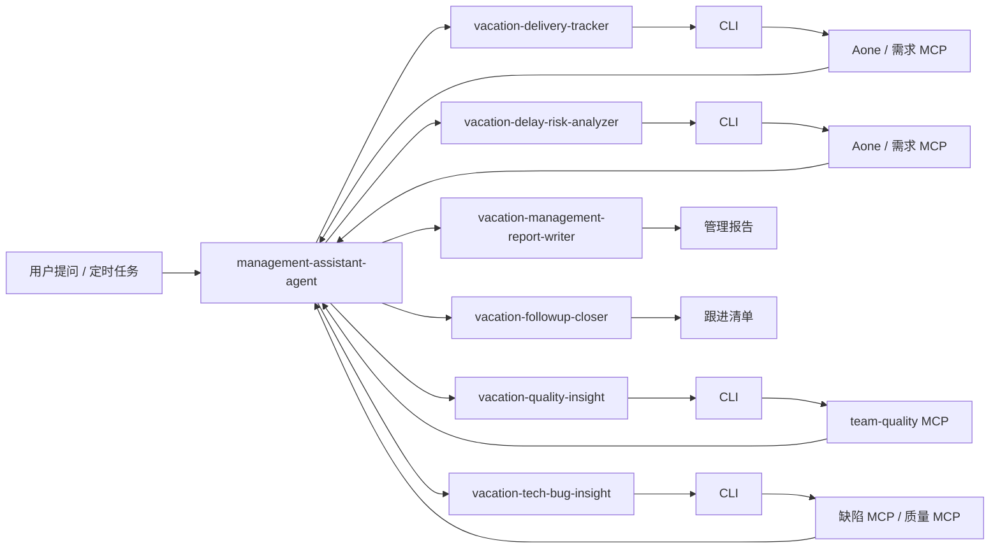

# 一、Agent 构建

- 推荐架构：`1 个主 Agent + 多个 skill`。
- 当前阶段不采用多个对等 Agent；`subagent` 只作为后续内部并行取数或定时任务增强能力，不作为对用户暴露的主形态。

## 1.1 架构选择

- 这个场景本质上是一个管理问题跨多个数据域联合分析，用户要的是统一结论，而不是分别问多个 Agent。
- 采用单主 Agent 可以统一统计口径、统一时间范围、统一输出模板，避免需求交付、延期、质量、bug 各说各话。
- skill 更适合承载“单一能力模块”，例如拉需求、算延期、看质量分、写报告；主 Agent 负责调度这些 skill 并合并结论。
- `subagent` 后续可以作为实现细节引入，例如并行拉 Aone、质量平台、缺陷平台数据，但当前阶段先不作为产品架构重点。

## 1.2 整体架构

| 层级 | 名称 | 角色 | 主要职责 |
|---|---|---|---|
| 主控层 | `management-assistant-agent` | 主 Agent | 理解用户意图、选择 skill、统一口径、跨域归因、输出最终报告 |
| 能力层 | `vacation-delivery-tracker` | Skill | 拉取需求交付数据，计算交付率、延期率、临期需求 |
| 能力层 | `vacation-delay-risk-analyzer` | Skill | 识别延期风险、归类延期原因、输出红黄灯风险清单 |
| 能力层 | `vacation-quality-insight` | Skill | 获取团队质量分、发布质量、CR、提测、灰度等过程质量数据 |
| 能力层 | `vacation-tech-bug-insight` | Skill | 获取技术 bug、按人/模块/需求聚合，分析技术质量风险 |
| 能力层 | `vacation-management-report-writer` | Skill | 按固定模板生成日报、周报、迭代复盘、月报 |
| 能力层 | `vacation-followup-closer` | Skill | 把风险和问题转成待跟进清单，输出 owner、动作、时间点 |

> 当前已存在的 `vacation-team-manager` 可以视为 `vacation-quality-insight` + `vacation-management-report-writer` 的第一阶段实现载体，后续逐步扩展到统一的管理辅助 Agent。

### 数据源接入约定

- 所有 skill 的数据获取统一依托 CLI 调用 MCP 服务完成，skill 本身不直接对接底层平台接口。
- 推荐模式是 `主 Agent -> skill -> CLI -> MCP 服务 -> 结构化结果 -> 主 Agent`。
- CLI 负责承接 MCP 服务的连接、参数透传、结果获取与标准化输出，skill 只关注业务口径、分析逻辑和结果组织。
- 这样做的好处是统一认证和环境配置、复用现有 MCP 能力、降低 skill 重复接入成本，也方便本地调试和定时任务复用。

## 1.3 主 Agent 设计

主 Agent 统一对外暴露为“管理辅助 Agent”，职责如下：

1. 接收用户问题或定时任务，例如“看本周延期情况”“生成质量周报”“输出今日风险需求”。
2. 判断本次任务需要调用哪些 skill，以及统计周期、团队范围、输出格式。
3. 汇总各 skill 的结构化结果，统一指标口径和优先级。
4. 做跨域关联，例如把延期需求和 bug、质量失分、缺陷责任人串起来。
5. 输出最终产物，包括结论摘要、风险清单、建议动作、闭环项。

主 Agent 不直接承担所有细节取数逻辑，避免 prompt 和流程过度膨胀。它更像一个管理场景下的编排器和结论生成器。

## 1.4 Skill 规划

### `vacation-delivery-tracker`

- 描述：负责需求交付数据的获取和结构化整理，是交付率、延期率、临期需求识别的基础 skill。
- 主要输入：团队、时间范围、需求池或迭代范围。
- 主要输出：承诺交付需求清单、已完成需求、未完成需求、准点交付率、延期率、临期需求列表。
- 取数方式：通过 CLI 调用 Aone 协作 / 需求 MCP。
- 依赖系统：Aone 协作、需求 MCP、CLI。

### `vacation-delay-risk-analyzer`

- 描述：负责识别哪些需求会延期、已经延期，以及延期的主要原因分类。
- 主要输入：需求交付清单、当前状态、联调/测试信息、人工补充 blocker。
- 主要输出：红黄灯风险清单、延期原因分类、重点升级项。
- 取数方式：通过 CLI 调用 Aone 协作 / 需求 MCP，必要时结合周会纪要和人工补充信息。
- 依赖系统：Aone 协作、需求 MCP、CLI、周会纪要、人工补充上下文。

### `vacation-quality-insight`

- 描述：负责团队质量分与过程质量数据分析，包括发布 bug 率、CR 覆盖率、提测驳回、灰度有效性等。
- 主要输入：团队、时间范围、质量平台统计参数。
- 主要输出：质量分总览、失分项分析、趋势变化、过程指标明细。
- 取数方式：通过 CLI 调用 `team-quality MCP`。
- 依赖系统：`team-quality MCP`、CLI。

### `vacation-tech-bug-insight`

- 描述：负责技术 bug 相关分析，识别 bug 是否上升、集中在哪些人、模块、需求和时间段。
- 主要输入：缺陷列表、缺陷类型、归属需求、责任人、创建和关闭时间。
- 主要输出：技术 bug 率、缺陷清单、责任人/模块聚合结果、重点关注项。
- 取数方式：通过 CLI 调用 Aone 缺陷相关 MCP 或质量 MCP。
- 依赖系统：Aone 缺陷数据、质量 MCP、CLI。

### `vacation-management-report-writer`

- 描述：负责将结构化结果生成管理可直接使用的日报、周报、迭代复盘和月报。
- 主要输入：交付、延期、质量、bug、闭环等 skill 输出。
- 主要输出：Markdown 格式管理报告、结论摘要、行动建议。
- 取数方式：不直接调用 MCP，主要消费前序 skill 的结构化结果。
- 依赖系统：无强依赖，主要依赖前序 skill 输出。

### `vacation-followup-closer`

- 描述：负责把风险识别结果落成可跟进的清单，推动管理动作闭环。
- 主要输入：风险需求、质量失分项、技术 bug 问题、历史未关闭事项。
- 主要输出：待跟进动作列表、owner、截止时间、下次检查点。
- 取数方式：不直接调用 MCP，主要消费报告结果和人工补充信息。
- 依赖系统：报告结果、周会纪要、人工确认。

## 1.5 Skill 之间的分工原则

- `vacation-delivery-tracker` 只负责“需求交付事实”，不做主观风险判断。
- `vacation-delay-risk-analyzer` 在交付事实基础上补充风险判断和原因分类。
- `vacation-quality-insight` 只对质量平台口径负责，避免和需求口径混淆。
- `vacation-tech-bug-insight` 聚焦缺陷和技术质量，不承担报告拼装。
- `vacation-management-report-writer` 只负责成文，不重新改写原始统计结果。
- `vacation-followup-closer` 只负责动作清单和闭环，不重新解释指标。

这样拆分的目的是让每个 skill 的边界清晰、输入输出稳定，便于后续独立演进。

## 1.6 流程设计简要描述

### 主流程

1. 用户提问或定时任务触发，例如“生成本周管理周报”。
2. 主 Agent 识别任务类型，确定统计周期、团队范围、报告类型。
3. 主 Agent 按需调用相关 skill。
4. 取数类 skill 通过 CLI 调用对应 MCP 服务，获得结构化数据结果。
5. 各 skill 返回结构化结果，不直接输出最终结论。
6. 主 Agent 做跨域汇总，识别核心结论、风险项、需要升级的事项。
7. `vacation-management-report-writer` 生成标准报告。https://gw.alicdn.com/imgextra/i3/O1CN01PP9VAh1FLJGxXME8D_!!6000000000470-2-tps-180-180.png
8. `vacation-followup-closer` 生成跟进清单，作为会后动作或下次巡检输入。

### 协同示意



### 各 Skill 的简版流程

| Skill | 简版流程 |
|---|---|
| `vacation-delivery-tracker` | 识别统计周期 -> 通过 CLI 调用需求 MCP 拉需求列表 -> 过滤承诺交付范围 -> 计算准点交付率和延期率 -> 输出结构化清单 |
| `vacation-delay-risk-analyzer` | 通过 CLI 调用需求 MCP 获取交付清单 -> 识别临期和已延期需求 -> 分类延期原因 -> 输出红黄灯风险清单 |
| `vacation-quality-insight` | 通过 CLI 调用质量 MCP 拉质量分和过程指标 -> 拆解失分项 -> 识别趋势变化 -> 输出质量摘要 |
| `vacation-tech-bug-insight` | 通过 CLI 调用缺陷 MCP / 质量 MCP 拉缺陷列表 -> 过滤技术类问题 -> 按人/模块/需求聚合 -> 输出 bug 分析 |
| `vacation-management-report-writer` | 读取结构化结果 -> 按模板组织内容 -> 输出日报/周报/复盘 Markdown |
| `vacation-followup-closer` | 提取风险和问题 -> 生成 owner 和动作 -> 标记截止时间和复查点 |

## 1.7 数据输入

| 数据域 | 主要来源 | 获取方式 | 关键字段 | 主要用途 |
|---|---|---|---|---|
| 需求池/迭代计划 | Aone 协作 / 需求 MCP | skill 通过 CLI 调用 MCP 服务获取 | 需求 ID、标题、负责人、计划发布时间、承诺完成时间、当前状态、实际完成时间、延期原因 | 统计交付率、延期率、风险需求 |
| 缺陷数据 | Aone / 缺陷平台 / 质量 MCP | skill 通过 CLI 调用 MCP 服务获取 | 缺陷标题、等级、类型、归属需求、责任人、创建时间、状态 | 统计技术 bug 率、识别高风险模块 |
| 质量分数据 | `team-quality MCP` | skill 通过 CLI 调用 MCP 服务获取 | 综合质量分、结果分、过程分、失分项、趋势值 | 输出质量总览与失分分析 |
| 发布过程数据 | `team-quality MCP` | skill 通过 CLI 调用 MCP 服务获取 | 发布次数、回滚次数、发布 bug 率、灰度有效性、提测驳回 | 补充过程质量分析 |
| 人工补充信息 | 周会纪要、项目群同步、TL 补充 | 人工补充或会议纪要输入 | blocker、资源冲突、跨团队依赖、临时插单 | 修正系统数据无法反映的真实风险 |

## 1.8 管理目标

| 目标 | 关注问题 | 结果产出 |
|---|---|---|
| 需求交付管理 | 本周期承诺交付的需求是否按时完成 | 交付清单、准点率、延期率 |
| 延期风险管理 | 哪些需求可能延期、已经延期、延期原因是什么 | 红黄灯风险清单、责任人跟进项 |
| 技术质量管理 | 技术 bug 是否上升、集中在哪些人/模块/需求 | 技术 bug 率、缺陷清单、重点关注项 |
| 团队质量管理 | 团队质量分是否下滑、失分点在哪 | 质量分总览、趋势分析、改进建议 |
| 管理动作闭环 | 上次识别的问题是否有人跟、是否关闭 | 闭环清单、未完成事项、复盘输入 |

## 1.9 能力边界

- 负责事实汇总、风险识别、建议动作、周期性报告生成。
- 不直接修改 Aone 状态、不替代负责人承诺排期、不自动关闭缺陷；涉及系统写操作时仅给出建议，由责任人确认后执行。
- 当口径不清晰或数据缺失时，必须在报告中显式标记“按当前系统口径统计”或“待人工确认”，不能自行脑补。
- 主 Agent 负责最终判断和成文，skill 负责局部能力，避免把所有逻辑都塞进单一 skill。

## 1.10 核心指标口径

| 指标 | 建议口径 | 管理意义 |
|---|---|---|
| 需求准点交付率 | 周期内按承诺时间完成的需求数 / 周期内承诺交付需求总数 | 反映交付稳定性 |
| 需求延期率 | 周期内延期需求数 / 周期内承诺交付需求总数 | 反映排期真实性和风险暴露程度 |
| 风险需求数 | 当前未延期，但存在 blocker、联调未完成、测试未开始、发布时间临近的需求数 | 提前发现未来 1 到 2 周风险 |
| 技术 bug 率 | 周期内技术原因缺陷数 / 周期内已交付需求数；若团队已有统一平台口径，则以平台口径为准并在报告中注明 | 反映交付后的技术质量 |
| 质量分 | 团队质量平台输出的综合质量分及其子项 | 反映团队整体研发质量水平 |
| 闭环完成率 | 周期内已识别问题中已完成跟进闭环的问题数 / 周期内应闭环问题总数 | 反映管理动作是否真正落地 |

## 1.11 标准动作

### 每日巡检

1. 拉取当日最新需求、缺陷、质量分、发布过程数据。
2. 对照承诺交付时间，识别 `T+3` 内到期需求、已逾期需求、状态长期不变需求。
3. 汇总新增技术 bug、高优先级 bug、未关闭历史 bug，并关联责任人和归属需求。
4. 输出红黄灯风险清单，标记“问题是什么、影响什么、谁负责、何时处理”。
5. 生成简版管理日报，适合直接同步到群里或周会纪要。

### 每周汇总

1. 汇总周度需求交付、延期、技术 bug、质量分变化情况。
2. 按人、按项目、按业务域拆分，识别延期集中区域和技术质量薄弱区域。
3. 归类延期原因，例如需求变更、联调依赖、测试资源不足、技术方案返工。
4. 输出周报，给出本周结论、重点风险、下周关注项和责任人动作。

### 迭代复盘

1. 对照迭代承诺范围与实际交付结果，识别范围膨胀、临时插单、返工需求。
2. 复盘延期需求的共性原因，区分可避免问题和不可避免问题。
3. 复盘技术 bug 集中来源，沉淀模块、人员、需求类型维度的规律。
4. 产出改进项，并跟踪到下一周期是否闭环。

### 月度经营视角

1. 观察需求交付率、延期率、技术 bug 率、质量分的月度趋势。
2. 识别连续两期恶化指标，以及反复出现的问题类型。
3. 输出月报和管理复盘材料，作为 TL 经营、绩效沟通、专项改进的输入。

## 1.12 预警规则建议

| 场景 | 黄灯 | 红灯 | 建议动作 |
|---|---|---|---|
| 交付风险 | 距离承诺时间 3 个工作日内，仍未进入联调或测试 | 已超过承诺时间仍未完成 | 当日催办并确认新的承诺时间 |
| 延期率 | 周期延期率高于团队基线 | 周期延期率连续两期上升或超过约定阈值 | 复盘延期原因，调整排期或资源 |
| 技术 bug 率 | 高于团队基线或较上期明显上升 | 高优 bug 集中爆发，或同一需求重复返修 | 拉专项复盘，关注设计和测试前置 |
| 质量分 | 较上周期下降 | 低于团队目标线，或连续两期下降 | 拆解失分项并明确改进 owner |
| 闭环进度 | 已识别问题未按期跟进 | 连续跨周期未闭环 | 升级到周会或专项跟进 |

## 1.13 输出物模板

| 输出物 | 适用场景 | 建议内容 |
|---|---|---|
| 每日风险简报 | 日常巡检、晨会前同步 | 结论摘要、红黄灯需求、待处理 bug、今日动作 |
| 周度管理报告 | 周会、TL 周报 | 交付率、延期率、技术 bug 率、质量分、重点风险、下周关注 |
| 迭代复盘报告 | 版本复盘、团队复盘 | 承诺与实际对比、延期原因分类、质量问题复盘、改进项 |
| 月度经营报告 | 管理评审、绩效沟通 | 趋势图、核心指标变化、问题闭环情况、管理建议 |

推荐统一采用以下输出结构：

1. 结论摘要：先说本周期最重要的 3 件事。
2. 指标总览：给出交付率、延期率、技术 bug 率、质量分。
3. 风险清单：列出具体需求、责任人、阻塞点、风险等级。
4. 质量问题：列出 bug、失分项、异常趋势。
5. 待跟进动作：明确 owner、动作、时间点。
6. 需要管理决策的事项：是否调资源、是否调整排期、是否升级协调。

## 1.14 Agent 执行原则

- 先给结论，再给明细，不堆原始数据。
- 所有指标必须带统计周期、样本范围、计算口径。
- 风险项必须同时给出责任人、原因、影响、下一步动作。
- 严格区分“事实”“判断”“建议”，避免把主观判断写成客观结论。
- 缺失数据不补造，无法确认的字段要明确提示人工确认。

## 1.15 典型触发方式

- “帮我看本周团队需求交付和延期情况。”
- “拉一下行业导购平台最近两周的技术 bug 和质量分变化。”
- “把今天需要重点盯的风险需求列出来。”
- “给我一版周会可直接使用的管理报告。”
- “复盘一下这个迭代为什么延期率高。”

## 1.16 规划演进

1. 第一阶段：复用 `vacation-team-manager` 和 `team-quality MCP`，先落地 `vacation-quality-insight` 与 `vacation-management-report-writer` 的核心能力。
2. 第二阶段：接入 Aone 需求数据，补齐 `vacation-delivery-tracker` 与 `vacation-delay-risk-analyzer`，让 Agent 能覆盖交付和延期管理。
3. 第三阶段：补齐 `vacation-tech-bug-insight` 和 `vacation-followup-closer`，形成日报、周报、复盘、闭环四类标准动作。
4. 第四阶段：在主 Agent 内部引入 `subagent` 机制，用于并行取数、定时推送、专项复盘，但仍保持“一个主 Agent 对外”的产品形态。

# 二、团队质量分

## 团队质量数据 MCP

![[IMG-20260408212057794.png]]

|   |   |
|---|---|
|工具名|描述|
|`getGroupScoreRankingPrint`|获取度假相关团队的质量分排名信息（仅打印不发送钉钉通知）|
|`getGroupData`|获取团队指标数据（startTime、endTime、oneDept、twoDept）|
|`queryCRList`|获取 CR 评审明细列表（支持按部门、是否评论筛选，分页）|
|`queryDefectList`|获取缺陷明细列表（支持按部门、低级bug类型、创建者花名筛选，分页）|
|`querySubmitTestList`|获取提测记录列表（支持按部门、驳回次数筛选，分页）|
|`queryCodeSpePublishList`|获取灰度明细列表（支持按部门、灰度有效性筛选，分页）|
|`queryActionList`|获取故障 action 列表（支持按部门、完成状态列表、优先级列表筛选，分页）|
|`queryOnlineProblemList`|获取线上问题明细列表（支持按部门、来源、主动发现、红线、资损筛选，分页）|
|`queryPublishBugRate`|获取发布 bug 率（含环比数据）|
|`queryCodeBugByEmpList`|获取千行代码 bug 率，按人聚合（分页）|

## 构建团队管理 Skill 一键安装

- skill地址：[https://open.aone.alibaba-inc.com/console/platform/fliggy-vacation-industry/skill/vacation-team-manager?tab=code](https://open.aone.alibaba-inc.com/console/platform/fliggy-vacation-industry/skill/vacation-team-manager?tab=code)
- skill 描述：获取团队开发质量报告。自动配置 team-quality MCP 并获取指定部门在目标时间范围内的质量数据（质量分、线上bug、CR覆盖率、千行代码bug率、缺陷、发布bug率、提测、灰度发布等），生成系统性 Markdown 报告。当用户提到"质量报告"、"质量周报"、"开发质量"、"团队质量"、"质量数据"时触发。

## 质量报告生成

### 方式一：主动询问

![[IMG-20260408212058004.png]]

### 方式二：利用skill创建定时任务，定期推送

![[17e7678ae2f964c96b8d231591423306_MD5.png]]

### 生成的报告

```java
# 团队开发质量报告

**报告周期**: 2026-04-01 ~ 2026-04-08  
**团队**: 度假&用户研发中心 / 行业导购平台  
**生成时间**: 2026-04-08

---

## 一、质量分总览

### 1.1 得分概览

| 维度 | 得分 | 满分 | 说明 |
|------|------|------|------|
| 结果分 | 100.00 | 100 | 线上质量分 + 发布分 - 红线扣分 |
| 过程分 | 99.87 | 100 | 7 项过程指标加权 |
| **综合质量分** | **99.9+** | **100** | 本周期表现优秀 |

### 1.2 结果分明细（满分 100）

| 子项 | 得分 | 满分 | 计算依据 |
|------|------|------|----------|
| 线上质量分 | 90.00 | 90 | 90 × (1 - 0%) = 90，发布bug率为 0 |
| 发布分 | 10.00 | 10 | 本周期无发布回滚 |
| 红线扣分 | 0 | 0 | 无红线事件 |

本周期无 P1/P2 故障，结果分保持满分。

### 1.3 过程分明细（满分 100）

| 子项 | 得分 | 满分 | 计算依据 |
|------|------|------|----------|
| Bug分 | 19.87 | 20 | 10×(1-0%) + 10×(1-0.0128) = 19.87 |
| CR分 | 20.00 | 20 | 20 × 100% CR覆盖率 |
| 提测质量分 | 20.00 | 20 | 本周期无提测驳回记录 |
| 故障主动发现率分 | 10.00 | 10 | 无故障，默认满分 |
| 所有Action完结率分 | 5.00 | 5 | 无Action记录，默认满分 |
| 高优Action解决率分 | 15.00 | 15 | 无高优Action记录，默认满分 |
| 灰度有效性分 | 10.00 | 10 | 核心应用灰度有效性 100% |

---

## 二、重点关注项 ⚠️

本周期整体质量表现优异，仅在 Bug 维度有极小失分（0.13 分），以下为唯一关注点：

**1. 千行代码bug率微弱失分（-0.13 分）**

似璟同学在本周期提交代码 1,074 行，产生 1 个缺陷，千行代码bug率为 0.93‰。该缺陷已关闭（Closed），且非低级缺陷，整体影响极小。

---

## 三、结果维度详情

### 3.1 线上问题

本周期（4/1 ~ 4/8）线上问题数为 **0**，无任何线上故障或问题。

- 线上问题总数：0
- 红线问题数：0
- 资损问题数：0
- P1~P5 各级别均为 0
- 主动发现 / 被动发现：无数据（无线上问题）

### 3.2 发布质量

| 指标 | 数值 |
|------|------|
| 发布总次数 | 11 |
| 回滚次数 | 0 |
| 发布回滚率 | 0% |
| 发布bug率 | 0.0% |
| 上期发布bug率 | 2.1%（1/47） |
| 环比变化 | 大幅改善（↓100%） |

发布bug率从上期 2.1% 降至本周期 0.0%，改善显著。

### 3.3 红线事件

本周期无红线事件。

---

## 四、过程维度详情

### 4.1 缺陷（Bug分 19.87/20）

| 指标 | 数值 |
|------|------|
| 新增缺陷总数 | 1 |
| 低级Bug数量 | 0 |
| 低级缺陷率 | 0% |
| 团队总代码行数 | 78,267 行 |
| 团队总Bug数 | 1 |
| 千行代码bug率 | 0.013‰ |

**缺陷明细：**

| 缺陷标题 | 负责人 | 创建者 | 严重程度 | 状态 |
|----------|--------|--------|----------|------|
| 【运价】88人群-标准区间票，营销返回了优惠，货架动补优惠没透出,sku预定浮层有优惠透出 | 似璟 | 黄紫君 | Medium | Closed |

### 4.2 CR 评审（CR分 20/20）

| 指标 | 数值 |
|------|------|
| CR 总数 | 14 |
| 有评论 CR 数 | 14 |
| CR 覆盖率 | **100%** |

**按人员统计：**

| 人员 | CR数 | 有评论数 | 覆盖率 | 涉及应用 |
|------|------|----------|--------|----------|
| 鸿羲 | 4 | 4 | 100% | travel-detail |
| 汐熙 | 2 | 2 | 100% | travel-xiaoer, travel-visa-center-online |
| 似璟 | 2 | 2 | 100% | travel-xiaoer, tripcenter |
| 姣仔 | 2 | 2 | 100% | irp |
| 钟有 | 1 | 1 | 100% | fliggy-gateway |
| 丘添 | 1 | 1 | 100% | travel-industry-ai |
| 止之 | 1 | 1 | 100% | vacation-guide-hub |
| 如枭 | 1 | 1 | 100% | vacation-shelf-ai |

所有 CR 均经过评审并有评论，覆盖率满分。

### 4.3 提测质量（提测质量分 20/20）

本周期无提测记录，无驳回发生，保持满分。

### 4.4 故障主动发现率（10/10）

本周期无线上故障，按规则默认满分 10 分。

### 4.5 Action 完结情况（20/20）

Action 数据获取返回为空，按规则无 Action 时默认满分：

- 所有Action完结率分：5/5（默认）
- 高优Action解决率分：15/15（默认）

### 4.6 灰度发布（灰度有效性分 10/10）

| 指标 | 数值 |
|------|------|
| 核心应用灰度发布次数 | 4 |
| 灰度有效次数 | 4 |
| 灰度有效性 | **100%** |

**灰度发布明细：**

| 应用 | 发布人 | 灰度有效 | 灰度时长(分钟) |
|------|--------|----------|----------------|
| travel-detail | 鸿羲 | ✅ | 86 |
| fliggy-gateway | 钟有 | ✅ | 26 |
| travel-detail | 鸿羲 | ✅ | 48 |
| tripcenter | 似璟 | ✅ | 22 |

---

## 五、人员维度统计

| 人员 | 代码行数 | Bug数 | 千行bug率(‰) | CR数 | CR覆盖率 | 灰度发布 |
|------|----------|-------|---------------|------|----------|----------|
| 止之 | 20,644 | 0 | 0.00 | 1 | 100% | - |
| 三柏 | 17,446 | 0 | 0.00 | - | - | - |
| 汐熙 | 9,471 | 0 | 0.00 | 2 | 100% | - |
| 苍羿 | 7,031 | 0 | 0.00 | - | - | - |
| 如枭 | 5,785 | 0 | 0.00 | 1 | 100% | - |
| 姣仔 | 5,551 | 0 | 0.00 | 2 | 100% | - |
| 丘添 | 3,517 | 0 | 0.00 | 1 | 100% | - |
| 金可欣 | 2,467 | 0 | 0.00 | - | - | - |
| 启年 | 1,727 | 0 | 0.00 | - | - | - |
| 凯哆 | 1,158 | 0 | 0.00 | - | - | - |
| 似璟 | 1,074 | 1 | 0.93 | 2 | 100% | 1次 |
| 钟有 | 848 | 0 | 0.00 | 1 | 100% | 1次 |
| 鸿羲 | 759 | 0 | 0.00 | 4 | 100% | 2次 |
| 晓无 | 623 | 0 | 0.00 | - | - | - |
| 博煜 | 136 | 0 | 0.00 | - | - | - |
| 兮哲 | 30 | 0 | 0.00 | - | - | - |

---

## 六、总结与建议

**本周期质量亮点：**

本周期行业导购平台团队质量表现极为出色，综合质量分接近满分。结果分方面，发布 bug 率从上期的 2.1% 降至 0%，11 次发布零回滚、零线上问题，线上质量稳健。过程分方面，CR 覆盖率达到 100%（14 个 CR 全部经过评审）、核心应用灰度有效性 100%，研发流程规范性突出。

**关注事项：**

唯一的失分项为千行代码 bug 率（仅失 0.13 分），由似璟同学 1,074 行代码中的 1 个 Medium 级别缺陷引起，该缺陷已关闭，非低级 bug，整体风险可控。

**行动建议：**

团队当前质量状态健康，建议继续保持良好的 CR 评审习惯和灰度发布规范。后续可关注代码量较大但无 CR 记录的同学（如三柏 17,446 行、苍羿 7,031 行），确认是否存在 CR 未纳入统计的情况，保障代码评审的全面覆盖。
```

# 三、Aone 协作

- aone平台现有的mcp：[https://open.aone.alibaba-inc.com/mcp/server/coop/tools/get_show_field_list](https://open.aone.alibaba-inc.com/mcp/server/coop/tools/get_show_field_list)
- todo：将需求管理的报告整合到vacation-team-manager skill 中