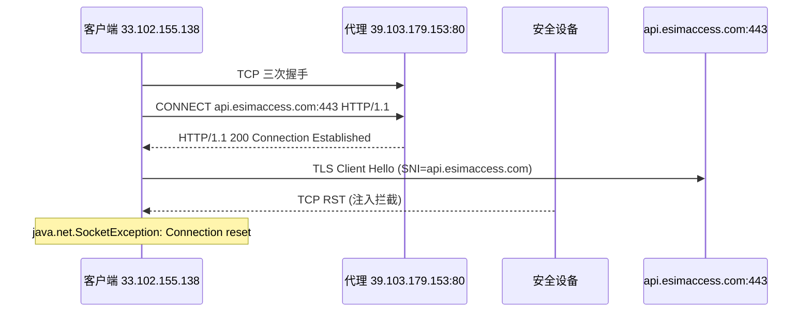

# 为什么你的异常栈日志没搜索出来？
> [!note] 相关笔记
> * `grep` 基础语法、管道符配合方式，以及 `-A` / `-B` / `-C` 的说明见 [搜索查找类指令中的 grep 章节](13.%20搜索查找类指令#Grep%20与管道符)。
1. 异常栈（Java、Python、Go 等语言的 stack trace）通常是**多行连续输出**的：
	- 第一行可能是：java.lang.NullPointerException: xxx 或 ERROR ... 或异常消息
	- 后面跟着很多行 at com.xxx.Class.method(Class.java:123) 这样的堆栈
2. 如果你只用 grep "NullPointerException" logfile 之类的命令，它只会输出**包含关键词的那一行**，而后面的堆栈行因为不包含这个关键词，就不会被输出出来。所以你会感觉“异常栈没搜出来”。
	```bash
	grep "213e035317754910700093035e1044" /home/admin/fliggy-gateway/logs/pontustogateway-analysis.log.2026-04-06.0.log
	```

	![[IMG-20260407202322553.png]]

	```bash
	grep -A 20 "213e035317754910700093035e1044" /home/admin/fliggy-gateway/logs/pontustogateway-analysis.log.2026-04-06.0.log
	```

	![[IMG-20260407202322722.png]]

# 一、问题现象

1. **eSIM 履约对账 BCP 告警**
2. **飞猪订单支付成功，但系统商未调用发货同步**（影响时间段：14:40 ~ 19:30）
	![[IMG-20260407202322900.png|1324]]
3. **fliggy-gateway 日志异常栈**：调用 `api.esimaccess.com` 时抛出 `java.net.SocketException: Connection reset`
	```bash
	grep "2701797063183243389" /home/admin/fliggy-gateway/logs/pontustogateway-analysis.log
	```
	```java
	2026-03-29 15:34:21.218|[HSFBizProcessor-DEFAULT-9-thread-38]|ERROR|pontustogateway-analysis|||FRAMEWORK|||BODY_S|orderEsimProfiles|RedTeaEsimRepositoryImpl.lambda$orderEsimProfiles$1|2103d5a517747696607842610d0663|4502218358110012239|{"orderId":4502218358110012239,"packageInfoList":[{"count":1,"packageCode":"custom_10_CN_15_Daily_1Mbps"}]}|RedTeaEsimRepositoryImpl#orderEsimProfiles parse 
	response error.|PHONECARD_RED_TEA_ESIM
	java.net.SocketException: Connection reset
	        at java.net.SocketInputStream.read(SocketInputStream.java:210)
	        at java.net.SocketInputStream.read(SocketInputStream.java:141)
	        at sun.security.ssl.InputRecord.readFully(InputRecord.java:465)
	        at sun.security.ssl.InputRecord.read(InputRecord.java:503)
	        at sun.security.ssl.SSLSocketImpl.readRecord(SSLSocketImpl.java:983)
	        at sun.security.ssl.SSLSocketImpl.performInitialHandshake(SSLSocketImpl.java:1385)
	        at sun.security.ssl.SSLSocketImpl.startHandshake(SSLSocketImpl.java:1413)
	        at sun.security.ssl.SSLSocketImpl.startHandshake(SSLSocketImpl.java:1397)
	        at okhttp3.internal.connection.RealConnection.connectTls(RealConnection.kt:379)
	        at okhttp3.internal.connection.RealConnection.establishProtocol(RealConnection.kt:337)
	        at okhttp3.internal.connection.RealConnection.connect(RealConnection.kt:209)
	        at okhttp3.internal.connection.ExchangeFinder.findConnection(ExchangeFinder.kt:226)
	        at okhttp3.internal.connection.ExchangeFinder.findHealthyConnection(ExchangeFinder.kt:106)
	        at okhttp3.internal.connection.ExchangeFinder.find(ExchangeFinder.kt:74)
	        at okhttp3.internal.connection.RealCall.initExchange$okhttp(RealCall.kt:255)
	        at okhttp3.internal.connection.ConnectInterceptor.intercept(ConnectInterceptor.kt:32)
	        at okhttp3.internal.http.RealInterceptorChain.proceed(RealInterceptorChain.kt:109)
	        at okhttp3.internal.cache.CacheInterceptor.intercept(CacheInterceptor.kt:95)
	        at okhttp3.internal.http.RealInterceptorChain.proceed(RealInterceptorChain.kt:109)
	        at okhttp3.internal.http.BridgeInterceptor.intercept(BridgeInterceptor.kt:83)
	        at okhttp3.internal.http.RealInterceptorChain.proceed(RealInterceptorChain.kt:109)
	        at okhttp3.internal.http.RetryAndFollowUpInterceptor.intercept(RetryAndFollowUpInterceptor.kt:76)
	        at okhttp3.internal.http.RealInterceptorChain.proceed(RealInterceptorChain.kt:109)
	        at okhttp3.internal.connection.RealCall.getResponseWithInterceptorChain$okhttp(RealCall.kt:201)
	```

# 二、排查过程

## 1. 检查 CLB 实例

代码通过 HTTP 代理转发请求到目标域名：

```java
String proxyIp = FliggySwitchConfig.useProxyIpSet.stream().findFirst().get();
InetSocketAddress inetSocketAddress = new InetSocketAddress(proxyIp, FliggySwitchConfig.proxyPort);
callBack = OkHttpClientUtil.asyncSubmitProxy(httpRequest, inetSocketAddress);
```

代理配置：

```java
@AppSwitch(des = "代理固定出口IP列表", level = Switch.Level.p2)
public static Set<String> useProxyIpSet = Sets.newHashSet("39.103.179.153");

@AppSwitch(des = "代理IP对照的端口", level = Switch.Level.p2)
public static int proxyPort = 80;
```

- `39.103.179.153` 是一个 CLB 实例
	![[IMG-20260407202323036.png|638]]
- ECS 实例健康检查均正常
![[IMG-20260407202323163.png|1353]]
![[IMG-20260407202323291.png|1375]]
![[IMG-20260407202323489.png|1336]]
![[IMG-20260407202323662.png|818]]

## 2. 预发环境抓包分析

![[IMG-20260407202323823.png|700]]

在预发环境将开关切到代理链路，触发 eSIM profile 查询，登录预发机器抓包：

```bash
sudo tcpdump host 39.103.179.153 -w 20260330.pcap
```

用 Wireshark 解析抓包结果，发现：

![[IMG-20260407202324003.png|615]]

![[IMG-20260407202324137.png|960]]

> [!important] 关键发现
> TCP 三次握手正常，HTTP CONNECT 也成功返回，但问题出在 ==TLS 握手阶段==。

**抓包时序：**



详细步骤：

1. 客户端 `33.102.155.138` 向代理 `39.103.179.153:80` 发起 TCP 建连
2. TCP 三次握手成功
3. 客户端发送 `CONNECT api.esimaccess.com:443 HTTP/1.1`
4. 代理返回 `HTTP/1.1 200 Connection Established`
5. 客户端发送 TLSv1.2 Client Hello，SNI 为 `api.esimaccess.com`
6. ==随即收到链路中设备注入的 TCP RST==
7. Java 侧表现为 `java.net.SocketException: Connection reset`

## 3. TTL 佐证
1. TTL 对比

| 报文类型   | TTL   |
| ------ | ----- |
| 正常报文   | 64、58 |
| RST 报文 | 59    |

2. RST 报文 TTL 与正常服务端响应不一致，表明 RST 并非目标服务端返回，而是**中间网络设备生成**，符合安全设备拦截特征。

	![[IMG-20260407202324331.png|1261]]

3. 初始 TTL 是固定档位，不同系统发送 IP 包时，初始 TTL 常见值一般是：64、128、255

4. 到达你抓包点时，看到的是：`到达TTL = 初始TTL - 路由跳数`

5. 例如：

    - 服务器初始 TTL = 64

    - 经过 6 跳到你这里

    - 你看到 TTL = 58

6. 如果后来一个 RST 到你这里 TTL = 59，可能意味着：

    - 它也是从初始 64 发出的

    - 但只经过了 5 跳

7. 那就说明它和正常服务端回包不完全同路，或者根本不是同一发包节点。

## 4. Java 报错与抓包现象一致

OkHttp 完整调用链：

1. OkHttp 建立 TCP 连接
2. 通过代理发送 `CONNECT api.esimaccess.com:443`
3. 代理返回 `200 Connection Established`
4. Java SSL 发送 TLS Client Hello
5. 中间设备注入 RST
6. Java 在读取 TLS 响应时发现连接被重置，抛出 `java.net.SocketException: Connection reset`

> [!note] 要点
> 异常出在 SSL/TLS 握手阶段，不是在发送 HTTP POST 业务请求阶段。代码本身没有明显问题。

# 三、根因结论

> [!danger] 根因
> 域名 `api.esimaccess.com` **未备案**，被阿里云公网出口的安全监测设备拦截。

## 1. 走代理被拦截的原因

- 走 HTTP 代理时，先通过 CONNECT 建立隧道，再发送 TLS Client Hello
- Client Hello 中的 SNI 字段携带了 `api.esimaccess.com` 域名
- 阿里公网出口的安全监测设备旁挂检测到域名未备案，注入 RST 拦截

## 2. 不走代理直连不拦截的原因

![[IMG-20260407202324479.png|716]]

- 直连时直接 TCP 到目标 443 端口，不存在 CONNECT 升级过程
- 检测流程存在差异，未被安全设备拦截

## 3. 拦截平台

1. 拦截平台查看：[https://jarvis-cloud.alibaba-inc.com/project/jarvis/page/punish-center/punish-7rst-event-list.html](https://jarvis-cloud.alibaba-inc.com/project/jarvis/page/punish-center/punish-7rst-event-list.html)
2. fliggy-gateway 的预发实例 IP：33.102.155.138，公网 IP：59.82.21.217
	```bash
	curl ipinfo.io
	```

	![[IMG-20260407202324636.png|685]]

3. 可以查到被拦截的预发请求
	![[IMG-20260407202324838.png]]

4. 问题期间，线上被拦截的请求，时间节点完全对的上
	![[IMG-20260407202324993.png|1144]]

## 4. Action

ICP备案流程

[https://help.aliyun.com/zh/icp-filing/basic-icp-service/user-guide/icp-filing-application-overview?spm=a2c4g.11186623.help-menu-35468.d_2_0.145e6a378I5aS7#0ef6f463e3n9r](https://help.aliyun.com/zh/icp-filing/basic-icp-service/user-guide/icp-filing-application-overview?spm=a2c4g.11186623.help-menu-35468.d_2_0.145e6a378I5aS7#0ef6f463e3n9r)

# 四、补充知识：HTTP 代理访问 HTTPS 的 CONNECT 原理

## 1. 为什么走代理时会有 CONNECT

当配置了 HTTP 代理访问 HTTPS 目标时，客户端不是直接连目标站点，而是先连代理服务器：

1. 客户端连接代理 `39.103.179.153:80`
2. 因为目标是 HTTPS，客户端不能把加密请求当普通 HTTP 发给代理
3. 客户端先发 `CONNECT api.esimaccess.com:443 HTTP/1.1`
4. 代理返回 `HTTP/1.1 200 Connection Established`
5. 这条 TCP 连接变成"隧道"
6. 客户端在隧道里发 TLS Client Hello，后续代理只转发字节流不解密

## 2. 直连 HTTPS 为什么没有 CONNECT

不走代理时直接连 `api.esimaccess.com:443`：

1. TCP 三次握手
2. 直接发 TLS Client Hello
3. TLS 握手成功后发 HTTP 请求

整个过程没有代理参与，不需要 CONNECT。

## 3. 两种流程对比

| 场景 | 流程 |
| ---- | ---- |
| HTTP 代理 + HTTPS | TCP→代理 → CONNECT → 200 → TLS Client Hello → TLS 握手 |
| 直连 HTTPS | TCP→目标 → TLS Client Hello → TLS 握手 |
| SOCKS 代理 + HTTPS | 无 HTTP CONNECT，用 SOCKS 协议建连 |

> [!tip] CONNECT 不是 OkHttp 特有的
> CONNECT 是 HTTP 协议标准方法，任何客户端（浏览器、curl、Python requests、Go http.Client 等）在"HTTP 代理 + HTTPS"场景下都会发送 CONNECT。